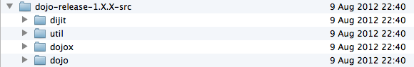

---
Category:  Widgets
...

## Beyond Dojo

One of the things that differentiates Dojo from many other JavaScript libraries is its scope. While you can simply use the functionality of Dojo base, [DOM](../dom_functions/), [Ajax](../ajax/), [effects](../effects/) and other common functionality, the toolkit provides much, much more. In this tutorial, we'll go on a quick tour of the Dojo Toolkit, to introduce some of the other components that are shipped with each release.

### Getting Started

Up to this point, you may have only been working with the base functionality of Dojo.  You might have ventured off into other parts of the core of Dojo, which would be modules contained in the `/dojo/` directory of the distribution and have modules IDs that start with `dojo/*`.  If you [downloaded](/download/) a SDK distribution of Dojo, or checked out a version from SVN, you would notice that `dojo` isn't the only package:



It is unlikely you have gotten this far and not nosed around little in different parts of Dojo, but just in case, let's go over some of the basics again.

### Packages and Modules

A package in Dojo is strictly an AMD package, which requires it to include a `package.json` file in the root directory to describe the package.  There are three packages that are distributed with a Dojo source distribution: `dojo`, `dijit` and `dojox`.  The fourth directory in the source distribution is the `util` directly - it is not a package and contains useful utilities to make it easier to manage a Dojo project.

Modules are then grouped together into packages.  A module is a JavaScript file that can be loaded via the Dojo loader (or another AMD loader) into your application.  These modules will generally start with a `define()` function.  Because of the expansive nature of Dojo, you will find many sub-directories within one of the three "root" packages.  Sometimes we refer to these as "sub-packages", but strictly speaking they cannot stand on their own as an AMD package.  A module's Module ID (MID) will map directly to the path that is occupies within the package.  For example the module `/dojo/fx.js` would have a MID of `dojo/fx`.  There will often be other resources included in the package directory, including tests, CSS, language resources and images.

### Base vs. Core

Traditionally (in Dojo releases prior to 1.7), there had been a set of functionality that was automatically available by default when you loaded the `dojo/dojo.js` file into your application.  This functionality is referred to as "base" Dojo.  As of Dojo 1.7, this functionality was broken out from `dojo/dojo.js` and placed into individual modules in the `dojo/_base` directory.  If you are running your application in "legacy" mode (`async: false`) then these modules will get automatically loaded when you load `dojo/dojo.js`.  If you are running in async mode (`async: true`) then these modules will only be loaded if required in directly or if another module that is loaded depends on that module.

The rest of the modules in the `dojo` package are referred to as the Core.  If you have been reading some of the other tutorials, you may have used other parts of the Core, such as `dojo/fx` in the [animation tutorial](../animation).

Dojo Core provides a wide range of functionality, including feature detection, deferreds and promises, event handling, data store, DOM manipulation, queries, DOM effects, window lifecycle management, mouse, touch and keyboard events, drag and drop, dates and internationalization.

#### A Traditional Example

This example makes use of some of the more "traditional" ways you might use Dojo (and potentially other JavaScript libraries) to do a level of DOM querying and manipulation:

```js
require([
	"dojo/query",
	"dojo/_base/array",
	"dojo/dom-construct",
	"dojo/domReady!"
], function(query, array, domConst){
	function topLinks(){
		var headings = query('h2,h3');

		array.forEach(headings, function(elm){
			var topLink = domConst.create("a", {
				href: "#top",
				innerHTML: "^top"
			});

			domConst.place(topLink, elm, "before");
		});
	}
});
```

The snippet queries the DOM using a CSS selector to indicate that we want both `<h2>` and `<h3>` elements, and uses each as a reference node to insert a newly created `<a>` element.  There are dedicated tutorials for working with [`dojo/query`](../using_query/), [DOM functions](../dom_functions/) and [array helpers](../arrays/) available to find out more.

#### Dojo Core Example

A simple example using a core module would be to create a function that compares two dates and returns the difference:

```js
require([
	"dojo/date",
	"dojo/dom",
	"dojo/domReady!"
], require(date, dom){
	function daysSince(fromDate, target){

		if(!(fromDate instanceof Date)){
			fromDate = new Date(fromDate);
		}
		console.log("from date: ", fromDate);
		var now = new Date();
		console.log("From Date: " + fromDate.toUTCString());

		console.log("Difference in days: " +
			date.difference(fromDate, now, "day"));

		var days  = date.difference(fromDate, now, "day");

		dom.byId(target).innerHTML = days;
	}
});
```

[View Demo](demo/basecore.html)

There is a wealth of functionality in Dojo Base and Core for common web and general-purpose programming tasks. These tutorials aim to introduce you to some of it, but it should not replace the broader familiarity you'll get from browsing the [Reference Guide](/reference-guide/1.10/dojo/) and the [API Reference](/api/?qs=1.10).

### Dijit: Forms, Layout and UI Goodness

The `dijit` package is a sibling to Dojo Core.  It is managed and run as a sub-project of the Dojo Toolkit, with its own owner, policies and guidelines.  Dijit is designed to be a set of visual elements that are "enterprise grade" and offer stability, accessibility and internationalization (including right-to-left and left-to-right support where applicable).  It enhances native HTML controls like form fields, provides advanced layout capabilities as well as other common UI element interfaces. As well as being a set of visual UI elements, it is also a framework for defining custom widgets.

<iframe src="demo/dijitForm_iframe.html" style="height: 182px; width: 582px; border: 1px solid #CCCCCC;"></iframe>

Dijit provides a series of controls which enhances basic HTML form controls with usability improvements, formatting and validation, as well as data-binding using the dojo/store API

See the [Dijit Themes, Buttons, and Textboxes](../themes_buttons_textboxes/) tutorial for additional reading.

[View Demo](demo/dijitForm.html)

Dijit also has powerful tools for creating dynamic user interfaces that adapt to viewport size, and respond to resize and user interaction. It includes widgets for creating desktop-like application layouts and standard items like Tab and Accordion controls for making the best use of the space available.

<iframe src="demo/dijitLayout.html" style="height: 252px; width: 582px; border: 1px solid #CCCCCC;"></iframe>

[View Demo](demo/dijitLayout.html)

You don't have to use Dijit when you are building interactivity, but the controls and patterns it comprises have grown out of a combined and cumulative experience of many years of building web applications, making it a great base to build on and with.

See the [Layout with Dijit](../dijit_layout/) tutorial for additional reading.

### DojoX: Dojo Extensions

The `dojox` package is a collection of sub-packages that extend the toolkit into common and less common areas.  Each sub-package is a directory under `dojox/`, and provides its own `README` file which outlines the functionality and status of the project.  Some code is stable and production-ready, while others are not. Here are some highlights in DojoX:

#### DojoX: Data Grid

One of the most widely used modules of DojoX (let alone Dojo as a whole) was `dojox/grid`. In response to ever-evolving web browsers and the widespread adoption of capable mobile browsers, the Dojo community has created new grids that should be used instead:

*   [dgrid](http://dgrid.io/) - Created and maintained by [SitePen](http://sitepen.com/), it offers a next-generation grid component that is designed for modern browsers and the [Dojo Store](../intro_dojo_store/) or dstore APIs.
*   [GridX](http://oria.github.com/gridx/) - A fast rendering, modularized and plugin architected grid component.

#### DojoX: GFX

<iframe src="demo/dojoxGfx_iframe.html" style="height: 586px; width: 574px; border: 1px solid #CCCCCC;"></iframe>

A cross-platform vector graphics API

[View Demo](demo/dojoxGfx.html)

See the [Vector Graphics with Dojo's GFX](../gfx/) tutorial for additional reading.</a>

#### DojoX: Charting

<iframe src="demo/dojoxCharting_iframe.html" style="height: 266px; width: 582px; border: 1px solid #CCCCCC;"></iframe>

Native charting built on dojox/gfx, with a broad selection of chart types, themes and features for visualizing data.

[View Demo](demo/dojoxCharting.html)

See the [Dojo Charting](../charting/) tutorial for additional reading.

#### DojoX: Mobile

<iframe src="demo/dojoxMobile.html" style="height: 562px; width: 442px; border: 1px solid #CCCCCC;"></iframe>

A lightweight, cross platform, mobile widgets and application framework for mobile devices.

[View Demo](demo/dojoxMobile.html)

See the [Getting Started with Dojox Mobile](../mobile/flickrview/part1/) tutorial for additional reading.

And the less photogenic, but highly useful:

<dl>
	<dt>dojox/lang/functional</dt>
	<dd>A library of functional programming utilities which complement the array methods in Dojo Base to make your code expressive, compact and side-effect free.</dd>

	<dt>dojox/widget | dojox/layout | dojox/form</dt>
	<dd>Further controls to augment the selection provided by Dijit.</dd>
</dl>

DojoX is a treasure trove of solutions for a wide range of problems, and many a rainy afternoon can be spent poking through its projects. You are encouraged to do just that - to spare yourself the forehead-slapping we've all experienced upon discovering in DojoX the very thing we've just spent a week working on.

For an overview of everything contained in DojoX, the [DojoX Reference Guide](/reference-guide/1.10/dojox/) is a good place to start.

### Util

The `util/` directory contains scripts and resources for packaging, testing and documenting your project. Util is not a Dojo namespace, and the contents are typically used outside the browser and your page. There is no "right" way to create and deploy web applications, but Dojo tries to provide tooling to facilitate some of the important best practices that have emerged over the years.

Each of the utils is [documented in its own right](/reference-guide/1.10/util/), but we'll give them a brief introduction here:

#### Dojo Build System

Dojo's package system allows the code in the toolkit to be modular, with the filesystem layout following the module structure. This means that for even a simple application, your browser would be issuing dozens of HTTP requests for the individual modules. This is an acceptable trade-off for developer convenience, but for production, you should _always_ use the build tools to combine these individual module files down to one or more "layers".

The build system is a JavaScript application, which runs on Rhino or NodeJS. Read more about the [build system itself](/reference-guide/1.10/build/index.html), and how to use it [on your own code](../build/).

#### Testing

[D.O.H.](/reference-guide/1.10/util/doh.html) is the test harness used by Dojo for its own unit tests. It includes an in-browser test runner and a non-browser, Rhino-driven test runner. DOH supports a simple set of assertions, and strong support for asynchronous tests, including a specialized implementation of Deferreds, meaning it can be used to test non-Dojo JavaScript as well.

For UI testing there is the [DOH Robot](/reference-guide/1.10/util/dohrobot.html), which is a Java applet-based web driver that can record and replay interactions with your pages. You can then take the recorded script and insert assertions as appropriate, making for a more complete test.

To better support the modern web development ecosystem, SitePen released a new testing framework in [mid-2013](http://www.sitepen.com/blog/2013/05/01/intern-javascript-testing/) - [Intern](http://theintern.io/). Intern will be replacing DOH for Dojo's self-tests in 2014. Further Intern information:

*   [Documentation: Intern wiki](https://github.com/theintern/intern/wiki)
*   [Tutorial](https://github.com/theintern/intern-tutorial)
*   [Examples](https://github.com/theintern/intern-examples)
*   [Help: Stack Overflow](http://stackoverflow.com/questions/tagged/intern)

### dstore: The future of dojo/store

The new [dstore](https://github.com/sitepen/dstore) package is the successor to dojo/store, and works with Dojo 1.8+, and is the planned API for Dojo 2. If you are just getting started with Dojo, we recommend taking a look at dstore.

### Conclusion

The Dojo Toolkit is much more than a DOM and Ajax library. While it has feature and API overlaps with other libraries in this space, it is broader in its scope, and digs deeper in many areas to provide useful abstractions, widgets, and tools to help tackle the large and small, simple and complex, common and uncommon.

You won't learn it all at once - or perhaps ever - but as your requirements grow, Dojo grows with you.