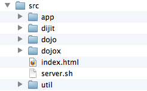

---
Category:  Fundamentals
...

## Building Web Apps

Dojo's build system provides a way to "build" Dojo and your other JavaScript resources and CSS files, so they can be more efficiently used in a production environment by your applications.

<style type="text/css">
table.options {
	border-collapse:collapse;
	margin: 20px 0;
}

table.options th {
	text-align:center;
	padding:3px 6px;
	background-color: #DDDDDD;
	background: #fdfdfd; /* Old browsers */
	background: -moz-linear-gradient(top, #fdfdfd 0%, #f0f0f0 100%); /* FF3.6+ */
	background: -webkit-gradient(linear, left top, left bottom, color-stop(0%,#fdfdfd), color-stop(100%,#f0f0f0)); /* Chrome,Safari4+ */
	background: -webkit-linear-gradient(top, #fdfdfd 0%,#f0f0f0 100%); /* Chrome10+,Safari5.1+ */
	background: -o-linear-gradient(top, #fdfdfd 0%,#f0f0f0 100%); /* Opera 11.10+ */
	background: -ms-linear-gradient(top, #fdfdfd 0%,#f0f0f0 100%); /* IE10+ */
	background: linear-gradient(top, #fdfdfd 0%,#f0f0f0 100%); /* W3C */
	border: 1px solid #E6E6E7;
	color: #333333;
	text-shadow: 0 1px 0 rgba(255,255,255,.9);
}

table.options td {
	padding:3px;
	vertical-align: top;
}

dl {
	font-size: 14px;
	line-height: 1.5em;
}

dt {
	font-size: 18px;
	font-weight: normal !important;
	font-family: Helvetica, Arial, sans-serif;
	margin-bottom: 6px;
}
</style>

### "Building" Dojo or JavaScript?

If you are used to other programming languages, you might be wondering why we would be discussing "building" Dojo or JavaScript, because building usually implies compiling code into machine byte code.  But when we talk about building Dojo we are referring to the concepts of minification, optimization, concatenation and "dead-code" removal.

Whenever you have to send code from a server to a client to be interpreted, like with JavaScript, HTML and CSS, it takes up bandwidth and time.  How much you have to send, coupled with how many requests you have to make to the server adds to the perception of latency.  No matter how "fast" your code executes, you can't start executing it until it is available in the client.

The Dojo Builder is the tool that can be used to accomplish the task of making the most efficient distribution of code to the client side possible, including the ability to handle custom code, modules and CSS.  If done properly, you can create an easy to manage and maintain build system for your application.

### The Basics

The Dojo Build system can be complex and is highly customizable.  It is also designed to be extended, though this tutorial won't address that.  In addition, while the new build system that was introduced in Dojo 1.7 is largely backwards compatible with previous versions, it is a total re-write and in most cases you would be better off looking anew at your build, especially if you have converted your application to AMD.

Before we get started though, there are several core concepts which you need to understand and terms we will use throughout the tutorial.

<dl>
	<dt>Modules and Packages</dt>
	<dd>You should hopefully understand modules before attempting this tutorial.  If not, you will want to review [Defining Modules](../modules/) tutorial first, as they are the foundation for Dojo 1.10.  These modules are then organized into packages, which then constitute a logical grouping of modules.  In Dojo 1.10, each package should have a `package.json` which describes the package. Many packages will also have a `package.js` file that provides Dojo-specific build information.</dd>

	<dt>Dojo Configuration</dt>
	<dd>Internally, Dojo has a lot of configuration options that you might need to leverage in your application.  This configuration is not only important for your application to run properly, it also comes into play as you want to build your application, potentially providing this configuration as part of the build process.  If you aren't familiar with how Dojo is configured, you should review the [Configuring Dojo with dojoConfig](../dojo_config/) first.</a>

	<dt>Layers</dt>
	<dd>Layers are essentially a single JavaScript file that contain several modules and in some cases other resources.  A layer is usually the main output of a build that you are looking for, creating this file which then becomes the "distributable" of your application.  A layer can be a "boot" layer, which means it includes the bootstrap code of Dojo to allow Dojo to load other modules.  What layers you have and their contents is highly dependent upon your application and design.  There is not necessarily one "right" way.</dd>

	<dt>Build Profiles</dt>
	<dd>Build profiles are small JavaScript files that provide information to the builder on how to handle the code.  In the old build system, you would have one profile, in the `util/buildscripts/profiles` directory that contained everything you needed.  With Dojo 1.7 and later, this has become highly decentralized, where each package should have its own build profile and then you have a "master" build profile which instructs the builder on which packages and layers should be built as well as providing configuration options which can be used when optimizing the code.</dd>

	<dt>Minification</dt>
	<dd>This is the concept of taking JavaScript code and "squeezing" it to be smaller, but keeping the code functionally the same.  From an efficiency perspective this is great and some developers like the fact that it obfuscates the code, but it does make debugging difficult.  This is one of the reasons you wouldn't want to develop off "built" code.  The Dojo Builder leverages two toolsets to do minification.  The first is ShrinkSafe, which was what the only tool that could be used in the builder prior to 1.7.  From Dojo 1.7 and beyond, the builder can also leverage Google's [Closure Compiler](https://developers.google.com/closure/compiler/).</dd>

	<dt>Dead Code Path Removal</dt>
	<dd>One of the strong advantages of the Google Closure Compiler is that it can detect when code is not accessible, and remove it from the minified version of the file. Several years ago, we had started a project called the Dojo Linker to solve a similar problem, but never had time to complete it, so we're happy to have an alternative solution. The Dojo Builder has been designed with this feature in mind.  There are several "knobs" which can be set during a build which then cause the builder to "hard code" in paths in the outputted code, which then when optimized, the Closure Compiler detects that certain code will always be unreachable and removes it from the minimized file.</dd>

	<dt>Build Controls, Transforms and Resolvers</dt>
	<dd>These are the basic building blocks of the build system.  Typically you will have no need to be directly aware of them, but if you are interested in very advanced builds, these can be modified and changed to do something more interesting.  The build control is the set of "instructions" for the build, that reads the profile and determines what transforms and resolvers need to be used.  Transforms do what they logically say, in taking something and transforming it to something else and resolvers are what are used to resolve AMD plugin modules at build time.  For example if you are using `dojo/text` to load a widget template, the build time plugin resolver for it will read the text and in-line it into the compressed file.</dd>
</dl>

### What You Need

To use the Dojo build system, you must have a copy of the [full Dojo SDK](/download/#sdk). The "standard release" of Dojo is already built using the build system. The build tool itself relies on [Java](http://java.com/en/download/index.jsp) (and, optionally, [Node.js](http://nodejs.org) for even faster builds), so make sure that have you that installed as well.

### Laying Out Your Application

This is one of the biggest challenges, especially when you go beyond the very basic application.  We have noticed a lot of people who have migrated from Dojo 1.6 and before had very strange application structures to what we expected.  This means a fair amount of people where challenged when it came to migrating their build to Dojo 1.7 and later.  So before you get too far down the path of your application, you need to consider how to lay it out.

The _pro forma_ is to have a `src` directory where all of your packages are at the root of that directory.  Typically you would have something like this:



Where the main packages of Dojo (`dojo`, `dijit` and `dojox`) are siblings of any other packages, including your custom packages, plus the Dojo Utility tools (`util`).

If you don't want to to start from scratch, the [Dojo Boilerplate](https://github.com/csnover/dojo-boilerplate) includes everything you need to get up running, not only with a basic application layout, but is already configured to be built.

### Packages

In order to create a build with the build system, two files must exist inside your main application package directory. The first file is a [CommonJS Packages/1.0](http://wiki.commonjs.org/wiki/Packages/1.0) _package descriptor_, which is always named `package.json` and is placed in the root of the package directory. The second file is a _build profile_, which contains information about how the build tool should process the package's contents. There are two main conventions for naming this file.  Within the Dojo Toolkit it is named `<package name>.profile.js` and is placed in the root of the package directory.  There is an alternative convention, which is to name the profile as `package.js` in the root of the package directory.  You will typically see this alternative convention in [Dojo Foundation Packages](http://packages.dojofoundation.org).

Typically, you'll have just one package containing your entire application, but if you've split your code into multiple packages (for instance, with shared/common modules in a different package), you will need to create both of these files _for each package_.

### Package Descriptors

The package descriptor file (`package.json`) provides information about the current package, such as the name of the package, information about its package dependencies, links to licensing and bug tracking information, and so on. For the purposes of the Dojo build system, the only really important key is the special key `dojoBuild`, though it is usually good to provide at least a name, version, and description. The `dojoBuild` key is used to point to the build profile file for the package. Given the example of a package named `app`, a basic `package.json` would look like this:

```js
{
	"name": "app",
	"description": "My Application.",
	"version": "1.0",
	"keywords": ["JavaScript", "Dojo", "Toolkit", "DojoX"],
	"maintainers": [{
		"name": "Kitson Kelly"
	}],
	"contributors": [{
		"name": "Kitson Kelly"
	},{
		"name": "Colin Snover"
	}],
	"licenses": [{
		"type": "AFLv2.1",
		"url": "http://bugs.dojotoolkit.org/browser/dojox/trunk/LICENSE#L43"
	},{
		"type": "BSD",
		"url": "http://bugs.dojotoolkit.org/browser/dojox/trunk/LICENSE#L13"
	}],
	"bugs": "https://github.com/example/issues",
	"repositories": [{
		"type": "git",
		"url": "http://github.com/example.git",
		"path": "packages/app"
	}],
	"dependencies": {
		"dojo": "~1.10.3",
		"dijit": "~1.10.3",
		"dojox": "~1.10.3"
	},
	"main": "src",
	"homepage": "http://example.com/",
	"dojoBuild": "app.profile.js"
}
```

The [CommonJS Packages/1.0](http://wiki.commonjs.org/wiki/Packages/1.0) specification provides a full list of possible options for the package descriptor.  If you plan to only use your code internally, you can strip this back to the bare minimum, but you need to at least include `dojoBuild` for the builder to find your build profile mentioned above.

### The Package Build Profile

The build profile is the main configuration file for the build system. It is a JavaScript file that places all of the directives that are necessary to create a fully functional build on a `profile` object. The most basic build profile for a package would look like this:

```js
var profile = (function(){
	return {
		resourceTags: {
			amd: function(filename, mid) {
				return /\.js$/.test(filename);
			}
		}
	};
})();
```

Notice how we did this as an anonymous self executing function.  This is to help ensure that other code in the environment doesn't interfere with your profile.  This will also give you an opportunity to do more complex self contained calculations to generate you profile object.

The build profile linked to by `dojoBuild` only needs to contain a `resourceTags` directive if it's not the primary build profile for the application itself.

This provides the "minimum" information needed for the builder to build your package.  What will happen when the builder reads this package, is pass each file in the package to the `resourceTags` functions in order to determine if the tag applies to the file.  There are two arguments that get passed, which are the filename and the MID (Module ID).  If the function returns `true` then the tag applies (and of course `false` means that tag does not apply).

What we are doing here is tagging every file that ends in `.js` as an AMD module, so the builder processes it as such and doesn't assume it is a legacy Dojo module.  Here are other tags that you may want to tag resources in your package with:

<dl>
	<dt>`amd`</dt>
	<dd>The resource is an AMD module.</dd>
	<dt>`declarative`</dt>
	<dd>The resource uses declarative markup you want to scan for dependencies.</dd>
	<dt>`test`</dt>
	<dd>The resource is part of the test code of the package.</dd>
	<dt>`copyOnly`</dt>
	<dd>The resource should be copied to the destination location and otherwise left unaltered.</dd>
	<dt>`miniExclude`</dt>
	<dd>The resource should not be copied to the destination if the profile property `mini` is truthy.</dd>
</dl>

If you don't tag your modules as `amd` but it is, the builder will usually complain that the module appears to be AMD and will process it anyways, but it is better to accurately tag your code.

Using the `declarative` tag is beyond the scope of this tutorial.  For more information on this topic, you can check out the reference guide for [depsDeclarative](/reference-guide/1.10/build/transforms/depsDeclarative.html) for more information.

It is important to make sure you tag your resources appropriately so the builder handles them properly.  Let's assume you have tests in the directors `src/app/tests` (because all good coders build unit tests for their packages, right?), plus the `profile.json` and a few other types of files we would want to only copy.  So a more complete package profile might be:

```js
var profile = (function(){
	var testResourceRe = /^app\/tests\//,
		// checks if mid is in app/tests directory

		copyOnly = function(filename, mid){
			var list = {
				"app/app.profile": true,
				// we shouldn't touch our profile
				"app/package.json": true
				// we shouldn't touch our package.json
			};
			return (mid in list) ||
				(/^app\/resources\//.test(mid)
					&& !/\.css$/.test(filename)) ||
				/(png|jpg|jpeg|gif|tiff)$/.test(filename);
			// Check if it is one of the special files, if it is in
			// app/resource (but not CSS) or is an image
		};

	return {
		resourceTags: {
			test: function(filename, mid){
				return testResourceRe.test(mid) || mid=="app/tests";
				// Tag our test files
			},

			copyOnly: function(filename, mid){
				return copyOnly(filename, mid);
				// Tag our copy only files
			},

			amd: function(filename, mid){
				return !testResourceRe.test(mid)
					&& !copyOnly(filename, mid)
					&& /\.js$/.test(filename);
				// If it isn't a test resource, copy only,
				// but is a .js file, tag it as AMD
			}
		}
	};
})();
```

As you can see, this can get quite complicated quite quickly, but essentially the concept is that the profile object needs to contain a `resourceTags` hash that contains a set of functions that represent the different tags.  You can then leverage the full power of JavaScript to figure out which resources get which tags.

For an example of a "standalone" package profile and how it tags it resources, you can look at the [dgrid Profile](https://github.com/SitePen/dgrid/blob/master/package.js) for an example.

### The Application Build Profile

In order to incorporate a package in an overall build, you simply need to do what is described in the previous section, tag your resources.  But to actually create a build that is useful for a production environment, you are going to need some additional options.  There are two trains of thought.  If your application is simple and you have one custom package that contains all of your custom code (e.g. `app`) you may just want to create a full profile in your package profile.  If your application is more complex and you have several packages, or if you want to potentially have different build profiles for different builds, then you should create an "application" build profile.

For the purposes of the rest of the tutorial, we are going to assume you will create an application level profile, called `myapp.profile.js` in the root of your application folder.

Some key options which create the structure for a full build profile are:

<table class="options">
	<thead>
		<tr><th>Option</th><th>Type</th><th>Description</th></tr>
	</thead>
	<tbody>
		<tr><td>`basePath`</td><td>Path</td><td>This is the "root" of the build, from where the rest of the build will be calculated from.  This is relative to where the build profile is located.</td></tr>
		<tr><td>`releaseDir`</td><td>Path</td><td>This is the root directory where the build should go.  The builder will attempt to create this directly and will overwrite anything it finds there.  It is relative to the `basePath`</td></tr>
		<tr><td>`releaseName`</td><td>String</td><td>This provides a name to a particular release when outputting it.  This is appended to the `releaseDir`.  For example if you are going to release your code in `release/prd` you could set your `releaseDir` to `release` and your `releaseName` to `prd`.</td></tr>
		<tr><td>`action`</td><td>String</td><td>This should be set to `release`.</td></tr>
		<tr><td>`packages`</td><td>Array</td><td>This is an array of hashes of package information which the builder uses when mapping modules.  This provides flexibility in locating in different places and the pulling it together when you build.</td></tr>
		<tr><td>`layers`</td><td>Object</td><td>This allows you to create different "layer" modules as part of a build that contain discreet functionality all built into single file.</td></tr>
	</tbody>
</table>

So assuming we are going to build an application profile, where we are going to have two files we want to load in a single page application.  One that contains most of the code we are going to use at its dependencies and then a second layer that we will load conditionally in certain situations:

```js
var profile = (function(){
	return {
		basePath: "./src",
		releaseDir: "../../app",
		releaseName: "lib",
		action: "release",

		packages:[{
			name: "dojo",
			location: "dojo"
		},{
			name: "dijit",
			location: "dijit"
		},{
			name: "dojox",
			location: "dojox"
		},{
			name: "app",
			location: "app"
		}],

		layers: {
			"dojo/dojo": {
				include: [ "dojo/dojo", "dojo/i18n", "dojo/domReady",
					"app/main", "app/run" ],
				customBase: true,
				boot: true
			},
			"app/Dialog": {
				include: [ "app/Dialog" ]
			}
		}
	};
})();
```

If we were to build this profile now, which would work, we would end up with a build in `app/lib` that would contain all the modules from our four packages, plus two specific files named `app/lib/dojo/dojo.js` and `app/lib/app/Dialog.js` that would contain "built" versions of all the necessary modules and their resources.

We are sort of glossing over the complexity of layers for the moment, but we will cover those more in depth below.

### Build Optimization

Just building a build won't necessarily give you everything you might want out of a build.  The builder does default to a situation where any layers built will be minified, but the rest of your build will be essentially "left alone".  There are several other build profile knobs/options you should consider:

<table class="options">
	<thead>
		<tr><th>Option</th><th>Type</th><th>Description</th></tr>
	</thead>
	<tbody>
		<tr><td>`layerOptimize`</td><td>String/Boolean</td><td>Sets the minification setting for layers.  This defaults to `"shrinksafe"`.  A value of `false` turns off minification and the other valid values are `"shrinksafe.keeplines"`, `"closure"`, `"closure.keeplines"`, `"comment"`, and `"comment.keeplines"`.</td></tr>
		<tr><td>`optimize`</td><td>String/Boolean</td><td>Sets the minification for modules that aren't part of a layer.  This defaults to `false` and takes the sames values as `layerOptimize`.</td></tr>
		<tr><td>`cssOptimize`</td><td>String/Boolean</td><td>Deals with out CSS is optimized.  It defaults to `false`.  A value of `"comments"` will strip out comments and extra lines and inline any `@import<code> commands.  A value of <code>"comments.keepLines"` strips the comments and inlines the `@import`s, but preserves any line breaks.</td></tr>
		<tr><td>`mini`</td><td>Boolean</td><td>This determines if the build is a "mini" build or not.  If `true` it will exclude files that are tagged as `miniExclude` which is typically things like tests, demos and other items not required for the build to work.  This defaults to `false`.</td></tr>
		<tr><td>`stripConsole`</td><td>String</td><td>This determines how `console` handling is dealt with in the output code.  This defaults to `"normal"` which strips all console messages except `console.error` and `console.warn`.  It is important to note though, this feature only applies when there is a level of optimization going on, otherwise it is ignored.  Other possible values are `"none"`, `"warn"` and `"all"`.</td></tr>
		<tr><td>`selectorEngine`</td><td>String</td><td>This identifies the default selector engine for the build and builds it into the code.  While this does not directly make the code smaller, it ensure that a selector engine won't require another call to be loaded.  It defaults to nothing and the two engines included with Dojo are `lite` and `acme`.</td></tr>
		<tr><td>`staticHasFeatures`</td><td>Object</td><td>This is a hash of features that you are "forcing" to be on or off for the build.  When coupled with the Closure Complier, this allows dead code path removal.  We will talk in detail later about the specific values that can be set.</td></tr>
	</tbody>
</table>

So based on the above features, you might want to create a build profile that provides you with a highly optimized version of your application as well any other required code.  The profile might add something like this:

```js
	layerOptimize: "closure",
	optimize: "closure",
	cssOptimize: "comments",
	mini: true,
	stripConsole: "warn",
	selectorEngine: "lite",
```

This would ensure that our layers were minified with the Closure Compiler, all our other modules are also minified, we improve the performance of our CSS resources, we don't copy over extra resources like demos and tests, we bring the console logging back to a minimum and we are explicit about what CSS selector we are going to use.

You might be asking yourself "if we build everything we need into a layer, why do we worry about the rest of the modules?"  If you were to only keep the layer files and not have the rest of the modules available, you would lose that as an option to keep your application working without having to do a whole build again to access those modules.

The output will include each module and layer in an uncompressed format as well as a version with the console messages stripped from it (`.uncompressed.js` and `.consoleStripped.js`.  These are there for potential debugging purposes.  Normally you would just leave these, but if you want to remove them (e.g. file space on the webserver is limited) you safely can.

### Dead Code Path Removal

Mentioned above, `staticHasFeatures` can be coupled with the Closure Compiler to optimize the code greatly.  Dojo uses the `has` API for feature detection.  When code related to that feature is required, `if(has("some-feature")){...}` is put into the code.  With `staticHasFeatures` it allows you at build time to "hardcode" the feature into the build and if the feature is disabled, Closure can detect that the code is no longer reachable and remove it from the built files.

It is important to note though that this will create a build that will not work exactly like the unbuilt version (by design).  So you need to carefully consider your target environment as well as do a level of testing on your built code to ensure it works as expected

There are lots of features available, but here is a list of features that would be generally applicable for a build of Dojo that is wholly AMD, designed for production browser environment and is configurable:

<table class="options">
	<thead>
		<tr><th>Feature</th><th>Setting</th><th>Description</th></tr>
	</thead>
	<tbody>
		<tr><td>`config-deferredInstrumentation`</td><td>0</td><td>Disables automatic loading of code that reports un-handled rejected promises</td></tr>
		<tr><td>`config-dojo-loader-catches`</td><td>0</td><td>Disables some of the error handling when loading modules.</td></tr>
		<tr><td>`config-tlmSiblingOfDojo`</td><td>0</td><td>Disables non-standard module resolution code.</td></tr>
		<tr><td>`dojo-amd-factory-scan`</td><td>0</td><td>Assumes that all modules are AMD</td></tr>
		<tr><td>`dojo-combo-api`</td><td>0</td><td>Disables some of the legacy loader API</td></tr>
		<tr><td>`dojo-config-api`</td><td>1</td><td>Ensures that the build is configurable</td></tr>
		<tr><td>`dojo-config-require`</td><td>0</td><td>Disables configuration via the `require()<code>.</td></tr>
		<tr><td><code>dojo-debug-messages`</td><td>0</td><td>Disables some diagnostic information</td></tr>
		<tr><td>`dojo-dom-ready-api`</td><td>0</td><td>Ensures that the DOM ready API is available</td></tr>
		<tr><td>`dojo-firebug`</td><td>0</td><td>Disables Firebug Lite for browsers that don't have a developer console (e.g. IE6)</td></tr>
		<tr><td>`dojo-guarantee-console`</td><td>1</td><td>Ensures that the console is available in browsers that don't have it available (e.g. IE6)</td></tr>
		<tr><td>`dojo-has-api`</td><td>1</td><td>Ensures the has feature detection API is available.</td></tr>
		<tr><td>`dojo-inject-api`</td><td>1</td><td>Ensures the cross domain loading of modules is supported</td></tr>
		<tr><td>`dojo-loader`</td><td>1</td><td>Ensures the loader is available</td></tr>
		<tr><td>`dojo-log-api`</td><td>0</td><td>Disables the logging code of the loader</td></tr>
		<tr><td>`dojo-modulePaths`</td><td>0</td><td>Removes some legacy API related to loading modules</td></tr>
		<tr><td>`dojo-moduleUrl`</td><td>0</td><td>Removes some legacy API related to loading modules</td></tr>
		<tr><td>`dojo-publish-privates`</td><td>0</td><td>Disables the exposure of some internal information for the loader.</td></tr>
		<tr><td>`dojo-requirejs-api`</td><td>0</td><td>Disables support for RequireJS</td></tr>
		<tr><td>`dojo-sniff`</td><td>1</td><td>Enables scanning of data-dojo-config and djConfig in the dojo.js script tag</td></tr>
		<tr><td>`dojo-sync-loader`</td><td>0</td><td>Disables the legacy loader</td></tr>
		<tr><td>`dojo-test-sniff`</td><td>0</td><td>Disables some features for testing purposes</td></tr>
		<tr><td>`dojo-timeout-api`</td><td>0</td><td>Disables code dealing with modules that don't load</td></tr>
		<tr><td>`dojo-trace-api`</td><td>0</td><td>Disables the tracing of module loading.</td></tr>
		<tr><td>`dojo-undef-api`</td><td>0</td><td>Removes support for module unloading</td></tr>
		<tr><td>`dojo-v1x-i18n-Api`</td><td>1</td><td>Enables support for v1.x i18n loading (required for Dijit)</td></tr>
		<tr><td>`dom`</td><td>1</td><td>Ensures the DOM code is available</td></tr>
		<tr><td>`host-browser`</td><td>1</td><td>Ensures the code is built to run on a browser platform</td></tr>
		<tr><td>`extend-dojo`</td><td>1</td><td>Ensures pre-Dojo 2.0 behavior is maintained</td></tr>
	</tbody>
</table>

See the Reference Guide for [`dojo/has`](/reference-guide/1.10/dojo/has.html) for more information about features available and feature detection in general.

In order to make this work, we would need to add the following to your build profile:

```js
staticHasFeatures: {
	"config-deferredInstrumentation": 0,
	"config-dojo-loader-catches": 0,
	"config-tlmSiblingOfDojo": 0,
	"dojo-amd-factory-scan": 0,
	"dojo-combo-api": 0,
	"dojo-config-api": 1,
	"dojo-config-require": 0,
	"dojo-debug-messages": 0,
	"dojo-dom-ready-api": 1,
	"dojo-firebug": 0,
	"dojo-guarantee-console": 1,
	"dojo-has-api": 1,
	"dojo-inject-api": 1,
	"dojo-loader": 1,
	"dojo-log-api": 0,
	"dojo-modulePaths": 0,
	"dojo-moduleUrl": 0,
	"dojo-publish-privates": 0,
	"dojo-requirejs-api": 0,
	"dojo-sniff": 1,
	"dojo-sync-loader": 0,
	"dojo-test-sniff": 0,
	"dojo-timeout-api": 0,
	"dojo-trace-api": 0,
	"dojo-undef-api": 0,
	"dojo-v1x-i18n-Api": 1,
	"dom": 1,
	"host-browser": 1,
	"extend-dojo": 1
},
```

While these should be generally safe for most web applications, nothing can replace testing on your built version with all your target platforms.  We are reminding you again, you are fundamentally changing the paths when using `staticHasFeatures`.

### Layers

There are many situations where it is beneficial to have multiple layer files. The most common cases for this are when you have code with several distinct sections that can be loaded on demand. For example, in a Web mail application that also has a calendaring component, the common code, mail part, and calendar part could all be split into separate layers. This would enable users that only want to use the mail service to avoid loading the calendaring code, whilst also making sure users that use both mail and calendaring don't download shared code twice. Creating these sorts of layers is extremely simple:

```js
var profile = {
	layers: {
		"app/main": {
			include: [ "app/main" ],
			exclude: [ "app/mail", "app/calendar" ]
		},
		"app/mail": {
			include: [ "app/mail" ],
			exclude: [ "app/main" ]
		},
		"app/calendar": {
			include: [ "app/calendar" ],
			exclude: [ "app/main" ]
		}
	}
};
```

In the above example, the build system creates three layers: one containing the main application, one containing the mail components, and one containing the calendar components. By excluding the `app/mail` and `app/calendar` layers from the `app/main` layer, those modules (and all their dependencies) are excluded from the main layer. (The same thing occurs in reverse by excluding `app/main` from the `app/mail` and `app/calendar` layers.)

Note that if there are other shared components that are _not_ required by any of the non-excluded dependency chains in `app/main`, you would need to add them to the list of modules to include in that layer. For example, if both the mail and calendar components used DataGrid, but _nothing_ else in `app/main` referenced it, it would need to be specified explicitly in the main layer to avoid being compiled in separately to both `app/mail` and `app/calendar`:

```js
var profile = {
	layers: {
		"app/main": {
			include: [ "app/main", "dojox/grid/DataGrid" ],
			exclude: [ "app/mail", "app/calendar" ]
		},
		"app/mail": {
			include: [ "app/mail" ],
			exclude: [ "app/main" ]
		},
		"app/calendar": {
			include: [ "app/calendar" ],
			exclude: [ "app/main" ]
		}
	}
};
```

It’s also possible to create a custom build of `dojo.js`; this is particularly relevant when using AMD, since by default (for backwards compatibility), the `dojo/main` module is added automatically by the build system to `dojo.js`, which wastes space by loading modules that your code may not actually use. In order to create a custom build of `dojo.js`, you simply define it as a separate layer, setting both `customBase` and `boot` to `true`:

```
var profile = {
	layers: {
		"dojo/dojo": {
			include: [ "dojo/dojo", "app/main" ],
			customBase: true,
			boot: true
		}
	}
};
```

The `customBase` directive prevents `dojo/main` from being added automatically, and the `boot` directive ensures that the file includes the necessary AMD loader code. Adding `app/main` to the `include` list builds `app/main` (and its dependencies) directly into `dojo.js`.

Designing your layers can be challenging, especially when you want to leverage other packages in your build.  A good example of dealing with layers and optimizing a build is covered in a [SitePen blog post](http://www.sitepen.com/blog/2012/06/11/dgrid-and-dojo-nano-build/).

### Default Configuration

One last item to cover is that the default configuration for the build can be specified in the build.  This can be overridden by an application or code, but if you are doing a specific build for a specific application, it might be very handy to utilize this.  In addition, you can specify a `hasCache`.  This is similar to the static has features, but instead of hard wiring the code, it simply "tells" the code what the setting of the feature is, so it doesn't have to spend cycles figuring it out.  We could add the following to our build profile:

```js
defaultConfig: {
	hasCache:{
		"dojo-built": 1,
		"dojo-loader": 1,
		"dom": 1,
		"host-browser": 1,
		"config-selectorEngine": "lite"
	},
	async: 1
},
```

The above is appropriate for an all AMD application.  If you are only ever using a single configuration for your production application, you could easily expand this to configure other things at build time and then omit them from your `dojoConfig` when you load your application.

### Putting it All Together

So, if we were to take everything here and combine it into an "application" build profile, it would look like this:

```js
var profile = (function(){
	return {
		basePath: "./src",
		releaseDir: "../../app",
		releaseName: "lib",
		action: "release",
		layerOptimize: "closure",
		optimize: "closure",
		cssOptimize: "comments",
		mini: true,
		stripConsole: "warn",
		selectorEngine: "lite",

		defaultConfig: {
			hasCache:{
				"dojo-built": 1,
				"dojo-loader": 1,
				"dom": 1,
				"host-browser": 1,
				"config-selectorEngine": "lite"
			},
			async: 1
		},

		staticHasFeatures: {
			"config-deferredInstrumentation": 0,
			"config-dojo-loader-catches": 0,
			"config-tlmSiblingOfDojo": 0,
			"dojo-amd-factory-scan": 0,
			"dojo-combo-api": 0,
			"dojo-config-api": 1,
			"dojo-config-require": 0,
			"dojo-debug-messages": 0,
			"dojo-dom-ready-api": 1,
			"dojo-firebug": 0,
			"dojo-guarantee-console": 1,
			"dojo-has-api": 1,
			"dojo-inject-api": 1,
			"dojo-loader": 1,
			"dojo-log-api": 0,
			"dojo-modulePaths": 0,
			"dojo-moduleUrl": 0,
			"dojo-publish-privates": 0,
			"dojo-requirejs-api": 0,
			"dojo-sniff": 1,
			"dojo-sync-loader": 0,
			"dojo-test-sniff": 0,
			"dojo-timeout-api": 0,
			"dojo-trace-api": 0,
			"dojo-undef-api": 0,
			"dojo-v1x-i18n-Api": 1,
			"dom": 1,
			"host-browser": 1,
			"extend-dojo": 1
		},

		packages:[{
			name: "dojo",
			location: "dojo"
		},{
			name: "dijit",
			location: "dijit"
		},{
			name: "dojox",
			location: "dojox"
		},{
			name: "app",
			location: "app"
		}],

		layers: {
			"dojo/dojo": {
				include: [ "dojo/dojo", "dojo/i18n", "dojo/domReady",
					"app/main", "app/run" ],
				customBase: true,
				boot: true
			},
			"app/Dialog": {
				include: [ "app/Dialog" ]
			}
		}
	};
})();
```

This build script performs the following:

1.  Specifies a base path for the build of `./src`.
2.  Specifies a release directory and name that will output to `app/lib`.
3.  Optimizes the layers and all modules with the Closure Compiler.
4.  Optimizes the CSS by removing comments and in-lining `@import`s.
5.  Doesn't copy over extra resources like tests and demos.
6.  Removes `console.log` lines from the code.
7.  Leverages the `lite` CSS selector engine for the built code.
8.  Provides a default `dojoConfig`.
9.  "Hardwires" certain features into and out of the code so unused features can be removed via the Closure Compiler
10.  Identifies each of the packages that are part of our build.
11.  Builds two layers, one called `app/lib/dojo/dojo.js` that contains most of our application code, plus the necessary Dojo code in a single file and one called `app/lib/app/Dialog.js` which contains any additional code needed to support the `app/Dialog` module which can be loaded dynamically by our application.

We have provided the location of our packages in the build file.  There are several ways to provide the location of the packages.  The ways they can be provided are:

*   Use the `--require` command-line flag to point to a script that contains a `require` object or a `require(config)` call.
*   Use the `--dojoConfig` command-line flag to point to a script that contains a `dojoConfig` object with package configuration data.
*   Use multiple `--package` command-line flags to point to each package directory (note that they must all have `package.json` descriptor files).
*   Specify the package configurations inside the build profile itself, which is what we did above.

### Building

Now that all the various configuration files have been set up, it is time to actually create the build. Thanks to all of the hard work done preparing for this moment, actually running the build is very simple.  From the root directory of your application you would run the following command on OSX or Linux:

```bash
$ src/util/buildScripts/build.sh --profile myapp.profile.js
```

Or on Windows:

```bash
> src\util\buildScripts\build.bat --profile myapp.profile.js
```

This will kick off a build using the build profile we created for the application. It is actually possible to specify many different configuration options on the command-line; run `build.sh --help` (or `build.bat --help` on Windows) for a list, although we recommend you keep it simple and put your options in the build profile. It is also possible to check what the build system thinks it should be using before actually running a build by appending `--check-args` to the build command. Doing this will output a JSON representation of the processed build configuration.

When running using Closure Compiler, you will see some warnings and errors about `dojox` code. These can be ignored and will be fixed in a future version of the toolkit.  Also when using `staticHasFeatures` you will see warnings about inaccessible code.  This is actually what it is supposed to be doing.

### Conclusion

The build system is critical for deploying Web applications. Even with the asynchronous loading mechanism built into Dojo 1.10, built applications load significantly faster than unbuilt ones. Load time is a key factor in user experience, so don’t release an application without it!

### Other Resources

*   [Defining Modules](../modules/) tutorial
*   [Configuring Dojo with dojoConfig](../dojo_config) tutorial
*   Reference Guide for [dojo/has](/reference-guide/1.10/dojo/has.html)
*   Reference Guide for [the build system](/reference-guide/1.10/build/index.html)
*   [generator-dojo](https://github.com/bryanforbes/generator-dojo)
*   [Working with Dojo and AMD in production](http://www.sitepen.com/blog/2012/08/27/working-with-dojo-and-amd-in-production/)