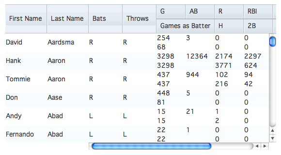
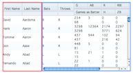
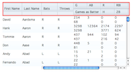
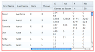
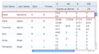
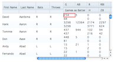

## Datagrid

The DataGrid is the central component of many applications due to its effective and usable presentation of tabular data. In this tutorial we will look at how to define a grid's layout and discuss the scrolling mechanism the DataGrid uses.

### dgrid

This tutorial covers the `dojox/grid/DataGrid` in depth, which is deprecated. Beginning with Dojo 1.7, you should use the [dgrid](http://dgrid.io/), a next-generation grid component that takes full advantage of modern browsers and object stores. Visit the dgrid site for a collection of [dgrid tutorials](http://dgrid.io#tutorials).

### dojox/grid/DataGrid

We've all been there: your boss comes to you and asks you to display an enormous amount of data in the application you're developing. As a web developer, you know that the more data displayed at a time means more memory the browser will consume-but your boss doesn't understand, he just wants this data in the application. This is where Dojo's `dojox/grid/DataGrid` can help you. The DataGrid is able to consume and scroll through thousands of rows of data with only a minimal memory footprint. In this tutorial, we will learn about the basics of the DataGrid.

To give you a taste of the DataGrid's ability to handle a massive amount of data, we've put together a grid that displays batting statistics for every person who has played professional baseball in the United States:

[](demo/datagrid.html)

[View Demo](demo/datagrid.html)

As you can see, the DataGrid easily handles this data set containing 17,452 records. For the purposes of this tutorial, we will be using a smaller set of data: batting statistics only for those players that are in the hall of fame. Let's get started.

### Parts of the DataGrid

As you probably guessed, the DataGrid is made up of several different parts. At the highest level, a DataGrid is made up of _views_. Views break the DataGrid up into sections and render the _header_ and _content_ for each section. Headers and contents contain _rows_ (although the header only contains one row) which are populated by _sub-rows_ of _cells_. Let's look at some pictures for a better understanding:

[](images/DataGridView.png "Views")
[](images/DataGridHeader.png "Header")
[](images/DataGridContent.png "Content")
[](images/DataGridRow.png "Row")
[](images/DataGridSubRow.png "SubRows")
[](images/DataGridCell.png "Cell")

We'll be recreating and modifying the layout of the first demo in this tutorial. To define how a DataGrid will look, we will be passing different objects and arrays to the `structure` property of the DataGrid constructor. We'll be working from the smallest definable object - a cell - to the largest - a view. We won't be describing how to retrieve the data from the server quite yet, but we'll get to it in the next tutorial.

#### Cells

The first thing we need to do is tell the DataGrid what cells, or columns, we want to be displayed for each data record. To do this, we will pass an array of _cell definition_ objects to the `structure` property. Each cell definition object can have several properties defined:

* `name`: the string to use in the header cell
* `field`: the name of the field of the data record to display
* `width`: a string containing the CSS width (with units) of the column
* `hidden`: a boolean that when true will hide the column

```js
require(["dojox/grid/DataGrid" /*, other deps */, "dojo/domReady!"],
	function(DataGrid /*, other deps */){
		/* create store here ... */

		var grid = new DataGrid({
			store: store,
			query: { id: "*" },
			structure: [
				{ name: "First Name", field: "first", width: "84px" },
				{ name: "Last Name", field: "last", width: "84px" },
				{ name: "Bats", field: "bats", width: "70px" },
				{ name: "Throws", field: "throws", width: "70px" },
				{ name: "G", field: "totalG", width: "60px" },
				{ name: "AB", field: "totalAB", width: "60px" },
				{ name: "Games as Batter", field: "totalGAB", width: "120px" },
				{ name: "R", field: "totalR", width: "60px" },
				{ name: "RBI", field: "totalRBI", width: "60px" },
				{ name: "BB", field: "totalBB", width: "60px" },
				{ name: "K", field: "totalK", width: "60px" },
				{ name: "H", field: "totalH", width: "60px" },
				{ name: "2B", field: "total2B", width: "60px" },
				{ name: "3B", field: "total3B", width: "60px" },
				{ name: "HR", field: "totalHR", width: "60px" }
			]
		}, "grid");

});
```

[View Demo](demo/datagrid-simple.html)

The DataGrid also provides a way to control visual styling via CSS styles or CSS classes. The cell definition properties `headerStyles`, `cellStyles`, and `styles` are strings of CSS style definitions (that must be terminated with a semi-colon) that are applied to only the header cell, only the content cells, and to all cells respectively. Likewise, the cell definition properties `headerClasses`, `cellClasses`, and `classes` are space separated strings of class names to apply to the respective cells:

```html
<style>
.firstName {
	font-style: italic;
}
.lastName {
	font-weight: bold;
}
</style>
<script>
grid = new DataGrid({
	store: store,
	query: { id: "*" },
	structure: [
		{ name: "First Name", field: "first", width: "84px",
			classes: "firstName" },
		{ name: "Last Name", field: "last", width: "84px",
			cellClasses: "lastName" },
		{ name: "Bats", field: "bats", width: "70px",
			cellStyles: "text-align: right;" },
		{ name: "Throws", field: "throws", width: "70px" },
		{ name: "G", field: "totalG", width: "60px" },
		{ name: "AB", field: "totalAB", width: "60px" },
		{ name: "Games as Batter", field: "totalGAB", width: "120px",
			styles: "text-align: center;" },
		{ name: "R", field: "totalR", width: "60px" },
		{ name: "RBI", field: "totalRBI", width: "60px" },
		{ name: "BB", field: "totalBB", width: "60px" },
		{ name: "K", field: "totalK", width: "60px" },
		{ name: "H", field: "totalH", width: "60px" },
		{ name: "2B", field: "total2B", width: "60px" },
		{ name: "3B", field: "total3B", width: "60px" },
		{ name: "HR", field: "totalHR", width: "60px" }
	]
}, "grid");
</script>
```

[View Demo](demo/datagrid-style.html)

#### Sub-Row

We now have all of the fields we care about from our data records displaying, but it's not very easy to look at. Sub-rows can make some data easier to understand and read. To define sub-rows, pass an array of arrays of cell definitions to the DataGrid. Sub-rows allow us to use two more properties of cell definitions: `rowSpan` defines how many rows a cell should take up and `colSpan` defines how many columns wide a cell should be.

`colSpan` cannot be defined on cells in the first sub-row. This is a because the DataGrid uses `table-layout: fixed;` to speed up the rendering of rows.

```js
grid = new DataGrid({
	store: store,
	query: { id: "*" },
	structure: [
		[
			{ name: "First Name", field: "first", width: "84px", rowSpan: 2 },
			{ name: "Last Name", field: "last", width: "84px", rowSpan: 2 },
			{ name: "Bats", field: "bats", width: "70px", rowSpan: 2 },
			{ name: "Throws", field: "throws", width: "70px", rowSpan: 2 },
			{ name: "G", field: "totalG", width: "60px" },
			{ name: "AB", field: "totalAB", width: "60px" },
			{ name: "R", field: "totalR", width: "60px" },
			{ name: "RBI", field: "totalRBI", width: "60px" },
			{ name: "BB", field: "totalBB", width: "60px" },
			{ name: "K", field: "totalK", width: "60px" }
		],[
			{ name: "Games as Batter", field: "totalGAB", colSpan: 2 },
			{ name: "H", field: "totalH" },
			{ name: "2B", field: "total2B" },
			{ name: "3B", field: "total3B" },
			{ name: "HR", field: "totalHR" }
		]
	]
}, "grid");
```

[View Demo](demo/datagrid-subrows.html)

#### Views

We've made it a little easier to view our data, however once you scroll to the right you can't see whose records you're looking at. By defining a _view definition_, we can lock sections of columns from scrolling left and right. A view definition is an object with some specific properties set on it:

* `cells`: an array or an array of arrays of cell definitions
* `noscroll`: a boolean that when true will prevent the view from scrolling horizontally
* `width`: a string specifying the CSS width of the view - this is only needed when your cells are defined with relative widths like percentages

```js
grid = new DataGrid({
	store: store,
	query: { id: "*" },
	structure: [
		{
			noscroll: true,
			cells: [
				{ name: "First Name", field: "first", width: "84px" },
				{ name: "Last Name", field: "last", width: "84px" }
			]
		},{
			cells: [
				[
					{ name: "Bats", field: "bats", width: "70px", rowSpan: 2 },
					{ name: "Throws", field: "throws", width: "70px", rowSpan: 2 },
					{ name: "G", field: "totalG", width: "60px" },
					{ name: "AB", field: "totalAB", width: "60px" },
					{ name: "R", field: "totalR", width: "60px" },
					{ name: "RBI", field: "totalRBI", width: "60px" },
					{ name: "BB", field: "totalBB", width: "60px" },
					{ name: "K", field: "totalK", width: "60px" }
				],[
					{ name: "Games as Batter", field: "totalGAB", colSpan: 2 },
					{ name: "H", field: "totalH" },
					{ name: "2B", field: "total2B" },
					{ name: "3B", field: "total3B" },
					{ name: "HR", field: "totalHR" }
				]
			]
		}
	]
}, "grid");
```

[View Demo](demo/datagrid-noscroll.html)

View definitions provide one more property that is helpful in reducing redundant code: `defaultCell`. This property allows you to define a default cell definition that the DataGrid will use if a property is missing from a cell definition:

```js
grid = new DataGrid({
	store: store,
	query: { id: "*" },
	structure: [
		{
			noscroll: true,
			defaultCell: { width: "84px" },
			cells: [
				{ name: "First Name", field: "first" },
				{ name: "Last Name", field: "last" }
			]
		},{
			defaultCell: { width: "60px" },
			cells: [
				[
					{ name: "Bats", field: "bats", width: "70px", rowSpan: 2 },
					{ name: "Throws", field: "throws", width: "70px", rowSpan: 2 },
					{ name: "G", field: "totalG" },
					{ name: "AB", field: "totalAB" },
					{ name: "R", field: "totalR" },
					{ name: "RBI", field: "totalRBI" },
					{ name: "BB", field: "totalBB" },
					{ name: "K", field: "totalK" }
				],[
					{ name: "Games as Batter", field: "totalGAB", colSpan: 2 },
					{ name: "H", field: "totalH" },
					{ name: "2B", field: "total2B" },
					{ name: "3B", field: "total3B" },
					{ name: "HR", field: "totalHR" }
				]
			]
		}
	]
}, "grid");
```

[View Demo](demo/datagrid-defaultcell.html)

As you can see, by defining the `width` of the `defaultCell`, we only have to specify a `width` if it differs from the default value.

The default width of a cell definition (if none is provided in either the default or main cell definition) is `6em`.

### Paging and Virtual Scrolling

Historically, when a large set of data needed to be displayed, developers would use a method called _paging_: only a small subset (perhaps 25-50 records) of the entire set would be displayed. The user would navigate through "pages" of data using buttons or other controls. With the advent of the scroll wheel (and one could argue the mouse), paging controls started to seem cumbersome.

The DataGrid takes a slightly different approach called _virtual scrolling_: to navigate, a user only needs to scroll. The reason it is called virtual scrolling is that although it may seem as though it is a long list of records, only a small subset of the data is ever rendered at one time. However, the DataGrid also uses paging: as a user scrolls, "pages" of data are requested from the data source, or "store". It also, by default, keeps the last three pages rendered intact in case you need to scroll back. The number of rows per page of data can be controlled by the `rowsPerPage` property of the DataGrid constructor, and the number of rows to keep rendered is controlled by `keepRows`.

To calculate how many pages the DataGrid will keep rendered, divide `keepRows` by `rowsPerPage`.  By default, `rowsPerPage` is set to 25 and `keepRows` to 75.

### Binding DataGrid to Data Stores

To learn how to bind a data or object store to the DataGrid, be sure to read the [Populating your Grid using dojo/data](../populating_datagrid), [Connecting a Store to a DataGrid](../store_driven_grid) and the [Using Dojo Data](../dojo_data) tutorials.

### Conclusion

The `DataGrid` is a powerful component. Not only can it render large data sets, but you can create complex layouts of rows and sub-rows for your data. It also allows users to intuitively scroll through long lists of information without having to click controls. In the next tutorial, we will discover how `DataGrid` can be coupled with Dojo's data stores.