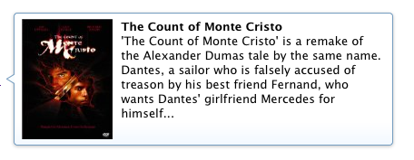
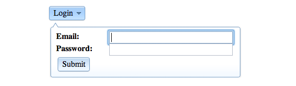

## Dialogs &amp; Tooltips

User interaction is extremely important in building responsive, interactive web applications.  Web browsers provide basic methods for user interaction in the form of alerts and dialogs, but this functionality is neither elegant nor flexible.  With `dijit/Tooltip`, `dijit/Dialog`, and `dijit/TooltipDialog`, Dijit, the Dojo Toolkit's UI framework, provides cross-browser, extendable, and themeable answers to what the browser's basic functionality lacks.  In this tutorial, you'll learn about each of these widgets, sample usages of each, and the ins and outs of creating them.

### Getting Started with Tooltips

Native "Tooltips" are created within the browser using `title` attributes within DOM nodes.  These Tooltips are as vanilla as they come:  no control over display duration, no rich text abilities, and little uniformity across browsers.  Dijit's `dijit/Tooltip` class fixes all of those issues by:

*   Allowing HTML content within the custom Tooltip
*   Providing methods to control Tooltip display position and duration
*   Repositioning and resizing Tooltips when the browser size is changed
*   Providing four themes for elegant Tooltip display
*   Implementing reliable cross-browser strategies for allowing Tooltips to display over Flash elements
*   "Lazy" creation of Tooltips -- not creating the Tooltip nodes until the Tooltip must display.

The setup for using `dijit/Tooltip` is the same as using any Dijit widget: add the desired theme stylesheet to the page, add the name of the theme as a CSS class to the body node, and require the widget's JavaScript class:

```html
<head>
<!-- use the "claro" theme -->
<link rel="stylesheet" href="//ajax.googleapis.com/ajax/libs/dojo/1.10.3/dijit/themes/claro/claro.css">
<!-- load dojo and provide config via data attribute -->
<script src="//ajax.googleapis.com/ajax/libs/dojo/1.10.3/dojo/dojo.js" data-dojo-config="async: true, parseOnLoad:true"></script>
<script>
    // Load the Tooltip widget class
    require(["dijit/Tooltip",  "dojo/parser", "dojo/domReady!"], function(Tooltip, parser){
        parser.parse();
    });
</script>
</head>
<!-- add the "claro" CSS class to the body -->
<body class="claro">

</body>
```

With the theme and widget class loaded, a basic example of programmatic `dijit/Tooltip` usage would look like:

```js
// Create a new Tooltip
var tip = new Tooltip({
	// Label - the HTML or text to be placed within the Tooltip
	label: '&lt;div class="myTipType"&gt;This is the content of my Tooltip!&lt;/div&gt;',
	// Delay before showing the Tooltip (in milliseconds)
	showDelay: 250,
	// The nodes to attach the Tooltip to
	// Can be an array of strings or domNodes
	connectId: ["myElement1","myElement2"]
});
```

Important `dijit/Tooltip` properties include:

*   **connectId** - An array of IDs or DOM nodes that the Tooltip should be connected to
*   **label** - The HTML or text content to be placed within the Tooltip
*   **showDelay** - The show delay of the Tooltip

Notable `dijit/Tooltip` methods include:

*   **addTarget** - Adds a Tooltip target if not already connected
*   **close** - Closes a Tooltip instance (hides its visibility)
*   **open** - Opens a Tooltip instance (makes the Tooltip visible)
*   **removeTarget** - Removes a node from the Tooltip target list
*   **set** - Allows for changing of properties, most notably Tooltip content (`myTip.set("label","New content!")`)

The `dijit/Tooltip` object also hosts a configurable `defaultPosition` array which contains the desired order which a Tooltip instance should try to display:

```js
Tooltip.defaultPosition = ["above", "below", "after-centered", "before-centered"];
```

This array may be changed to the developer's liking.

<!-- protip -->
> Note that changing the `Tooltip.defaultPosition` array changes the display position for _all_ tooltips.

### dijit/Tooltip Examples

The following are some very common usages of `dijit/Tooltip`.

#### Declarative (HTML) Tooltip Creation

```html
<button id="TooltipButton" onmouseover="dijit.Tooltip.defaultPosition=['above', 'below']">Tooltip Above</button>
<div class="dijitHidden"><span data-dojo-type="dijit/Tooltip" data-dojo-props="connectId:'TooltipButton'">I am <strong>above</strong> the button</span></div>

<button id="TooltipButton2" onmouseover="dijit.Tooltip.defaultPosition=['below','above']">Tooltip Below</button>
<div class="dijitHidden"><span data-dojo-type="dijit/Tooltip" data-dojo-props="connectId:'TooltipButton2'">I am <strong>below</strong> the button</span></div>

<button id="TooltipButton3" onmouseover="dijit.Tooltip.defaultPosition=['after','before']">Tooltip After</button>
<div class="dijitHidden"><span data-dojo-type="dijit/Tooltip" data-dojo-props="connectId:'TooltipButton3'">I am <strong>after</strong> the button</span></div>

<button id="TooltipButton4" onmouseover="dijit.Tooltip.defaultPosition=['before','after']">Tooltip Before</button>
<div class="dijitHidden"><span data-dojo-type="dijit/Tooltip" data-dojo-props="connectId:'TooltipButton4'">I am <strong>before</strong> the button</span></div>
```

[View Demo](demo/tooltip-mixed.html)

#### Programmatic Tooltip Creation

```js
// Add Tooltip of his picture
new Tooltip({
	connectId: ["nameTip"],
	label: "&lt;img src='rod-stewart.jpg' alt='Rod Stewart' width='300' height='404' /&gt;"
});
// Add Tooltip of North London
new Tooltip({
	connectId: ["londonTip"],
	label: "&lt;img src='emirates-stadium.jpg' alt='The Emirates in London' width='400' height='267' /&gt;"
});
//Add Tooltip of record
new Tooltip({
	connectId: ["recordsTip"],
	label: "&lt;img src='every-picture.jpg' alt='Every Picture Tells a Story' width='200' height='197' /&gt;"
});
// Add custom Tooltip
var myTip = new Tooltip({
	connectId: ["hoverLink"],
	label: "Don't I look funky?",
	"class": "customTip"
});
```
[View Demo](demo/tooltip-mixed.html)

#### Product Details

```html
<ul>
    <li><a href="http://www.imdb.com/title/tt0112573/" id="movieBraveheart">Braveheart</a></li>
    <li><a href="http://www.imdb.com/title/tt0237534/" id="movieBrotherhood">Brotherhood of the Wolf</a></li>
    <li><a href="http://www.imdb.com/title/tt0245844/" id="movieCristo">The Count of Monte Cristo</a></li>
</ul>
<div class="dijitHidden">
    <div data-dojo-type="dijit/Tooltip" data-dojo-props="connectId:'movieBraveheart'">
        
        <p style="width:400px;"><strong>Braveheart</strong><br />Braveheart is the partly historical, partly mythological, story of William Wallace, a Scottish common man who fights for his country's freedom from English rule around the end of the 13th century...</p>
        <br style="clear:both;">
    </div>
</div>
<div class="dijitHidden">
    <div data-dojo-type="dijit/Tooltip" data-dojo-props="connectId:'movieBrotherhood'">
        
        <p style="width:400px;"><strong>Brotherhood of the Wolf</strong><br />In 1765 something was stalking the mountains of central France. A 'beast' that pounced on humans and animals with terrible ferocity...</p>
        <br style="clear:both;">
    </div>
</div>
<div class="dijitHidden">
    <div data-dojo-type="dijit/Tooltip" data-dojo-props="connectId:'movieCristo'">
        
        <p style="width:400px;"><strong>The Count of Monte Cristo</strong><br />'The Count of Monte Cristo' is a remake of the Alexander Dumas tale by the same name. Dantes, a sailor who is falsely accused of treason by his best friend Fernand, who wants Dantes' girlfriend Mercedes for himself...</p>
        <br style="clear:both;">
    </div>
</div>
```
[View Demo](demo/tooltip-details.html)

[](demo/tooltip-details.html)

The basic Tooltip widget is great for providing feature-rich information, but what if you need a widget that will stand out a bit more?  Dijit's Dialog widget is the perfect choice!

### Getting Started with Dialogs

When looking to get information from the user, or serve a notification, the browser's native `alert` and `confirm` methods simply aren't good enough.  They're inflexible and ugly.  Luckily, the Dojo Toolkit offers an alternative with `dijit/Dialog`.  Much like `dijit/Tooltip`, `dijit/Dialog` allows for HTML content and easy theming.  A sample usage of `dijit/Dialog` would look like:

```js
// Create a new instance of dijit/Dialog
var myDialog = new Dialog({
	// The dialog's title
	title: "The Dojo Toolkit",
	// The dialog's content
	content: "This is the dialog content.",
	// Hard-code the dialog width
	style: "width:200px;"
});
```

One important fact to know about `dijit/Dialog` is that instances are added to a "stack" so that you may have instances on top of one another.  Displaying dialogs are also backed up by an iFrame so that they are ensured to always be "on top" of other elements.  A single `dijit/DialogUnderlay` instance is shared by all Dialogs.

Important `dijit/Dialog` properties include:

*   **content** - The HTML or text content for the Dialog
*   **draggable** - Represents if the Dialog should be draggable
*   **href** - If content is to be loaded by Ajax (`xhrGet`), a path to that content file
*   **loadingMessage** - Message to be shown while the Ajax content is loading.
*   **open** - Returns true if the Dialog instance is presently open
*   **title** - The title to display atop the Dialog

Notable `dijit/Dialog` methods include:

*   **hide** - Hides the dialog and underlay
*   **refresh** - Refreshes the content of the Dialog if it's Ajax-based
*   **show** - Displays the dialog and underlay

`dijit/Dialog` also provides the callback methods you'd expect from a Dijit widget:  onShow, onHide, onLoad, onClick, and more.

### dijit/Dialog Examples

The following are some very common usages of `dijit/Dialog`:

#### Terms and Conditions

```html
<script>
    // Require the Dialog class
    require(["dijit/registry", "dojo/parser", "dijit/Dialog", "dijit/form/Button", "dojo/domReady!"], function(registry, parser){
        // Show the dialog
        showDialog = function() {
            registry.byId("terms").show();
        }
        // Hide the dialog
        hideDialog = function() {
            registry.byId("terms").hide();
        }

        parser.parse();
    });
</script>
<button onclick="showDialog();">View Terms and Conditions</button>

<div class="dijitHidden">
    <div data-dojo-type="dijit/Dialog" style="width:600px;" data-dojo-props="title:'Terms and Conditions'" id="terms">
        <p><strong>Please agree to the following terms and conditions:</strong></p>
        <div style="height:160px;overflow-y:scroll;border:1px solid #769dc4;padding:0 10px;width:600px"><p>
        Lorem ipsum dolor sit amet, consectetur adipiscing elit. Sed sed suscipit massa. Aenean vel turpis tincidunt velit gravida venenatis. In iaculis urna non quam tincidunt elementum. Nunc pellentesque aliquam dui, ac facilisis massa sollicitudin et. Donec tincidunt vulputate ultrices. Duis eu risus ut ipsum auctor scelerisque non quis ante. Nam tempor lobortis justo, et rhoncus mauris cursus et. Mauris auctor congue lectus auctor ultrices. Aenean quis feugiat purus. Cras ornare vehicula tempus. Nunc placerat, lorem adipiscing condimentum sagittis, augue velit ornare odio, eget semper risus est et erat....
        </p></div>

        <button onclick="hideDialog();">I Agree</button>
        <button onclick="alert('You must agree!');">I Don't Agree</button>
    </div>
</div>
```

[View Demo](demo/dialog-terms.html)

[](demo/dialog-terms.html)

#### Stacked Dialogs

```html
<script>
    // Require the Dialog class
    require(["dijit/Dialog"], function(Dialog) {
        // Create counter
        var counter = 1;
        // Create a new Dialog
        createDialog = function(first) {
            // Create a new dialog
            var dialog = new Dialog({
                // Dialog title
                title: "New Dialog " + counter,
                // Create Dialog content
                content: (!first ? "I am a dialog on top of other dialogs" : "I am the bottom dialog") + "<br /><br /><button onclick='createDialog();'>Create another dialog.</button>"
            });
            dialog.show();
            counter++;
        }
    });

</script>
<button onclick="createDialog(true);">Create New Dialog</button>
```

[View Demo](demo/dialog-stacked.html)

#### Ajax Dialogs with Black Underlay

```html
<style>
    /* colors the underlay black instead of white
     * We're using '.claro .dijitDialogUnderlay' as our selector,
     * to match the specificity in claro.css */
    .claro .dijitDialogUnderlay { background:#000; }
</style>

<script>
    // Require the Dialog class
    require(["dijit/registry", "dojo/parser", "dijit/Dialog", "dojo/domReady!"], function(registry, parser){
        // Show the dialog
        showDialog = function() {
            registry.byId("ajaxDialog").show();
        }

        parser.parse();
    });
</script>

<button onclick="showDialog();">Load Ajax Dialog</button>

<div class="dijitHidden">
    <!-- dialog that gets its content via ajax, uses loading message -->
    <div data-dojo-type="dijit/Dialog" style="width:600px;" data-dojo-props="title:'Ajax Dialog',href:'dialog-ajax-content.html',loadingMessage:'Loading dialog content...'" id="ajaxDialog"></div>
</div>
```

[View Demo](demo/dialog-ajax.html)

### Getting Started with dijit/TooltipDialog

Dijit's `TooltipDialog` widget mixes the best pieces of Tooltip and Dialog to create a focusable, rich "pop-in" element.  The `TooltipDialog` widget is opened by other widgets as dropdowns, usually `dijit/form/DropDownButton`.  The difference between `Tooltip` and `TooltipDialog` widget is that the `TooltipDialog` stays open until the user clicks outside of the widget so that the "Tooltip" can have clickable links, form elements, etc. inside the widget without it closing when you "mouseout" like a Tooltip would.

The `dijit/TooltipDialog` widget features most of the same properties, methods, and events supported by Tooltip and Dialog.

### dijit/TooltipDialog Example

The following is a very common usage of `dijit/TooltipDialog`.

#### Button Dropdown

```html
<script>
    // Require the Button, TooltipDialog, DropDownButton, and TextBox classes
    require(["dojo/parser", "dijit/form/DropDownButton", "dijit/TooltipDialog", "dijit/form/TextBox", "dijit/form/Button", "dojo/domReady!"],
    function(parser){
        parser.parse();
    });

</script>
<div data-dojo-type="dijit/form/DropDownButton">
    <span>Login</span><!-- Text for the button -->
    <!-- The dialog portion -->
    <div data-dojo-type="dijit/TooltipDialog" id="ttDialog">
        <strong><label for="email" style="display:inline-block;width:100px;">Email:</label></strong>
        <div data-dojo-type="dijit/form/TextBox" id="email"></div>
        <br />
        <strong><label for="pass" style="display:inline-block;width:100px;">Password:</label></strong>
        <div data-dojo-type="dijit/form/TextBox" id="pass"></div>
        <br />
        <button data-dojo-type="dijit/form/Button" data-dojo-props="onClick:doAlert" type="submit">Submit</button>
    </div>
</div>
```

[View Demo](demo/ttd-button.html)

[](demo/ttd-button.html)

`TooltipDialog` can be an invaluable way to allow interaction of popup content without the need to use a full dialog.

### Conclusion

The Dojo Toolkit not only makes it easier for you to accomplish basic tasks, but also provides you with cross-browser consistent, flexible, and themeable widgets.  The widgets described here offer great alternatives to the basic functionalities provided by the browser.  Enrich your website with Dijit's Tooltip, Dialog, and TooltipDialog!

### Dialog and Tooltip Resources

Looking for more detail about Dijit's Dialogs and Tooltips?  Check out these great resources:

*   [dijit/Tooltip API Documentation](/api/1.10/dijit/Tooltip.html)
*   [dijit/Dialog API Documentation](/api/1.10/dijit/Dialog.html)
*   [dijit/TooltipDialog API Documentation](/api/1.10/dijit/TooltipDialog.html)