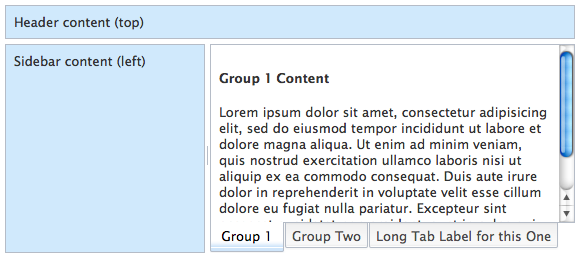
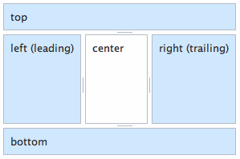
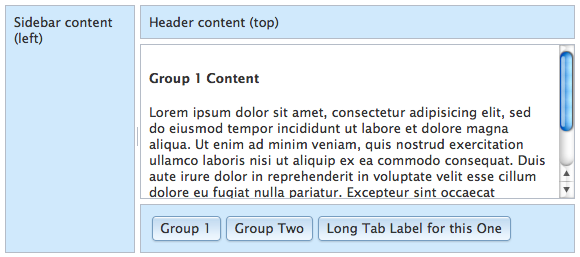

---
Category:  Widgets
...

## Layout with Dijit

Creating dynamic and interactive layouts is a challenge common to any graphical user interface. We have a lot of ability to create layout with HTML and CSS. Where CSS leaves off, Dojo picks up with a set of extensible widgets as a part of Dijit - Dojo's UI framework. In this tutorial, we'll explain how Dijit addresses common layout needs and see how easy it can be to create even complex layouts with just a few flexible widgets.

### Introducing Layout Management

<!-- what is layout management and why do we need to solve it? -->
> "Surely CSS is the language of layout? Why is layout a problem that needs solving by JavaScript and fancy widgets?"

Layout widgets don't replace CSS for general purpose placement and flow of content on the page. Instead, they allow precise placement and management of areas of the page where we want to:

*   Respond to resize events
*   Provide for user control over layout and how the available space is apportioned
*   Adapt controls and/or contents to the currently available horizontal and vertical space

Layout management is the process of actively controlling layout after a page has loaded, and responding to and propagating events, which then drive layout on the page. In Dijit, layout management is accomplished by specialized layout widgets. These are widgets whose primary purpose is to act as a container for one or more content areas or child widgets, and to control the sizing and display of those children.

### Getting Started

You can manage layout of the entire page, or just a small part of it. For this tutorial, we'll be developing a desktop application-like UI layout, with some controls and content being fixed on the page. It should end up looking like this:

[](demo/appLayout.html)

[View Complete Demo](demo/appLayout.html)

Dijit provides a small collection of flexible widgets to meet common layout requirements like this. We'll prepare the ground with some HTML and CSS, then introduce those widgets to build up a typical application layout.

```html
<!DOCTYPE HTML>
<html lang="en">
    <head>
        <meta charset="utf-8">
        <title>Demo: Layout with Dijit</title>
        <link rel="stylesheet" href="style.css" media="screen">
        <link rel="stylesheet" href="//ajax.googleapis.com/ajax/libs/dojo/1.10.3/dijit/themes/claro/claro.css" media="screen">
    </head>
    <body class="claro">
        <div id="appLayout" class="demoLayout">
            <div class="centerPanel">
                <div>
                    <h4>Group 1 Content</h4>
                    <p>Lorem ipsum dolor sit amet, consectetur adipisicing elit, sed do eiusmod tempor incididunt ut labore et dolore magna aliqua. Ut enim ad minim veniam, quis nostrud exercitation ullamco laboris nisi ut aliquip ex ea commodo consequat. Duis aute irure dolor in reprehenderit in voluptate velit esse cillum dolore eu fugiat nulla pariatur. Excepteur sint occaecat cupidatat non proident, sunt in culpa qui officia deserunt mollit anim id est laborum.</p>
                </div>
                <div>
                    <h4>Group 2 Content</h4>
                </div>
                <div>
                    <h4>Group 3 Content</h4>
                </div>
            </div>

            <div class="edgePanel">Header content (top)</div>
            <div id="leftCol" class="edgePanel">Sidebar content (left)</div>
        </div>
        <!-- load dojo and provide config via data attribute -->
        <script src="//ajax.googleapis.com/ajax/libs/dojo/1.10.3/dojo/dojo.js"
                data-dojo-config="async: 1, parseOnLoad: 1">
        </script>
    </body>
</html>
```

The markup has our top, sidebar and center content wrapped in handy divs, and we've got the Dojo `script` tag already in place.
Also in the `<head>` we load the Claro theme stylesheet and our page stylesheet. In the `<body>`, notice the `claro` class which is necessary to apply the Claro CSS theme to the contents. Omitting it is a common gotcha.

The stylesheet has just a few rules that we'll need as we define the layout:

```css
html, body {
    height: 100%;
    margin: 0;
    overflow: hidden;
    padding: 0;
}

#appLayout {
    height: 100%;
}
#leftCol {
    width: 14em;
}

.claro .demoLayout .edgePanel {
    background-color: #d0e9fc;
}

#viewsChart {
	width: 550px;
	height: 550px;
}
```

<!-- protip -->
> All demos shown here also include a demo.css file, which contains a few styles for the body, button, and h1 elements. View the source of any of the demos to see the contents of this file.

To get the desired arrangement and behavior of content regions, we want the layout to fill the viewport. We explicitly set the document and the outermost element to 100% of the viewport height. `overflow: hidden` is used as we don't want a document scrollbar; scrolling will happen as necessary in the different regions of our layout.
We've given the `DIV` that will become the left column a fixed width in `em`s. The other fixed regions will derive their size from their initial content.

### Adding Widgets

To implement the layout, we'll be using three widget classes from Dijit: `dijit/layout/BorderContainer`, `dijit/layout/TabContainer` and `dijit/layout/ContentPane`.
You can see a sampling of the available Dijit widgets on the [Dojo Toolkit "Features" page](/features/desktop).

To get started, let's add a `require` call to load these dependencies.

```js
<script src="//ajax.googleapis.com/ajax/libs/dojo/1.10.3/dojo/dojo.js"
        data-dojo-config="async:true, parseOnLoad:true">
</script>
<script>
    require(["dojo/parser", "dijit/layout/BorderContainer", "dijit/layout/TabContainer",
        "dijit/layout/ContentPane"]);
</script>
```

Notice in the `data-dojo-config` attribute in the Dojo script tag we've set `parseOnLoad` to true. This tells Dojo to run the parser automatically to "widgetize" the elements it finds. Given that we're fully relying on the parser, we have no need for `dojo/domReady!` or anything like that &mdash; we're just loading what we use.

<!-- protip -->
> Notice that we have also explicitly loaded the `dojo/parser` module.
This is of monumental importance; despite popular misconception,
`dojo/parser` does _not_ load automatically when
`parseOnLoad` is set to `true`, and never has.
It happened to "just work" in many cases prior to 1.7 due to how many widgets
loaded `dijit/_Templated` (which loads `dojo/parser`).

The widget classes will now load in the background, and the parser will walk over the DOM. But nothing is actually going to happen yet &mdash; we need to create those layout widgets.

For this example, we'll be using the markup or _declarative_ way of instantiating the widgets. The `data-dojo-` attributes on each element provide instruction for the Dojo parser on what widget class to instantiate, and hold the properties to configure the widget instance with.

```html
<body class="claro">
    <div
            id="appLayout" class="demoLayout"
            data-dojo-type="dijit/layout/BorderContainer"
            data-dojo-props="design: 'headline'">
        <div
                class="centerPanel"
                data-dojo-type="dijit/layout/ContentPane"
                data-dojo-props="region: 'center'">
            <div>
                <h4>Group 1 Content</h4>
                <p>Lorem ipsum dolor sit amet, consectetur adipisicing elit, sed do eiusmod tempor incididunt ut labore et dolore magna aliqua. Ut enim ad minim veniam, quis nostrud exercitation ullamco laboris nisi ut aliquip ex ea commodo consequat. Duis aute irure dolor in reprehenderit in voluptate velit esse cillum dolore eu fugiat nulla pariatur. Excepteur sint occaecat cupidatat non proident, sunt in culpa qui officia deserunt mollit anim id est laborum.</p>
            </div>
            <div>
                <h4>Group 2 Content</h4>
            </div>
            <div>
                <h4>Group 3 Content</h4>
            </div>
        </div>
        <div
                class="edgePanel"
                data-dojo-type="dijit/layout/ContentPane"
                data-dojo-props="region: 'top'">Header content (top)</div>
        <div
            id="leftCol" class="edgePanel"
            data-dojo-type="dijit/layout/ContentPane"
            data-dojo-props="region: 'left', splitter: true">Sidebar content (left)</div>
    </div>
</body>
```

[View Demo](demo/borderContainer.html)

The outer `appLayout` element has been configured as a `BorderContainer`, and the child divs are each `ContentPane`s.
	This gives us a full-screen flexible layout. Go ahead and try resizing your Demo window, to see how the left region stays a fixed width, while the center/right region sizes to fit.
You may also notice a handle on the vertical divider, between the left and center regions, which allows you to manually set their relative widths.

This is what we mean by dynamic and interactive layout. We'll get to adding in the tab-strip shown in the initial demo, but first let's back up and look a bit closer at the individual layout widgets and their use.

### BorderContainer



If you've used layout managers and containers in other GUI toolkits, `dijit/layout/BorderContainer` should be pretty familiar to you, and if not we can soon catch you up.

BorderContainer allows you to define a layout subdivided into regions. The `center` region is always flexible and auto-sized, while the other regions are fixed in size: "`top`", "`bottom`", "`leading`", "`trailing`", "`left`" or "`right`".

All Dijit widgets support internationalization (i18n), so Dijit can't assume left-to-right flow of content and controls on the page. For left-to-right locales, the `leading` section will be on the left, and the `trailing` section on the right. For right-to-left locales (e.g. Arabic, Hebrew), it is reversed. That being said, you can use `left` and `right` as appropriate to ensure that sections are always on the side of your choosing, regardless of locale. Use what fits your content logically.

Each region is represented by a child widget, as we saw in the App Layout example. All Dijit widgets support the `region` property, so in principle, you can use any widget in these positions, though clearly some will work better than others.
The fixed-size regions (all but `center`) can have a end-user-moveable divider associated with them by setting a `splitter` property.

When using BorderContainer, the initial sizes of regions are specified in the normal manner using CSS &mdash; using rules in a stylesheet or as inline style. Note that although you can set an initial size of say, 50%, it will be converted to `px` as it renders, so relative proportions in percentage units are not maintained as the BorderContainer is resized.
	The center region should not be given style height or width; it will always occupy whatever space remains.

Up to now as we've been building our layout, all the regions were `ContentPane`s - a very general purpose content-loading and content-containing widget, but as we saw in the first App Layout where a TabContainer occupied the center region, that needn't be so.
In fact, BorderContainer works quite happily as a region in a BorderContainer. Here's an example of nesting BorderContainers to achieve a more complex layout.

```html
<div class="demoLayout" style="height: 300px; width: 300px" data-dojo-type="dijit/layout/BorderContainer" data-dojo-props="design: 'headline'">
    <div class="centerPanel" data-dojo-type="dijit/layout/ContentPane" data-dojo-props="region: 'center'">center</div>
    <div class="demoLayout" style="height: 50%" data-dojo-type="dijit/layout/BorderContainer" data-dojo-props="region: 'top', splitter: true, design: 'headline'">
        <div class="centerPanel" data-dojo-type="dijit/layout/ContentPane" data-dojo-props="region: 'center'">center</div>
        <div class="edgePanel" data-dojo-type="dijit/layout/ContentPane" data-dojo-props="region: 'bottom'">bottom</div>
    </div>
    <div class="edgePanel" data-dojo-type="dijit/layout/ContentPane" data-dojo-props="splitter: true, region: 'left'">left</div>
    <div class="demoLayout" style="width: 50%" data-dojo-type="dijit/layout/BorderContainer" data-dojo-props="region: 'right', design: 'headline'">
        <div class="centerPanel" data-dojo-type="dijit/layout/ContentPane" data-dojo-props="region: 'center'">center</div>
        <div class="edgePanel" data-dojo-type="dijit/layout/ContentPane" data-dojo-props="region: 'left'">left</div>
    </div>
    <div class="edgePanel" data-dojo-type="dijit/layout/ContentPane" data-dojo-props="splitter: true, region: 'bottom'">bottom</div>
</div>
```

[View Demo](demo/nestedBorderContainer.html)

See the [BorderContainer documentation](/reference-guide/1.10/dijit/layout/BorderContainer.html) for more details on the different options for BorderContainer and its use.

### Making the Tabs

A layout widget's job is to layout and display its contents in the space it has available. Most expect their contents to be one or more child widgets.
A common requirement is to display only one of those child widgets at once, and treat them as a stack that the user can move through. This maximizes the use of space and also allows for interesting possibilities like not loading content until that entry in the stack is selected.
Dijit provides alternatives on this theme, in the form of StackContainer, TabContainer and AccordionContainer.

The layout we are trying to create had each of the different "group" divs displayed as tabbed panels, with a tab strip at the bottom of the center region.
This is a common, intuitive UI pattern dating back to analog filing systems. The `dijit/layout/TabContainer` widget implements this pattern. It represents the child widgets it contains as tabs in the tab strip (the tab controller), and displays their contents one at a time in the remaining space.

```html
<div class="centerPanel"
        data-dojo-type="dijit/layout/TabContainer"
        data-dojo-props="region: 'center', tabPosition: 'bottom'">
    <div
            data-dojo-type="dijit/layout/ContentPane"
            data-dojo-props="title: 'Group 1'">
        <h4>Group 1 Content</h4>
        <p>Lorem ipsum dolor sit amet, consectetur adipisicing elit, sed do eiusmod tempor incididunt ut labore et dolore magna aliqua. Ut enim ad minim veniam, quis nostrud exercitation ullamco laboris nisi ut aliquip ex ea commodo consequat. Duis aute irure dolor in reprehenderit in voluptate velit esse cillum dolore eu fugiat nulla pariatur. Excepteur sint occaecat cupidatat non proident, sunt in culpa qui officia deserunt mollit anim id est laborum.</p>
    </div>
    <div
            data-dojo-type="dijit/layout/ContentPane"
            data-dojo-props="title: 'Group Two'">
        <h4>Group 2 Content</h4>
    </div>
    <div
            data-dojo-type="dijit/layout/ContentPane"
            data-dojo-props="title: 'Long Tab Label for this One'">
        <h4>Group 3 Content</h4>
    </div>
</div>
```

To make the "group" sections tabs in a TabContainer, we first make the containing element a TabContainer. This widget is itself a child of the BorderContainer, so it still needs the `region` property. TabContainer provides a number of options for configuring how the tabs and their content are displayed; here we indicate we want the tab-strip at the bottom by setting the `tabPosition` property.
TabContainer is another _container_ widget - it manages child widgets - so we need to wrap each of our section blocks in a suitable widget. They don't need to do anything fancy, so a ContentPane is a good choice.
Notice that each provides a "`title`" property. The title is what TabContainer uses as the label in the corresponding tab it creates for each child widget.

[View Demo](demo/appLayout.html)

### StackContainer and Friends

The result completes our layout, but to understand how to vary this recipe and make your own layouts - and even your own layout widgets - we need to look under the hood a little.
TabContainer is actually a sub-class of `dijit/layout/StackContainer`; it borrows most of its functionality from StackContainer (which in turn is an extension of `dijit/layout/_LayoutWidget`.)
Where TabContainer is specific about how the panels of content should be arranged and represented, StackContainer is a more general-purpose widget.
There is no intrinsic controller to provide UI to navigate the stack of child widgets, but `dijit/layout/StackController` is available as a simple example. Here's how our layout looks if we swap out the TabContainer for the StackContainer, and put the controller widget in a new `bottom` region.
To get everything to line up, we've also changed the BorderContainer to use the sidebar design layout here.

[](demo/stackContainerAppLayout.html)

[StackContainer Demo](demo/stackContainerAppLayout.html)

Dijit also provides a `dijit/layout/AccordionContainer` that drops in as easily, and in `dojox/layout` there are other StackContainer subclasses that may fit your requirements. Similarly, our vanilla `ContentPane` can be replaced with a `dojox/layout/ExpandoPane` to provide for collapsible panels in a layout.
As always, it's worth familiarizing yourself with the options provided to you before you start thinking about customizing.

### Startup and Resize

So far we've been happily assembling layouts in markup, and leaning on the Dojo parser to coordinate instantiation and the startup sequence for us.
That gets you a long way and might be all you ever need to really know about layout with Dijit. However, if you need to create and insert widgets programmatically, that voodoo won't do.
We need to understand a bit more about how and when layout happens.

Let's review. We know that:

*   Creating widgets involves a sequence of well defined steps
*   Layout is intrinsically linked to the measurement of available space
*   A widget's `domNode` can't be guaranteed to be in the DOM until `startup` happens
*   Layout widgets actively lay out their child widgets

When creating widgets programmatically, we have to complete the sequence by calling the `startup` method.
This step includes anything that can only happen once a widget is in the DOM - which includes measurement and sizing.
Layout widgets will call `startup` on their children, so it's sufficient to start the ball rolling from the top-most widget.

By definition, all layout widgets have a `resize` method.
This method gets called during startup, and also whenever there's a change that might require adjustment of dimensions - such as a window resize, or adding a new child widget.
Like `startup`, `resize` also propagates down a hierarchy, allowing each widget in a layout to adjust, and pass along new dimensions to its children.

With this in mind, lets look at some code. Here's the basic outline:

```html
<head>
    <script src="//ajax.googleapis.com/ajax/libs/dojo/1.10.3/dojo/dojo.js"
        data-dojo-config="async:1">
    </script>
    <script>
    require(["dijit/registry", "dijit/layout/BorderContainer",
            "dijit/layout/TabContainer", "dijit/layout/ContentPane", "dojo/domReady!"],
        function(registry, BorderContainer, TabContainer, ContentPane){
            // create the main appLayout BorderContainer
            // create the TabContainer
            // create the BorderContainer edge regions
        });
    </script>
</head>
<body class="claro">
    <div id="appLayout" class="demoLayout"></div>
</body>
```

Here we've omitted `parseOnLoad`, which defaults to false; the gloves are off. Instead, we use `dojo/domReady!` which will wait for the DOM to load.

```js
// create the BorderContainer and attach it to our appLayout div
var appLayout = new BorderContainer({
	design: "headline"
}, "appLayout");

// create the TabContainer
var contentTabs = new TabContainer({
	region: "center",
	id: "contentTabs",
	tabPosition: "bottom",
	"class": "centerPanel"
});

// add the TabContainer as a child of the BorderContainer
appLayout.addChild( contentTabs );

// create and add the BorderContainer edge regions
appLayout.addChild(
	new ContentPane({
		region: "top",
		"class": "edgePanel",
		content: "Header content (top)"
	})
);
appLayout.addChild(
	new ContentPane({
		region: "left",
		id: "leftCol", "class": "edgePanel",
		content: "Sidebar content (left)",
		splitter: true
	})
);

// Add initial content to the TabContainer
contentTabs.addChild(
	new ContentPane({
		href: "contentGroup1.html",
		title: "Group 1"
	})
);

// start up and do layout
appLayout.startup();
```

[View Demo](demo/programmaticLayout.html)

Each widget is instantiated with the equivalent properties we were defining before in the `data-dojo-props` attributes.
Rather than the implicit containment we get from the markup, each widget is explicitly added to its parent using its `addChild` method.
<p>Notice that only when all the widgets are added does the startup method of the appLayout get called.
Until startup happens, `addChild` simply registers the widget as a child. After startup, `addChild` represents a potential layout change, so it would trigger `resize` on the parent, and all other children.

We can see this in action, by adding a new child after the layout is rendered. Here's a quick function to test that:

```js
function addTab(name) {
	var pane = new ContentPane({
		title: name,
		content: "<h4>" + name + "</h4>"
	});
	// add the new pane to our contentTabs widget
	registry.byId("contentTabs").addChild(pane);
}
```

[View Demo](demo/addTabs.html)

### Conclusion

We've looked at the building blocks Dijit provides to create dynamic layouts and how they can be snapped together using the declarative markup style, as well as creating them programmatically.
This approach allows you the full range of options for how you define and assemble your UIs. You'll find the same flexibility as we explore more of Dijit. We can multiply our options further by creating our own layout widgets, building on the infrastructure Dijit provides. These are topics for future tutorials.