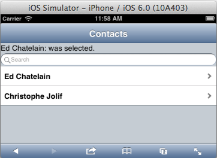

---
Category:  dojox/app
...

## Getting Started with dojox/app

In this tutorial, we will cover how to use dojox/app and dojox/mobile to create a simple one page Contacts List Application.

### About dojox/app

**dojox/app** is an extensible, configuration based, application framework which is built on Dojo.
**dojox/app** helps application developers create applications more quickly, increases maintainability and
reduces coding effort by providing:

*   Support for a predefined JSON-based configuration file
*   A typical application structure
*   A set of application controllers that the application can leverage or extend, including layout and transition controllers
*   A notion of views, with view templates, and view controllers in addition to the application controllers
*   A build system to bundle your application with a limited set of files to be downloaded or installed onto the system

The documentation for dojox/app can be found here:

*   [Dojo Reference Guide section for dojox/app](http://dojotoolkit.org/reference-guide/1.10/dojox/app.html)
*   [Dojo API Guide](http://dojotoolkit.org/api/)
*   [Run the dojox/app tests here](http://download.dojotoolkit.org/release-1.10.4/dojo-release-1.10.4/dojox/app/tests/)
*   [View the dojox/app tests source here](https://github.com/dmachi/dojox_application/tree/dojo19/tests)

Even though dojox/app is built on top of Dojo, it is UI Toolkit agnostic.  The application views can be developed with:

*   Dijit
*   Dojo Mobile
*   Any other JavaScript/HTML5 toolkit like jQuery Mobile

dojox/app works well with dojox/mvc

*   dojox/app includes support for creating [dojox/mvc](http://dojotoolkit.org/reference-guide/dojox/mvc.html) models via the JSON Config, and accessing those models from the views
*   Since dojox/mvc is still experimental we will not be using it in this tutorial

### Contacts Data Structure

Before starting on the application let's see how the **Contacts List Application data** will be structured.
	We chose this data structure because it is a subset of the contacts data structure
	used by [Cordova/PhoneGap](http://docs.phonegap.com/en/2.8.0/cordova_contacts_contacts.md.html#Contacts).
	The data will include an array of contacts with the following:

*   **"id"**: a unique id
*   **"name"**: which includes sub-fields of **"givenName"** and **"familyName"**
*   **"displayName"**: which is created by joining the **"givenName"** and **"familyName"**
*   **"emails"**: an array which contains entries which include sub-fields of **"type"** and **"value"**
*   **"phoneNumbers"**: an array which contains entries which include sub-fields of **"type"** and **"value"**

### The Contacts List Application


The **Contacts List Application** on an **iPhone** iOS Simulator.



The **Contacts List Application** has the following file structure:

```
/contactsList/
		contacts.js
		contacts.json
		contacts.php
		/views/
			list.html
			list.js
```

### The main HTML file

The main HTML file includes the Dojo Mobile CSS.

```html
<script src="{path-to-dojox}/dojox/mobile/deviceTheme.js">

</script>
```

The main HTML file loads dojo.js

```html
<script src="{path-to-dojo}/dojo/dojo.js" data-dojo-config= "async: true">

</script>
```

The main HTML file loads the main application module.

```html
<script>
require(["contactsList/contacts"]);

</script>
```

### The JSON configuration file

The JSON Configuration file contains the following:

*   An application ID
*   A set of application controllers
*   A set of application dependencies
*   A set of views with:
	*   Templates (View rendering)
	*   Controllers (View controllers)
	*   View Translation Files
	*   Possibly custom parameters
*   A set of data stores that can be shared at application level or specific to a view

See the dojox/app documentation for more information about the [JSON configuration](http://dojotoolkit.org/reference-guide/dojox/app.html#the-configuration-file).

<!-- protip -->
> The JSON configuration can leverage ["dojo/has"](http://dojotoolkit.org/reference-guide/dojo/has.html) support
to use different sections of configuration based on the targeted platform or other "dojo/has" features.

### The JSON configuration file for the **Contacts List Application**

<!-- protip -->
> The JSON configuration for the Contacts List Application is named contacts.json, it includes the dependencies, controllers, store,
defaultView and the list view, as follows:

<!-- highlight: [2,3,10,16,17,56,57] -->
```js
{
	"id": "contactsApp",
	"dependencies": [
		"dojo/store/Observable",
		"dojox/mobile/Heading",
		"dojox/mobile/ScrollableView",
		"dojox/mobile/ToolBarButton",
		"dojo/store/Memory"
	],
	"controllers": [
		"dojox/app/controllers/Load",
		"dojox/app/controllers/Transition",
		"dojox/app/controllers/Layout"
	],
	"defaultView": "list",
	"stores": {
		"contacts": {
			"type": "dojo/store/Memory",
			"observable": true,
			"params": {
				"data": [
					{
						"id": "1",
						"displayName": "Ed Chatelain",
						"name": {
							"givenName": "Ed",
							"familyName": "Chatelain"
						},
						"emails": [
							{
								"type": "home",
								"value": "me@myhome.com"
							}
						],
						"phoneNumbers": [
							{
								"type": "home",
								"value": "10-20-30-40"
							},
							{
								"type": "work",
								"value": "11-22-33-44"
							}
						],
						"organizations": []
					},
					{
						"id": "2",
						"displayName": "Christophe Jolif",
						:   :   :
					}
				]
			}
		}
	},
	"views": {
		"list": {
			"controller": "contactsList/views/list",
			"template": "contactsList/views/list.html"
		}
	}
}
```

### The main module for the application

The main module (contacts.js) will load the configuration file using "dojo/text", and instantiate the application using the parsed JSON config.

<!-- highlight: [4] -->
```js
define(["dojo/json", "dojo/text!contactsList/contacts.json",
	"dojox/app/main"],
	function(json, config, Application){
		Application(json.parse(config));
});
```

### The "list" view

The **"list"** view includes a template, and a controller.

The **"list" view template** (list.html) contains:

*   A dojox/mobile/Heading.
*   A div used to show which item was selected.
*   A dojox/mobile/EdgeToEdgeStoreList with a dojox/mobile/FilteredListMixin.
*   The contacts list store comes from stores defined in the JSON config which are accessed by name via the views loadedStores.
*   displayName is used as the labelProperty to match the data in the store.
*   The ContactListItem defined in the view controller is used as the itemRender to set the "clickable" property true.

<!-- highlight: [2,6,7,8,10,11,12] -->
```html
<div class="mblBackground">
    <div data-dojo-type="dojox/mobile/Heading"
        data-dojo-props="fixed: 'top'">
        Contacts
    </div>
    <div id="selectionMade">None selected.</div>
    <div data-dojo-type="dojox/mobile/EdgeToEdgeStoreList"
            data-dojo-mixins="dojox/mobile/FilteredListMixin"
            data-dojo-attach-point="contacts"
            data-dojo-props="store: this.loadedStores.contacts,
                            labelProperty: 'displayName',
                            itemRenderer: this.ContactListItem,
                            placeHolder: 'Search', stateful: false">
    </div>
</div>
```

The **"list" view controller** (list.js):

*   The **ContactListItem** is used to set clickable property true for the items shown in the list, so the arrow will be displayed.
*   The **init** function is only called when the view is loaded for the first time.
*   The init function will watch for clicks on the contacts list and use dom.byId and innerHTML to set the text to indicate which item was clicked.

<!-- highlight: [4,9,10,11,12] -->
```js
define(["dojo/_base/declare", "dojo/dom", "dojox/mobile/ListItem",
	"dojox/mobile/EdgeToEdgeStoreList", "dojox/mobile/FilteredListMixin"],
	function(declare, dom, ListItem){
	var ContactListItem = declare(ListItem, {
		clickable: true
	});

	return {
		ContactListItem: ContactListItem,
		init: function(){
			this.contacts.on("click", function(e){
				dom.byId("selectionMade").innerHTML = e.target.innerHTML + ": was selected.";
			});
		}
	};
});
```

[Run the Contacts List Application App](demos/contactsList/contacts.html)

<a href="https://github.com/edchat/dojox_app_tutorial/tree/master/contactsList/demos/contactsList" class="button">View the Contacts List Application source on github</a>

### Conclusion

In this tutorial, we've learned how to build a simple one page Contacts List Application with dojox/app.
In the next part of this series we will create a Details View, and add support to Edit, Add, and Delete contacts.

### The dojox/app Contacts Application Series
1.   [Getting Started with dojox/app](../contactsList)
1.   [Updating the Contacts App for a Phone](../contactsPhone)
1.   [Updating the Contacts App for a Tablet](../contactsTablet)
1.   [Using dojox/app Build and Cordova](../contactsCordova)