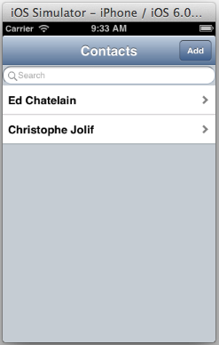
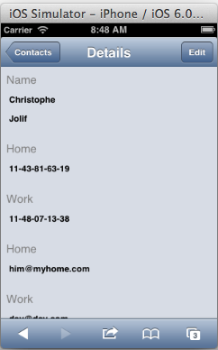
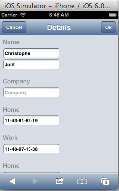

---
Category:  dojox/app
...

## Updating the Contacts App for a Phone

In the previous tutorial, [Getting Started with dojox/app](/documentation/tutorials/1.10/dojox_app/contactsList/),
we created a simple Contacts List Application using the `dojox/app` library.
This tutorial will use a phone form factor and two views, the "list" view from the previous tutorial and a new "details" view.

### The Views

The **Contacts Application** will include two views.  The first view will include the filtered
**list of contacts** from the previous tutorial and the second view will show the **details of a contact** in
either "View" or "Edit" mode.



This is how the **Details View of the Contacts Application** will look on an iPhone iOS Simulator.

 &nbsp; 

In addition to support for the Details view we will also add:

*   Support to **"Add", "Edit" and "Delete"** a contact.
*   Support to **Transition** from the **list** view to the **details** view and back.
*   **History** support for using the browser's back button, using **"has"** based config support.
*   **NLS** support for translated strings for the application and for each of the views.

The **Contacts Application** will have the following file structure:

```
/contactsAppPhone/
		contacts.css
		contacts.js
		contacts.json
		contacts.php
		/nls/
			contacts.js
			details.js
			list.js
			/fr/
				contacts.js
				details.js
				list.js
		/views/
			details.html
			details.js
			list.html
			list.js
```

### The CSS file for the application.

Create the application CSS file and add it to the main HTML file.

To add it to the the main HTML file:

```html
<link rel="stylesheet" href="contacts.css">
```

The **application CSS** (contacts.css) includes CSS related to the following:

*   Making the labels gray and the text fields bold.
*   In "View" mode the CSS will set the background color and border width of the text fields to make it obvious that the fields are not editable.
*   In "View" mode the CSS will be used to hide the labels and fields for empty fields.

The CSS file looks like this:

<!-- highlight: [11,12,16,20,21] -->
```css
.hidden {
	display: none !important;
}

.mblFormLayout {
	margin: 8px;
	background-color: rgba(0, 0, 0, 0);
}

.mblFormLayout > * > *:first-child {
	font-weight: normal;
	color: gray;
}

.mblFormLayoutReadOnly .readOnlyHidden {
	display: none !important;
}

.mblFormLayoutReadOnly .mblTextArea {
	background-color: rgba(0, 0, 0, 0);
	border-width: 0px;
}
.android_theme .mblFormLayoutReadOnly .mblTextArea {
	background-color: #d3d3d3;
}

.mblFormLayout .mblTextArea {
	font-weight: bold;
}
```

### The NLS files for the application.

The nls files **(contacts.js, details.js, and list.js)** include the following:

<!-- highlight: [1,9,30] -->
```js
/// (contacts.js)
	define({
		root: {
			contacts: "Contacts"
		},
		fr: true
	});
```

```js
/// (details.js)
	define({
		root: {
			home: "Home",
			work: "Work",
			cell: "Cell",
			name: "Name",
			first: "Firstname",
			last: "Lastname",
			company: "Company",
			details: "Details",
			mail: "E-mail",
			phone: "Phone",
			edit: "Edit",
			cancel: "Cancel",
			ok: "Ok",
			remove: "Delete the contact"
		},
		fr: true
	});
```

```js
/// (list.js)
	define({
		root: {
			search: "Search",
			add: "Add"
		},
		fr: true
	});
```

### The JSON configuration file

The JSON configuration file (contacts.json) is updated to add the following:

*   The "nls" files for the application and the views.
*   The "defaultTransition" for the application.
*   The **details** view controller, template and nls configuration.
*   The **"has"** checks and configuration for the history support.

<!-- highlight: [1,2,7,9,10,11,12,15,16,21] -->
```js
	"nls": "contactsAppPhone/nls/contacts",
	"defaultTransition": "slide",
	"views": {
		"list": {
			"controller": "contactsAppPhone/views/list",
			"template": "contactsAppPhone/views/list.html",
			"nls": "contactsAppPhone/nls/list"
		},
		"details": {
			"controller": "contactsAppPhone/views/details",
			"template": "contactsAppPhone/views/details.html",
			"nls": "contactsAppPhone/nls/details"
		}
	},
	"has": {
		"html5history": {
			"controllers": [
				"dojox/app/controllers/History"
			]
		},
		"!html5history": {
			"controllers": [
				"dojox/app/controllers/HistoryHash"
			]
		}
	}
```

### The main module of the application

The main module (contacts.js) is updated to define the configuration flags needed by the configuration file
	using **has** support to add the setting for **html5history**.

<!-- highlight: [8] -->
```js
// we use 'define' and not 'require' to workaround Dojo build system
// limitation that prevents from making of this file a layer if it
// using 'require'
define(["dojo/sniff", "dojo/json",
	"dojo/text!contactsAppPhone/contacts.json", "dojox/app/main"],
	function(has, json, config, Application){

	 has.add("html5history", !has("ie") || has("ie") > 9);
	 Application(json.parse(config));

});
```

### The **"list"** view

The **"list" view template** (list.html) is updated to:

*   Include an **Add** button in the dojox/mobile/Heading.
*   Use the **nls** strings for the "heading" text, "Add" button text and the "Search" string.
*   Set the Add button **"target"** property to "details" in order to transition to the "details" view when add is clicked.
*   Set the Add button **"transitionOptions"** property to use "edit: true" so that the details
	view will use "Edit" mode when adding an item.

<!-- highlight: [4,5,9,17] -->
```html
<div class="mblBackground">
    <div data-dojo-type="dojox/mobile/Heading"
         data-dojo-props="fixed: 'top'">
        ${nls.contacts}
        <button data-dojo-type="dojox/mobile/ToolBarButton"
                style="position: absolute; right: 0"
                data-dojo-props="target: 'details',
                    transitionOptions: { params: { edit: true } }"
                data-dojo-attach-point="add">${nls.add}</button>
    </div>
    <div data-dojo-type="dojox/mobile/EdgeToEdgeStoreList"
            data-dojo-mixins="dojox/mobile/FilteredListMixin"
            data-dojo-attach-point="contacts"
            data-dojo-props="store: this.loadedStores.contacts,
                labelProperty: 'displayName',
                itemRenderer: this.ContactListItem,
                placeHolder: '${nls.search}', stateful: false">
    </div>
</div>
```

The **"list" view controller** (list.js) is updated to:

*   Set **target: "details"** property on ContactListItem which causes the transition to the
	"details" view when an item is selected.
*   Add a **postMixInProperties function** on ContactListItem to set the params of the transitionOptions with the item's id.
*   Remove the **init** function which was used to watch for clicks on the contacts list and use
	dom.byId and innerHTML to set the text to indicate which item was clicked, but it is no longer needed since the transition
	to the "details" view will be done when the item is clicked.

<!-- highlight: [6,8,10,12] -->
```js
define(["dojo/_base/declare", "dojo/has",
	"dojox/mobile/ListItem", "dojox/mobile/EdgeToEdgeStoreList",
	"dojox/mobile/FilteredListMixin"],
	function(declare, has, ListItem){
	var ContactListItem = declare(ListItem, {
		target: "details",
		clickable: true,
		postMixInProperties: function(){
			this.inherited(arguments);
			this.transitionOptions = {
				params: {
					"id" : this.id
				}
			}
		}
	});

	return {
		ContactListItem: ContactListItem
	};
});
```

### The **"details"** view

The "details" view (details.html) template's **Heading** has a label set with the nls string for "Details" and includes these ToolBarButtons:

*   A **Back** button which is used to transition back to the "list" view.
	*   The **Back** button sets the **"arrow"** property to "left" in order to look like a "back" button,
		and it uses the nls string for "Contacts" as it's label.
	*   The **Back** button sets the **"target"** property to "list" in order to transition
		back to the "list" view when clicked.
	*   The **Back** button is shown in "View" mode, and it is hidden in "Edit" mode.
*   A **Cancel** button which is used to cancel out of "Edit" mode, and switch back to "View" mode.
	*   The **Cancel** button sets a **"target"** property to "details" along with transitionOptions
	to indicate that "edit" is false in order to stay on the "details" view but to change back to "View" mode.
	*   The **Cancel** button is shown in "Edit" mode, and it is hidden in "View" mode.
*   An **Edit** button which is used to change from "View" mode to "Edit" mode.
	*   In "View" mode the **Edit** button is shown with a label of "Edit" and the button is used to change to "Edit" mode.
	*   In "Edit" mode the label is changed to **Ok** and the button is used to save the updates, and change back to "View" mode.
	*   The **Edit** button sets a **"target"** property to "details" in order to stay on the "details" view and the transitionOptions are set in the view controller (details.js) to change to "Edit" or "View" mode as needed.

<!-- highlight: [4,5,7,9,11,12,13,15,17,19,20] -->
```html
<div data-dojo-type="dojox/mobile/Heading"
    data-dojo-props="fixed: 'top'">
    <button data-dojo-type="dojox/mobile/ToolBarButton"
            data-dojo-attach-point="backButton"
            data-dojo-props="arrow: 'left', target: 'list'"
            style="position: absolute; left: 0"
            class="backButton">${nls.contacts}</button>
    <button data-dojo-type="dojox/mobile/ToolBarButton"
            data-dojo-attach-point="cancelButton"
            style="position: absolute; left: 0; display: 'none'"
            data-dojo-props="target: 'details',
                transitionOptions: { params: { edit: false } }">
        ${nls.cancel}
    </button>
    ${nls.details}
    <button data-dojo-type="dojox/mobile/ToolBarButton"
            data-dojo-attach-point="editButton"
            style="position: absolute; right: 0"
            data-dojo-props="target: 'details',
                transitionOptions: { params: { } }"></button>
</div>
```

The **"details" view template** (details.html) also includes:

*   A dojox/mobile/ScrollableView with a dojox/mobile/FormLayout, and labels and fields for:
	*   Name (first name, and last name). Shown below.
	*   Company. Shown below.
	*   Home and Work Phone. Not shown below, very similar to "Company".
	*   Home and Work Email. Not shown below, very similar to "Company"
	*   Delete button The Delete button is only available in Edit mode. Shown below.

<!-- highlight: [7,12,22,34] -->
```html
<div data-dojo-type="dojox/mobile/ScrollableView">
    <div data-dojo-type="dojox/mobile/FormLayout"
            data-dojo-attach-point="formLayout">
        <div>
            <label for="firstname">${nls.name}</label>
            <fieldset>
                <input id="firstname" name="firstname"
                        data-dojo-type="dojox/mobile/TextArea"
                        data-dojo-props="readOnly: true,
                                placeHolder: '${nls.first}'"
                        data-dojo-attach-point="firstname">
                <input id="lastname" name="lastname"
                        data-dojo-type="dojox/mobile/TextArea"
                        data-dojo-props="readOnly: true,
                                placeHolder: '${nls.last}'"
                        data-dojo-attach-point="lastname">
            </fieldset>
        </div>
        <div>
            <label for="company">${nls.company}</label>
            <fieldset>
                <input id="company" name="company"
                        data-dojo-type="dojox/mobile/TextArea"
                        data-dojo-props="readOnly: true,
                                placeHolder: '${nls.company}'"
                        data-dojo-attach-point="company">
            </fieldset>
        </div>
        <!-- Home Phone, Work Phone, Home Email and Work Email would
                be here but are not shown to save space.
        -->
        <div>
            <div></div>
            <button data-dojo-type="dojox/mobile/Button"
                    data-dojo-attach-point="deleteButton"
                    data-dojo-attach-event="onClick: _deleteContact"
                    class="mblRedButton" style="padding: 0 10px">
                ${nls.remove}
            </button>
        </div>
    </div>
</div>
```

#### The **"details"** view controller

The **"details" view controller** (details.js) is large because it is responsible for most of the work
	in the Contacts application.

*   The **"beforeActivate"** function in a view is called each time a view is transitioned to.  The "beforeActivate" function
	in the "details" view controller calls "_beforeActivate".
	*   "_beforeActivate" determines if we are in "Edit" mode or "View" mode, and sets up the buttons, domNodes and handlers accordingly.
	*   "_beforeActivate" determines the "id" of the selected contact, and gets the data for the contact from the contacts store using
		the view's loadedStores property and the contact's "id".
	*   "_beforeActivate" initializes the form with the values from the selected contact's data.
	*   "_beforeActivate" calls "_hideEmptyFields" to hide the form fields which do not have a value set when in "View" Mode.
*   The **"_saveForm"** function in the "details" view controller is called when the "Ok" button is clicked in "Edit" mode.
	*   "_saveForm" creates a promise named "_savePromise" to return the contact after the save is completed.  This promise
	is used in "beforeActivate" to be sure the save is completed before calling "_beforeActivate" to update the form data from the store.
	*   "_saveForm" calls "_createContact" if the contact does not exist, which is indicated by the "id" being "undefined".
	*   If the "id" is set, "_saveForm" calls "_saveContact" to update the contact with the latest input from the form.
	*   After the "_saveForm" call is complete "put" is called on the contacts store to update the contact in the store, and
		when the "put" is complete "resolve" is called for the "_savePromise".
	*   The view template will cause a transition when the "Ok" button is clicked. This transition causes
		"beforeActivate" to be called which will switch back to "View" mode.
*   The **"_createContact"** function in the "details" view controller is called when the "Ok" button is clicked for a new contact.
	*   "_createContact" creates an empty contact and calls "_saveContact(contact)" to update empty Contact with the latest
		input from the form.
	*   "_createContact" also calls "add" on the store to add the new contact to the store, and resolves the "_savePromise"
		which was setup by "_saveForm" and is used in "beforeActivate".
*   The **"_saveContact"** function in the "details" view controller is called from "_saveForm" or "_createContact"
	when the "Ok" button is clicked in order to update the contact with the latest changes from the form.
	*   "_saveContact" will update the first and last names, and combine them to update the display name, it will also update the company.
	*   "_saveContact" uses a loop and a DATA_MAPPING object to update the home and work phone and emails.
*   The **"_hideEmptyFields"** function in the "details" view controller is called from "_beforeActivate"
	when not in "Edit" mode, in order to hide the fields which are not set.
	*   "_hideEmptyFields" uses "dojo/query" to find any form fields which are currently hidden, and removes the class
	which is used to hide the fields.
	*   "_hideEmptyFields" uses "dojo/query" again to find any input fields in the form which do not have a value, and
	adds the class which is used to hide the fields to the node's parent.
*   The **"_deleteContact"** function in the "details" view controller is called from the view template
	when the "Delete" button is clicked.
	*   "_deleteContact" will access the contacts store with the loadedStores on the view, and call remove to delete the contact from the store.
    *   "_deleteContact" will use access the app from the view, and use the app to call "transitionToView" to transition back to the "list" view after the contact is deleted.

<!-- highlight: [30,36,38,41,52,54,61,62,74,82,87,88,92,96,103,104,114,116,119,160,165,169,173,175,177,181,189,199,203,208,215,220,231,233,247,248,250,252,258,264,266,269] -->
```js
define(["dojo/_base/array", "dojo/_base/lang", "dojo/has", "dojo/when",
	"dojo/Deferred", "dojo/query", "dojo/dom-class", "dijit/registry",
	"dojox/mobile/Button", "dojox/mobile/FormLayout",
	"dojox/mobile/TextArea"],
	function(array, lang, has, when, Deferred, query, domClass,
			 registry){

	var DATA_MAPPING = {
		"phonehome": "phoneNumbers.home",
		"phonework": "phoneNumbers.work",
		"mailhome": "emails.home",
		"mailwork": "emails.work"
	};

	var getStoreField = function(arr, type){
		var index = array.indexOf(arr, function(item){
			return (item.type == type);
		});
		if(index == -1){
			// create one
			arr.push({
				type: type
			});
			index = arr.length - 1;
		}
		return arr[index];
	};

	return {
		beforeActivate: function(){
			// in case we are still under saving previous
			// modifications, let's wait for the operation
			// to be completed and use the resulting
			// contact as input
			var view = this;
			when(view._savePromise, function(contact){
				view._savePromise = null;
				view._beforeActivate(contact);
			});
		},
		_beforeActivate: function(contact){
			// get the id of the displayed contact from the params if
			// we don't have a contact or from the contact if we have
			// one
			if(contact){
				this.params.id = contact.id;
			}
			var id = this.params.id;

			// are we in edit mode or not? if we are we need to
			// slightly update the view for that
			var edit = this.params.edit;
			// are we in create mode
			var create = (typeof id === "undefined");
			// change widgets readonly value based on that
			query("input", this.domNode).forEach(function(node){
				registry.byNode(node).set("readOnly", !edit);
			});
			// in edit mode change the label and params of the
			// edit button
			this.editButton.set("label",
				edit?this.nls.ok:this.nls.edit);
			// put a listener to save the form when we are editing if
			// there is not one already
			if(!this._onHandler && edit){
				this._onHandler = this.editButton.on("click",
					lang.hitch(this, this._saveForm));
			}else if(this._onHandler && !edit){
				this._onHandler.remove();
				this._onHandler = null;
			}
			var editButtonOptions =
				this.editButton.transitionOptions;
			editButtonOptions.params.edit = !edit;
			// also update the edit & ok button to reference the
			// currently displayed item
			editButtonOptions.params.id = id;
			var cancelButtonOptions =
				this.cancelButton.transitionOptions;
			if(create){
				// if we cancel we want to go back to main view
				cancelButtonOptions.target = "list";
				if(cancelButtonOptions.params.id){
					delete cancelButtonOptions.params.id;
				}
			}else{
				cancelButtonOptions.target = "details";
				cancelButtonOptions.params.id = id;
			}
			// hide back button in edit mode
			if(edit){
				domClass.add(this.backButton.domNode, "hidden");
				domClass.remove(this.formLayout.domNode,
					"mblFormLayoutReadOnly");
			}else{
				domClass.remove(this.backButton.domNode, "hidden");
				domClass.add(this.formLayout.domNode,
					"mblFormLayoutReadOnly");
			}
			// cancel button must be shown in edit mode only,
			// same for delete button if we are not creating a
			// new contact
			this.cancelButton.domNode.style.display = edit?"":"none";
			this.deleteButton.domNode.style.display =
				(edit&&(typeof id !== "undefined"))?"":"none";

			// let's fill the form with the currently selected contact
			// if nothing selected skip that part
			var view = this;
			var promise = null;
			if(!create && !contact){
				id = id.toString();
				// get the contact on the store
				promise = this.loadedStores.contacts.get(id);
			}else{
				promise = contact;
			}
			when(promise, function(contact){
				view.firstname.set("value",
					contact ? contact.name.givenName : null);
				view.lastname.set("value",
					contact ? contact.name.familyName : null);
				if(contact && contact.organizations &&
					contact.organizations.length){
					view.company.set("value",
						contact.organizations[0].name);
				}else{
					view.company.set("value", null);
				}
				// reset binding fields
				for(var key in DATA_MAPPING){
					view[key].set("value", null);
				}
				if(contact){
					// set each phone number to the corresponding form
					// field
					array.forEach(contact.phoneNumbers,
						function(number){
						// for now we just skip non supported
						// fields, ideally we should have a generic
						// mechanism to deal with them
						var phonekey = "phone"+number.type;
						if(view[phonekey]){
							view[phonekey].set("value", number.value);
						}
					});
					// set each mail field to the corresponding form
					// field
					array.forEach(contact.emails, function(mail){
						// for now we just skip non supported
						// fields, ideally we should have a generic
						// mechanism to deal with them
						var mailkey = "mail"+mail.type;
						if(view[mailkey]){
							view[mailkey].set("value", mail.value);
						}
					});
					// hide empty fields when not in edit mode
					if(!edit){
						view._hideEmptyFields(view);
					}
				}
			});
		},
		_saveForm: function(){
			var id = this.params.id, view = this;
			view._savePromise = new Deferred();
			if(typeof id === "undefined"){
				view._createContact();
			}else{
				// get the contact on the store
				var promise =
					this.loadedStores.contacts.get(id.toString());
				when(promise, function(contact){
					view._saveContact(contact);
					// save the updated item into the store
					when(view.loadedStores.contacts.put(contact),
						function(savedContact){
							// some store do return a contact some
							// other an ID
							view._savePromise.resolve(
								savedContact == id ?
									contact:savedContact);
						}
					);
				});
			}
		},
		_createContact: function(){
			var contact = {
				"id": (Math.round(Math.random()*1000000)).toString(),
				"name": {},
				"displayName": "",
				"phoneNumbers": [],
				"emails": [],
				"organizations": []
			};
			var view = this;
			this._saveContact(contact);
			when(this.loadedStores.contacts.add(contact),
				function(savedContact){
					// some store do return a contact some other an ID
					view._savePromise.resolve(savedContact ==
						contact.id ? contact : savedContact);
				}
			);
		},
		_saveContact: function(contact){
			// set back the values on the contact object
			var value, keys;
			// deal with name first
			var displayName = "";
			value = this.firstname.get("value");
			if(typeof value !== "undefined"){
				contact.name.givenName = value;
				displayName += value;
			}
			value = this.lastname.get("value");
			if(typeof value !== "undefined"){
				contact.name.familyName = value;
				displayName += " " + value;
			}
			contact.displayName = displayName;
			value = this.company.get("value");
			if(typeof value !== "undefined"){
				if(!contact.organizations){
					contact.organizations = [{}];
				}else if(contact.organizations.length == 0){
					contact.organizations.push({});
				}
				contact.organizations[0].name = value;
			}
			for(var key in DATA_MAPPING){
				value = this[key].get("value");
				if(typeof value !== "undefined"){
					// there is a value, save it
					keys = DATA_MAPPING[key].split(".");
					if(contact[keys[0]] == null){
						contact[keys[0]] = [];
					}
					getStoreField(contact[keys[0]],
						keys[1]).value = value;
				}
			}
		},
		_hideEmptyFields: function(view){
			query(".readOnlyHidden",
				view.formLayout.domNode).forEach(function(node){
				domClass.remove(node, "readOnlyHidden");
			});
			query("input",
				view.formLayout.domNode).forEach(function(node){
				var val = registry.byNode(node).get("value");
				if(!val && node.parentNode.parentNode &&
					node.id !== "firstname" &&
					node.id !== "lastname"){
						domClass.add(node.parentNode.parentNode,
							"readOnlyHidden");
				}
			});

		},
		_deleteContact: function(){
			var view = this;
			when(this.loadedStores.contacts.remove(
				this.params.id.toString()), function(){
				// we want to be back to list
				view.app.transitionToView(view.domNode, {
					target: "list" });
			});
		}
	}
});
```

[Run the Contacts Application](demos/contactsAppPhone/contacts.html)

[View the contactsAppPhone source on github](https://github.com/edchat/dojox_app_tutorial/tree/master/contactsPhone/demos/contactsAppPhone)

### Conclusion

In this tutorial, we've learned how to update the Contacts List Application to add a Details View, along with
support to Add, Edit and Delete contacts.  The next step will be to use a two column layout on a tablet.

### The dojox/app Contacts Application Series
1.   [Getting Started with dojox/app](../contactsList)
1.   [Updating the Contacts App for a Phone](../contactsPhone)
1.   [Updating the Contacts App for a Tablet](../contactsTablet)
1.   [Using dojox/app Build and Cordova](../contactsCordova)