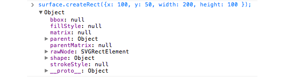
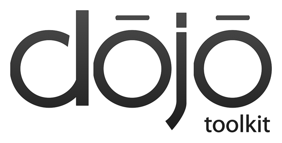

---
Category:  Widgets
...

## Vector Graphics with Dojo's GFX

Vector graphics can have many advantages, including flawless scaling with maximum portability.
The problem with vector graphic creation is that it can be difficult&mdash;but not so with Dojo's GFX library.
GFX provides a simple and flexible API (along with other utilities) for creating, animating, and managing amazing vector graphics.

### Getting Started

[Vector graphics](http://en.wikipedia.org/wiki/Vector_graphics)&mdash;the use of geometric "primitives" or
shapes&mdash;is a time-honored way of creating images by using mathematical formulae to describe how to render something;
unlike raster-based images (such as PNG and JPG files), which use a two dimensional array of colors.  Often
vector-based images (such as those made with a program like Illustrator or InkScape) are more efficient because
they are not rendered until the viewing device interprets the math behind it.

There are several advantages to using vector graphics as opposed to fixed JPG/GIF images:

*   **Seamless Scalability**: no loss of quality when enlarging or shrinking;
*   **Portability**: vector graphics are easily portable and may be rendered in many formats (SVG, Canvas, VML, etc.);
*   **Programmable**: you don't need to be a Photoshop or Illustrator expert to quickly create vector graphics.

<!-- protip -->
> Vector graphics have been in use for a long time; one of the most common examples is the use of [PostScript](http://en.wikipedia.org/wiki/PostScript)
to describe how to print something.

The Dojo Toolkit features `dojox/gfx` (GFX), a vector graphic creation library capable of creating extremely powerful
vector graphics.  Features of GFX include:

*   Works on almost all devices
*   Can render images (including charts) with SVG, VML, Silverlight, or Canvas.
*   Evaluates the client and uses whichever renderer will work most efficiently
*   Allows for the developer to decide which renderer to use
*   Allows for linear and radial gradients within shapes (and even works in Internet Explorer!)

<!-- protip -->
> `dojox/gfx` also includes experimental SVG rendering for older versions of Internet Explorer
through the use of the [SVGWeb](http://code.google.com/p/svgweb/) project.

GFX was created to accomplish visual tasks that are not easily accomplished with basic CSS and HTML, all while avoiding
Flash and keeping the API simple.

### Creating an Image using `dojox/gfx`

The following is a general timeline for the creation of most vector graphics:

1.  Create the surface (or "canvas")
2.  Create the shapes (paths, lines, rectangles, text, etc.)
3.  Create groups of shapes (grouping shapes together)
4.  Animate shapes or groups of shapes (transform, scale, etc.)
5.  Add shape events

To use the GFX library, there's one simple resource to `require`:

```js
require("dojox/gfx", function(gfx) {

});
```

If a specific rendering priority is preferred, it may be added to the `dojoConfig` object that is created before loading Dojo:

```html
<script>
    dojoConfig = {
        async: true,
        gfxRenderer: "svg,silverlight,vml" // svg gets priority
    };
</script>
<script src="/path/to/dojo/dojo.js"></script>
```

With GFX available within the page, let's explore each part of a GFX graphic timeline, focusing on both the concepts and the syntax.

### Creating the Surface

We consider the surface to be the "canvas" of the graphic; it hosts all of the graphic's shapes. To create a surface, simply code:

```html
<script>
    // Create a GFX surface
    // Arguments:  node, width, height
    require(["dojox/gfx", "dojo/domReady!"], function(gfx) {
        gfx.createSurface("surfaceElement", 400, 400);
    });
</script>

<!-- DOM element which will become the surface -->
<div id="surfaceElement"></div>
```

That's all that's needed to create the surface!  Each rendering engine (SVG, VML) will generate its own code.  For example, the SVG renderer will output:

```html
<svg width="400" height="400"><defs></defs></svg>
```

...while the VML rendering engine will output:

```html
<group style="position: absolute; width: 400px; display: inline-block; height: 400px">
    <rect style="width: 400px; height: 400px; top: 0px; left: 0px"/>
</group>
```

...and the Canvas engine will render:

```html
<canvas width="400" height="400"></canvas>
```

<!-- button for example links -->
[View Demo](demo/surface.html)

### Creating Shapes

With a surface created, the next step is creating shapes.  GFX provides many shapes, including:

*   **[Rect](/api/?qs=1.10/dojox/gfx/shape.Rect)**: A basic rectangle
*   **[Circle](/api/?qs=1.10/dojox/gfx/shape.Circle)**: A basic circle
*   **[Ellipse](/api/?qs=1.10/dojox/gfx/shape.Ellipse)**: A basic ellipse, more flexible than a circle
*   **[Line](/api/?qs=1.10/dojox/gfx/shape.Line)**: A basic line
*   **[PolyLine](/api/?qs=1.10/dojox/gfx/shape.Polyline)**: A multi-point line
*   **[Image](/api/?qs=1.10/dojox/gfx/shape.Image)**: The Image shape allows for loading of bitmap images
*   **[Text](/api/?qs=1.10/dojox/gfx/shape.Text)**: Allows for creation of text
*   **[TextPath](/api/?qs=1.10/dojox/gfx/path.TextPath)**: A shape that flows text along an arbitrary path. TextPath properties are based on the text shape properties
*   **[Path](/api/?qs=1.10/dojox/gfx/path.Path)**: Most versatile geometric shape, which can emulate all other geometric shapes

<!-- protip -->
> Text support within the Canvas rendering engine was added in Dojo 1.6&mdash;which is especially useful, since Android does not
presently support SVG.

`dojox/gfx` has implemented a factory pattern for shape creation. Creating a shape is as easy
as `gfx.create_ShapeName_(properties)`.  For example, creating a rectangle would look like:

```js
// Create a basic 200px wide, 100px tall rectangle at position 100x, 50y
var rectangle = surface.createRect({ x: 100, y: 50, width: 200, height: 100 });
```

When a shape is created, Dojo generates the the necessary objects within the rendering environment and provides references to them
for future modification and management.  The method from above returns the following object:



Rectangle shape properties

Any number of shapes can be created on a given surface.  Let's create a series of shapes:

```js
// Create a GFX surface
// Arguments:  node, width, height
var surface = gfx.createSurface("surfaceElement", 400, 400);

// Create a rectangle
surface.createRect({ x: 100, y: 50, width: 200, height: 100 })
	.setFill("yellow")
	.setStroke("blue");

// Add a circle
surface.createCircle({ cx: 100, cy: 300, r:50 })
	.setFill("green")
	.setStroke("pink");

// Now an ellipse
surface.createEllipse({ cx: 300, cy: 200, rx:50, r:25 })
	.setFill("#fff")
	.setStroke("#999");

// And a line
surface.createLine({ x1: 10, y1: 50, x2:400, y2:400 })
	.setStroke("green");

// How about a polyline?
surface.createPolyline([
	{x: 250, y: 250},
	{x: 300, y: 300},
	{x: 250, y: 350},
	{x: 200, y: 300},
	{x: 110, y: 250}
]).setStroke("blue");

// Add in an image
surface.createImage({
	x:100, y:300, width: 123, height: 56, src: "../images/logo.png"
});

// With some text
surface.createText({ x: 64, y: 220, text: "Vector Graphics Rock!", align: "start" })
	.setFont({ family: "Arial", size: "20pt", weight: "bold" }) //set font
	.setFill("blue");

// And an advanced textpath
var textShape = surface.createTextPath({ text: "TextPath!" })
	.moveTo(125, 70)
	.lineTo(285, 20)
	.setFont({ family: "Verdana", size: "2em" })
	.setFill("black");

// And a simple path
surface.createPath("m100 100 100 0 0 100c0 50-50 50-100 0s-50-100 0-100z")
	.setStroke("black");
```

[View Demo](demo/shapes.html)

<!-- protip -->
> Each shape type has its own creation properties; visit the [dojox/gfx](/reference-guide/1.10/dojox/gfx.html)
reference guide to see options for your specific shape.  Note also that Path shapes use the
[SVG Path syntax](http://www.w3.org/TR/SVG/paths.html) when using a string as the main argument.

Shapes generated by `dojox/gfx` also include numerous methods for modification.  A few key methods include:

*   **applyTransform**: Allows for transforming of a shape (scaling and skewing, for example)
*   **getFill/setFill**: Get and set fill colors
*   **getStroke/setStroke**: Get and set stroke colors
*   **moveToBack/moveToFront**: Moves shapes based on "z-indexing"

More details about these methods will be provided later within this tutorial.

<!-- protip -->
> Moving shapes from back to front (and vice-versa) is not quite the same as the `z-index` in CSS; it depends on the rendering engine
being used to draw the shapes.

### Styling Shapes

Creating shapes is easy, but more important than creating the shape is making it look good.  The shape objects created by
`dojox/gfx` provides a number of methods to change fill, stroke, and font properties.  These methods allow the
developer to style a shape to their heart's content.

#### Filling a Shape

The `setFill` method allows for a named color, hex color, linear gradient, or radial gradient to color (or fill) a shape.

```js
// Create a circle with a set "blue" color
surface.createCircle({ cx: 50, cy: 50, rx:50, r:25 }).setFill("blue");

// Crate a circle with a set hex color
surface.createCircle({ cx: 300, cy: 300, rx:50, r:25 }).setFill("#f00");

// Create a circle with a linear gradient
surface.createRect({ x: 180, y: 40, width: 200, height: 100 }).
setFill({ type:"linear",
	x1:0,
	y1:0,   //x: 0=&gt;0, consistent gradient horizontally
	x2:0,   //y: 0=&gt;420, changing gradient vertically
	y2:420,
	colors: [
		{ offset: 0,   color: "#003b80" },
		{ offset: 0.5, color: "#0072e5" },
		{ offset: 1,   color: "#4ea1fc" }
	]
});

// Create a circle with a radial gradient
surface.createEllipse({
	cx: 120,
	cy: 260,
	rx: 100,
	ry: 100
}).setFill({
	type: "radial",
	cx: 150,
	cy: 200,
	colors: [
		{ offset: 0,   color: "#4ea1fc" },
		{ offset: 0.5, color: "#0072e5" },
		{ offset: 1,   color: "#003b80" }
	]
});
```
[View Demo](demo/fills.html)

<!-- protip -->
> The `colors` array accepts objects with `offset` and `color` keys.  The `offset` property represents a number between 0 and 1, and the `color` property represents the color at that offset.  You may provide any number of `colors` objects.

#### Setting a Stroke on a Shape

The `setStroke` method styles the shape's stroke (like a border or outline).  The `setStroke` method accepts a color string (hex, named color, rgb, etc.)  or an object with more specific stroke properties:

```js
// Create a GFX surface
// Arguments:  node, width, height
var surface = gfx.createSurface("surfaceElement", 400, 400);

// Create a rectangle with a basic black border
surface.createRect({x: 100, y: 50, width: 200, height: 100 }).setStroke("#000");

// Create a circle with a 3-pixel dotted red border
surface.createCircle({ cx: 300, cy: 300, rx: 50, r: 25 }).setStroke({
	style: "Dot", width: 3, cap: "round", color: "#f00"
});

// Create a circle with a 3-pixel dotted red border
surface.createCircle({ cx: 150, cy: 250, rx: 100, r: 50 }).setStroke({
	style: "Dash", width: 3, cap: "butt", color: "#00f"
});
```

Properties may include:

*   **style**: the style of the line (solid, dotted, dashed)
*   **width**: the width of stroke in pixels
*   **color**: the stroke's color
*   **cap**: the shape of the end of the stroke

[View Demo](demo/strokes.html)

#### Choosing a Font

Both the Text and TextPath shapes allow for a specific font family, size, and weight.  Usage of `setFont` is easy:

```js
// Create the initial text, set the font to 20pt Arial Bold, and fill it blue
surface.createText({ x: 64, y: 220, text: "This is my text", align: "start"}).
setFont({ family: "Arial", size: "20pt", weight: "bold" }).
setFill("blue");
```

The font properties are formatted and work very much like CSS properties you use every day!

### Grouping Shapes Together

Individual shapes may be "glued" together in groups, so that the shapes within a group can be treated like they are a single shape.
Groups are especially important when animating related shapes and attaching events to said shapes.  The best thing about using groups is
that they feature the same animation methods as individual shapes:

```js
// Create a GFX surface
// Arguments:  node, width, height
var surface = gfx.createSurface("surfaceElement", 400, 400);

// Create a group
var group = surface.createGroup();

// Add a shape directly to the group instead of the surface
var rectShape = group.createRect({ x: 0, y: 0, width: 200, height: 100 })
	.setFill("#0000ae");
```

Shapes can also be added to the group at any time:

```js
// Create the shape on the surface
var rectShape = shape.createRect({ x: 0, y: 0, width: 200, height: 100 })
	.setFill("#0000ae");

// Move it to the group!
group.add(rectShape);
```

Groups are especially useful when creating moveable shapes:

```js
// Require the resource
require("dojox/gfx", "dojox/gfx/Moveable", function(gfx, Moveable) {

	// Make all shapes within the group move together!
	new Moveable(group);

});
```

The above snippet allows users to click and hold any shape within the group to move every shape in the group around.

[View Demo](demo/moveable.html)

### Animations and Transformations

The real power of the GFX library lies within its animation capabilities.  GFX's animations are extremely powerful and smooth,
and capable of many animations&mdash;including simple stroke and fill animations, scaling, rotating, and skewing.  The `dojox/gfx/fx`
resource was created to allow for both simple and complex animations.

The first step in creating GFX animations is requiring the resource:

```js
// Require the powerful gfx.fx resource
require(["dojox/gfx", "dojox/gfx/fx"], function(gfx, gfxFx) {

});
```

<!-- protip -->
> Transform capabilities are hosted by each individual shape, so no additional resources are required for scaling, skewing, etc.

#### Fill, Stroke, and Font Animations

The `dojox/gfx/fx` resource provides `animateFill`, `animateFont`, and `animateStroke`
methods for easy animation of each shape property:

```js
// Create a circle, a dojox/gfx.fx instance, play it immediately
var circle = surface.createCircle({ cx: 50, cy: 50, rx: 50, r: 25 })
	.setFill("blue");
gfxFx.animateFill({
	shape: circle,
	duration: 500,
	color: { start: "blue", end: "green" }
}).play();

// Create a rectangle, animate its stroke
var rectangle = surface.createRect({ x: 100, y: 50, width: 200, height: 100 })
	.setStroke("yellow");
gfxFx.animateStroke({
	shape: rectangle,
	duration: 500,
	color: { start: "yellow", end: "pink" },
	width: { end: 15 },
	join:  { values: ["miter", "bevel", "round"] }
}).play();

// Create text, animate it
var text = surface.createText({
	x: 64, y: 220, text: "Vector Graphics Rock!", align: "start"
}).setFont({ family: "Arial", size: "20pt", weight: "bold" })
	.setFill("red");
gfxFx.animateFont({
	shape: text,
	duration: 500,
	variant: { values: ["normal", "small-caps"] },
	size:  { end: 10, units: "pt" },
	color: "green"
}).play();
```

Each method has its own properties relative to the property (stroke, fill, text) being changed.  Also note that gradient
backgrounds cannot be animated;  solid colors are animated flawlessly.

[View Demo](demo/animate-fill.html)

#### Rotating a Shape

Shape rotation is also incredibly easy with GFX's animation API.  The `rotateAt` and `rotategAt`
animations allow for rotating shapes or groups of shapes around a given center-point.  The `gfxFx.animateTransform`
method will assemble the animation, and the play method will start it.

```js
// Create a group
var group = surface.createGroup();

// Create a circle
var circle1 = group.createCircle({ cx: 100, cy: 300, r: 50 }).setFill("green");
var circle2 = group.createCircle({ cx: 100, cy: 100, r: 50 }).setFill("blue");
var circle3 = group.createCircle({ cx: 300, cy: 300, r: 50 }).setFill("black");
var circle4 = group.createCircle({ cx: 300, cy: 100, r: 50 }).setFill("yellow");

// Create an animation of the group
var animation = new gfxFx.animateTransform({
    duration: 700,
    shape: group,
    transform: [{
        name: "rotategAt",
        start: [0, 200, 200], // Starts at 0 degree rotation at center-point 200x200
        end: [360, 200, 200]  // Ends at 360 degrees
    }]
});

// Showtime!
animation.play();
```

The `transform` property passed to `gfxFx.animateTransform` allows for any number of animations to be added.

[View Demo](demo/rotate.html)

<!-- protip -->
> If you are wondering why there are `rotateAt` and `rotategAt` methods, it is because geometry with
JavaScript is usually _radian_-based; but most developers find it easier to think in terms of _degrees_. Both
rotate a shape around a specific point on the surface.

#### Scaling and Skewing

The process of shrinking, enlarging, and skewing GFX graphics is simple.  Use the `gfx.matrix.scale` method to scale
the image, providing `x` and `y` values for the amount to scale on each axis:

```js
// Double the size of the shape
shapeGroup.applyTransform(gfx.matrix.scale({ x: 2, y: 2 }));

// Shrink the shape to half size
shapeGroup.applyTransform(gfx.matrix.scale({ x: 2, y: 0.5 }));
```

The `applyTransform` method of a shape is used to perform the transformation.  The graphic will be flawlessly resized!
Skewing (transforming or moving points of a shape along a single axis) is just as easy:

```js
// Skews the group at -20 degrees
shapeGroup.applyTransform(gfx.matrix.skewYg(-20));
```

[View Demo](demo/scale.html)

<!-- protip -->
> The `gfx.matrix` resource contains numerous helpers to invert, rotate, scale, and skew shapes so that you don't
need to know the complex math equations behind setting up any shape modifications or transformations.

### Events

Events are particularly important in `dojox/gfx` as they allow for triggering movement and display changes within groups.
Many of the [charting plugins](../charting) are triggered by events on GFX-created shapes.  You can add events to GFX-created nodes or groups using `shape.on and group.on`, which extends `dojo/on`.

#### shape.on

The `shape.on` method works very much like a native event handler.  Provide a shape and event type:

```js
// Add a circle
var circle = group.createCircle({ cx: 100, cy: 300, r: 50 })
	.setFill("green").setStroke("pink");

// Add a click event to the circle to change its fill!
circle.on("click", function(e) {
	circle.setFill("red");
});
```

#### group.on

The `group.on` method of GFX groups allows for `dojo/on`-style event listeners:

```js
// Get the eventSource to find out what element the event occurred on
group.on("click", function(e) {
    //our shape was clicked, now do something!
}, true);
```

The event object is very much like a standard DOM event object.  The `target` property provides the GFX-generated DOM element which was clicked.

[View Demo](demo/events.html)

<div class="proTip">

<!-- protip -->
> The Silverlight rendering engine supports the following events: `onclick`, `onmouseenter`, `onmouseleave`, `onmousedown`, `onmouseup`, `onmousemove`, `onkeydown`, and `onkeyup`. If you want to target the broadest range of renderers, you are advised to restrict yourself to
this list of events.

</div>

### Create the Dojo Logo with GFX

If we have the Dojo Toolkit logo in an SVG format, the path information describing the shapes of that logo can be extracted and used to
create a GFX-based image.  The following is a portion of that SVG file:

```html
<svg version="1.1" id="Layer_1" xmlns="http://www.w3.org/2000/svg" xmlns:xlink="http://www.w3.org/1999/xlink" x="0px" y="0px" width="1100px" height="700px" viewBox="0 0 1100 700" enable-background="new 0 0 1100 700" xml:space="preserve">
    <g>
        <g>
            <path fill="#010101" d="M826.698,536.736v11.722h12.71v6.758h-12.71v26.25c0,6.065,1.718,9.483,6.659,9.483    c2.427,0,3.834-0.203,5.147-0.61l0.406,6.759c-1.721,0.621-4.439,1.211-7.876,1.211c-4.145,0-7.466-1.404-9.575-3.729    c-2.429-2.729-3.442-7.062-3.442-12.82v-26.555h-7.576v-6.756h7.576v-8.996L826.698,536.736z"/>
            <path fill="#010101" d="M868.708,598.43c-13.119,0-23.418-9.695-23.418-25.142c0-16.354,10.801-25.938,24.225-25.938    c14.039,0,23.525,10.196,23.525,25.036c0,18.175-12.623,26.05-24.229,26.05h-0.103V598.43L868.708,598.43z M869.115,591.764    c8.481,0,14.846-7.975,14.846-19.089c0-8.267-4.146-18.686-14.643-18.686c-10.396,0-14.931,9.694-14.931,18.976    c0,10.717,6.052,18.783,14.638,18.783h0.09V591.764L869.115,591.764z"/>
            <path fill="#010101" d="M924.162,598.43c-13.119,0-23.406-9.695-23.406-25.142c0-16.354,10.801-25.938,24.213-25.938    c14.039,0,23.517,10.196,23.517,25.036c0,18.175-12.611,26.05-24.216,26.05h-0.106L924.162,598.43L924.162,598.43z     M924.574,591.764c8.487,0,14.834-7.975,14.834-19.089c0-8.267-4.129-18.686-14.638-18.686c-10.395,0-14.94,9.694-14.94,18.976    c0,10.717,6.063,18.783,14.643,18.783h0.103L924.574,591.764L924.574,591.764z"/>

            <!-- more SVG below this shape... -->

        </g>
    </g>
</svg>
```

Judging by the SVG above, it's easy to deduce that:

*   The canvas is approximately 1100 pixels wide and 700 pixels tall.
*   The letters should be drawn with paths (`surface.createPath`)
*   The fill color of each letter (per the logo) is `#010101`.  This example will use a gradient fill, however.

Using the path information in the logo is simple:

```js
// Arguments:  node, width, height
var surface = gfx.createSurface("surfaceElement",1100,700);

// Regular fill
var regularFill = { type: "linear", x1: 0, y1: 0, x2: 0, y2: 900, colors: [{ offset: 0, color: "#555" }, { offset: 1, color: "#000"}] };

// Create group too contain each letter of "toolkit"
var tkGroup = surface.createGroup();

// Tiny letter "t" in "toolkit"
var letterToolkitT = tkGroup.createPath("M826.698,536.736v11.722h12.71v6.758h-12.71v26.25c0,6.065,1.718,9.483,6.659,9.483    c2.427,0,3.834-0.203,5.147-0.61l0.406,6.759c-1.721,0.621-4.439,1.211-7.876,1.211c-4.145,0-7.466-1.404-9.575-3.729    c-2.429-2.729-3.442-7.062-3.442-12.82v-26.555h-7.576v-6.756h7.576v-8.996L826.698,536.736z").setFill(regularFill).setStroke("#000");

// "o"
var letterToolkitO1 = tkGroup.createPath("M868.708,598.43c-13.119,0-23.418-9.695-23.418-25.142c0-16.354,10.801-25.938,24.225-25.938    c14.039,0,23.525,10.196,23.525,25.036c0,18.175-12.623,26.05-24.229,26.05h-0.103V598.43L868.708,598.43z M869.115,591.764    c8.481,0,14.846-7.975,14.846-19.089c0-8.267-4.146-18.686-14.643-18.686c-10.396,0-14.931,9.694-14.931,18.976    c0,10.717,6.052,18.783,14.638,18.783h0.09V591.764L869.115,591.764z").setFill(regularFill).setStroke("#000");

// More "letter" shapes here...
```

When all of the paths are drawn to the surface, the following vector graphic will be created:

[](demo/logo.html)

GFX logo created from SVG paths

When the information describing the Dojo Toolkit logo is loaded, it may be converted to any of the supported renderers effortlessly by
changing GFX's default rendering engine order.  The graphic shapes and properties may also be animated or modified as desired.
[This demo](demo/logo.html) uses many of the animation techniques described in this tutorial to modify and animate the
Dojo Toolkit logo.

[View Demo - Dojo Logo](demo/logo.html)

[View Demo - London Ajax Logo](demo/london.html)

<!-- tutorials end with a "Conclusion" block -->

### Conclusion

Dojo's GFX library provides the ability to create simple vector graphics or more complex vector graphic groups. The Dojo Toolkit's
[advanced charting](../charting) and drawing libraries are based on the power of GFX.  No matter what your medium, the Dojo
Toolkit provides an easy to use API for creating, animating, and managing your vector graphics!

### GFX Resources

Looking for more detail about Dojo's GFX library? Check out these great resources:

*   [GFX Resource Guide](/reference-guide/1.10/dojox/gfx.html)
*   [Dive Into Dojo GFX](http://www.sitepen.com/blog/2010/12/30/dive-into-dojo-gfx/)
*   [GFX API Documentation](/api/?qs=1.10/dojox/gfx)
*   [GFX FX API Documentation](/api/?qs=1.10/dojox/gfx/fx)
*   [GFX Animations Matrix API Documentation](/api/?qs=1.10/dojox/gfx/matrix)
*   [GFX Tests](http://download.dojotoolkit.org/release-1.10.3/dojo-release-1.10.3/dojox/gfx/tests/)