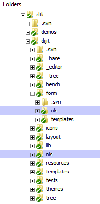

## Internationalization with the Dojo Toolkit

In this tutorial, you'll learn how the Dojo Toolkit supports internationalization (i18n), including the use
of dictionaries for string substitution, and how basic locale formatting for things such as Date
objects, numbers and currencies are supported.

### Getting Started

Creating a web application for a specific target market is usually a daunting task, but libraries such as the Dojo Toolkit
ease that task by providing tools to [quickly](../dijit_layout/ "Layout with Dijit")
[assemble](../themes_buttons_textboxes/ "Themes, Buttons, and Textboxes") [user](../dialogs_tooltips/ "Dialogs &amp; Tooltips")
[interfaces](../understanding_widgetbase/ "Understanding _WidgetBase") (i.e. Dijit), supporting code to ease
[the pain](../dom_functions/ "DOM Functions") [of cross-browser](../arrays/ "Arrays Made Easy")
[compatibility](../ajax/ "Ajax"), and [various add-ons/plug-ins](../datagrid/ "DataGrid")
for specific functionality such as the [DojoX Charting package](../charting/ "Charting").

No such toolkit would be complete without the ability to _localize_ an application—in other words, the ability for
an application to be presented using language based on the location of the application's user.  The Dojo Toolkit provides this
ability for application developers through the use of **[dojo/i18n](/reference-guide/1.10/dojo/i18n.html)**.

#### A Short History

In software development, two terms are used when discussing the ability to display application elements based on a user's locale:
_internationalization_ (or **i18n**) and _localization_ (or **L10n**).  While many use
these terms interchangeably, there is a subtle difference between the two:

*   An application is considered _localized_ when language elements are _hard-coded_ or built directly into the executable;
*   An application is considered _internationalized_ when the _preparation_ of language elements are built into the executable;

in this case, it means that specific language elements _are not substituted until run-time_.

> If you are wondering where "i18n" and "l10n" come from, it is an old computer science tradition that lists the number
of letters in the term that are abbreviated, and is wrapped with the first and last letters of the term.  The capital "L" for localization is normally
used to distinguish the term from _i18n_. A good explanation of the concept and differences can be
[found at Wikipedia](http://en.wikipedia.org/wiki/I18n).

Because applications built using the Dojo Toolkit are dynamic in nature (i.e. compiled and executed at run-time), they are considered
to be _internationalized_ and not localized.

Internationalization with the Dojo Toolkit takes two forms: the ability to define _resource bundles_ that can be loaded
based on a user's locale, and special built-in i18n facilities based on the [Unicode CLDR](http://cldr.unicode.org)
for dates, numbers and currencies.

### Locales with the Dojo Toolkit

In order for an application to know what resources it may need to use for i18n, a _locale_ must first be defined.

#### What are locales?

**Locales** are a short string, based on [a language](http://en.wikipedia.org/wiki/ISO_639) code and
[a country](http://en.wikipedia.org/wiki/ISO_3166-1_alpha-2) code, separated by a dash.  For example, the locale
for a typical user in the United States is _en-us_.

*   Normally, the locale is determined for a browser during the browser's installation, and cannot be easily configured.

When loading a Dojo Toolkit-based application, the user's locale is detected automatically and can be found programmatically
through the `dojo/locale` property.  This is the normal usage scenario; however, there may be times (particularly
when testing your application with resource bundles) where you would like to specify a locale.

#### Specifying a locale

If you need to specify a locale, you may do so by setting a `locale` property on the
[Dojo configuration object](/reference-guide/1.10/dojo/_base/config.html#dojo-config), like
so:

```js
//  before dojo.js is loaded
var dojoConfig = {
	locale: 'pt-pt'
};
```

```html
<!-- or in the script tag: -->
<script src="path/to/dojo.js" data-dojo-config="locale:'pt-pt'"></script>
```

You should always include the full locale (i.e. language + country) when specifying a locale, even though many resource
bundles are defined by language only (as you'll see later on).

> Once a Dojo Toolkit-based application is loaded, it is not possible to change the locale.

> When using the `dojo/parser`, the `lang=` setting on an ancestor DOMNode overrides the `dojoConfig.locale` setting. This behavior will change in Dojo 2.0. You can also specify the `lang `for individual widgets, overriding the `dojoConfig.locale` setting for only that widget.

#### Including extra locales

There may be times when you want to include more than one locale-specific resource—for instance, if you need
to display date resources in more than one language.  While this is not the normal use-case, the Dojo Toolkit allows
you to include more locale-based resources through the use of the `extraLocale` property of the Dojo
configuration object, like so:

```js
//  before dojo.js is loaded
var dojoConfig = {
    locale: "pt-pt",
    extraLocale: ["zh-cn","zh-tw"]
};
```

```html
<!-- or in the script tag -->
<script src="path/to/dojo.js" data-dojo-config="locale:'pt-pt',extraLocale:['zh-cn','zh-tw']"></script>
```

These extra locales can be passed into methods such as `dojo/date/format`, or optionally used with specific
Dijits by setting the `lang` attribute/property when instantiating them.

### Resource Bundles

A **resource bundle** is a file containing a JavaScript object literal (or dictionary) of terms used by your
application code for a specific locale.  When a user's locale is detected (and `dojo/i18n` is required), you can
use the i18n facilities within the Dojo Toolkit to load the resource bundle for a specific locale.  For example, here is the
Japanese resource bundle for Dijit's `ValidationTextBox` widget:

```js
define({
	invalidMessage: "入力した値は無効です。",
	missingMessage: "この値は必須です。",
	rangeMessage: "この値は範囲外です。"
});
```

There are a few things to note here about the structure of this resource bundle:

*   The _fields_ of the bundle correspond to fields that are referenced within `dijit/form/ValidationTextBox`
(for instance, `myValidationWidget.invalidMessage`);
*   **Not** all fields need to be defined in a specific resource bundle;
*   Not all language/country combinations need to be defined.

Let's take a look at how to create a resource bundle, as part of a larger set of resource bundles.

#### Creating resource bundles

The first step in creating resource bundles is to create a subdirectory called **nls** where your code lives,
like so:



> Note that the directory **must** be named "nls", and must be a subdirectory of the code that will be using it.
In our example above, we have i18n directories for both the root of Dijit (i.e. for any widget that lives directly under
the `dijit` namespace) and for `dijit.form`.

Inside the `nls` directory for your namespace, you'll add both individual files and directories based on either
the international language code, or the full locale (such as _pt-pt_):


The name of each resource bundle does not matter, though by convention it should be close to the purpose of it.  For example,
in our screen shot above, there are three main resource bundles in the root of `/nls`: _ComboBox.js_,
_Textarea.js_ and _validate.js_.  The first two resource bundles are aimed at a specific widget, while the last
is intended for use by any validation widget.

The resource bundles in the root of the `/nls` folder are intended to be _master_ bundles; what this means
is that _any and all properties to be consumed must be defined within these files_.  The reason for this is because the
"master" bundle is the **fallback** for when a particular property does not exist in a specific language-based
resource bundle.  For example, if your master resource bundle defines a property called `message` but the locale
resource `fr` does not define it, the value of `message` in the master resource bundle will be used
in its place—in other words, when a locale is detected and a resource bundle is loaded, the locale-specific bundle will
be _mixed into_ the master bundle.

> You do **not** have to create locale-specific bundles for all possible languages/locales; in the case that a
locale is detected but no locale-specific resource exists, the master bundle will be used in full.

In your language or locale directory, create identically named resource bundles as the master bundles; in each locale-specific
bundle, define whatever properties you will be using in your code.

Finally, in your master bundle (the main one in the root of the `/nls` folder), add properties matching each locale
you've defined and set the value of each to **true**.  As an example, here is the master bundle for the `validate.js`
resource, followed by our localized Japanese version:

```js
//	the master bundle, from dijit/form/nls/validate.js:
define({
	root: {
		invalidMessage: "The value entered is not valid.",
		missingMessage: "This value is required.",
		rangeMessage: "This value is out of range."
	},
	"zh": true,
	"zh-tw": true,
	"tr": true,
	"th": true,
	"sv": true,
	"sl": true,
	"sk": true,
	"ru": true,
	"ro": true,
	"pt": true,
	"pt-pt": true,
	"pl": true,
	"nl": true,
	"nb": true,
	"ko": true,
	"kk": true,
	"ja": true,
	"it": true,
	"hu": true,
	"he": true,
	"fr": true,
	"fi": true,
	"es": true,
	"el": true,
	"de": true,
	"da": true,
	"cs": true,
	"ca": true,
	"ar": true
});

//	our localized Japanese resource, from
//	dijit/form/nls/ja/validate.js:
define({
	invalidMessage: "入力した値は無効です。",
	missingMessage: "この値は必須です。",
	rangeMessage: "この値は範囲外です。"
});
```

Notice that in the "master" bundle, the properties to be referenced in application code are declared on the
**root** property, while the localized Japanese version defines the properties at the top level of the object.
You **must** follow this form for i18n to work correctly.

#### Consuming resource bundles

To consume resource bundles in your application code, you'll rely on the `dojo/i18n` module along
with two basic constructs: the `dojo/i18n!` plug-in and `i18n.getLocalization` (from `dojo/i18n`).
These two methods work hand-in-hand; `dojo/i18n!` fetches and assembles the locale-specific
bundle, and `getLocalization` returns the JavaScript object literal fully assembled.

Both `dojo/i18n!` and `i18n.getLocalization` have the same method signature:
the main namespace under which the resource bundles live, and the name (without the `.js` extension)
of the bundle to load.  In addition, `i18n.getLocalization` can take one more argument: the locale
of the resource bundle to load.  Here's how the resources are loaded within `dijit/form/ValidationTextBox`:

```js
//	at the top of ValidationTextBox.js:
"dojo/i18n", // to require i18n.getLocalization
"dojo/i18n!./nls/validate" // to require form validation internationalization

//	later on, in the declaration of the widget:
postMixInProperties: function(){
	this.inherited(arguments);
	this.messages = i18n.getLocalization("dijit.form", "validate", this.lang);
	this._setConstraintsAttr(this.constraints);
```

[View Demo](demo/)

You'll see that `i18n.getLocalization` returns a JavaScript object, which we assign to the property
`messages`; we then read that object to populate the properties of the widget that require
localization.

> You'll note that these localized properties are set in the `postMixInProperties` method
of `dijit/form/ValidationTextBox`; this is the proper place to set up your i18n within any
custom widget code.  See [Understanding _WidgetBase](../understanding_widgetbase/) for more information.

#### Working with resource bundles in alternative file locations

For resources located outside the default location specified by Dojo, we may define packages which enable Dojo to find the resources.

The `registerModulePath` can be used to indicate where to load the resources. For Dojo 1.7+, the packages configuration may also be applied.
Here is the example of how to define a package:

```js
var dojoConfig = {
	async: false,
	parseOnLoad: true,
	packages: [
		{
			name: "resource",
			location: "../bundles/messages"
		}
	]
};
```

The example above uses a relative path. However, you may choose to use absolute path as well. After the path
is assigned to "resource", we can load the resources using

```js
require(["dojo/i18n", "resource"], function(i18n, resource){
    var bundle = i18n.load(resource, "sample");
});
```

Note that `dojoConfig` has to be set before loading dojo.js. Visit the [Configuring Dojo
with dojoConfig](../dojo_config/) tutorial for more details.

#### Creating builds with resource bundles

A typical step in deploying a Dojo Toolkit-based application is to [create
a build](../build/) of your application; a build minifies your JavaScript, inlines HTML and CSS, and generally makes your
application run much more efficiently.  The [Dojo Build Tool](../build/) also
provides ways of flattening your resource bundles through the command line parameter `localeList`.

Normally you won't need to include this command line parameter to create your build; by default, the following list
of locales is included:

```
	"en-gb,en-us,de-de,es-es,fr-fr,it-it,pt-br,ko-kr,zh-tw,zh-cn,ja-jp"
```
However, if your application needs more than these locales defined, you can write your own comma-delimited list
as the value of the `localeList` parameter.

> A common "gotcha" when creating internationally-aware applications is to forget to copy over any `/nls`
directories to your Dojo Toolkit release.  If you create a build and run into errors loading the application the
first time, it is likely that some `/nls` directories were not copied during the course of the build process;
to fix simply copy the missing directories into your release, in the appropriate spots.

### Dates, Numbers and Currencies in the Dojo Toolkit

Internationalization in a toolkit would not be complete without the ability to parse and format dates, numbers and currency
in locale-specific formats. The Dojo Toolkit provides this functionality with `dojo/date/locale`,
`dojo/number` and `dojo/currency`.

> You can learn more about working localization and dates specifically in the [Dojo Date tutorial](../dojo_date/).

#### Locale-aware dates with the Dojo Toolkit

As with our resource bundles, `dojo/date/locale` provides locale-specific formatting and parsing of dates,
like so:

```js
//	with our config object:
var dojoConfig = {
	extraLocale: [ "zh-cn", "ja-jp" ]
};

//	after dojo.js has been loaded:
require(["dojo/date/locale"], function(locale){
	var d = new Date(2006,9,29,12,30);
	// to format a date, simply pass the date to the format function
	locale.format(d);
	// => "10/29/06 12:30 PM"

	// the second argument may contain a list of options in Object syntax,
	// such as overriding the default locale
	locale.format(d, {locale:'zh-cn'});
	// => "06-10-29 下午12:30"
});
```

For more information about working with Date objects with the Dojo Toolkit, see the
[Dojo Date tutorial](../dojo_date/).

Note that if you plan on formatting and parsing dates, numbers and currencies in a number of different locales, you **must**
set the `extraLocale` property on the Dojo configuration object before loading `dojo.js`.

#### Locale-aware number formatting

Like `dojo/date/locale`, `dojo/number` uses the Dojo CLDR (see below) to correctly format numbers
based on a locale.  For example, an American user might expect to see the number "1000000" (one million) formatted like
so:

```js
// => 1,000,000
```

...but German, French and Indian users would expect the following formats:

```js
// => 1.000.000,00  German
// => 1 000 000,00  French
// => 10,00,000.00  Indian
```

Like with `dojo/date/locale`, you can pass an optional arguments object that specifies the locale to
format or parse a number with (otherwise it will use the current locale as detected by the browser):

```js
require(["dojo/number"], function(number){
	console.log(number.format(100000, { locale: "hi-in" }));
	// => 10,00,000.00

	console.log(number.parse("10,00,000.00", { locale: "hi-in" }));
	// => 1000000
});
```
#### Locale-aware currencies

Finally, `dojo/currency` will display numbers formatted to the correct currency—or optionally
based on the three-letter ISO code for that currency—using the same basic function signature as `dojo/number`:

```js
require(["dojo/currency"], function(currency){
	// in the United States
	currency.format(1234.567, {currency: "USD"});
	// => "$1,234.57"

	//  basic Euro formatting
	currency.format(1234.567, {currency: "EUR"});
	// => "€1,234.57"

	// a French-speaking Swiss user would see
	currency.format(-1234.567, {currency: "EUR"});
	// => "-1 234,57 €"

	// while a German-speaking Swiss user would see
	currency.format(-1234.567, {currency: "EUR"});
	// => "-€ 1,234.57"
});
```

Note that `dojo/currency` _combines_ locale information with currency information, so that the formatting
for a particular user is always correct.  [See the Dojo Toolkit API](/api/?qs=1.10/dojo/currency) for more details.

### Other internationalization resources

In addition to the basic i18n facilities, the Dojo Toolkit also implements a version of the
[Unicode CLDR](http://cldr.unicode.org) and supports bi-directional text.

#### The Dojo CLDR

The [`dojo/cldr`](/api/?qs=1.10/dojo/cldr/monetary) (or Common Locale Data Repository) contains tables with
culturally sensitive information for hundreds of languages and country variants for locale-specific information,
such as days of week, currency symbols and formats, and more.  In addition to being used by date, number and
currency-specific functions in the Dojo Toolkit (see the above section), it also contains some methods that allow
you to find locale-based things.  For example, if you want to find out how to format a currency (by learning how
many places and rounding should be), you'd pass an ISO code to `monetary.getData from dojo/cldr/monetary`, like so:

```js
require(["dojo/cldr/monetary"], function(monetary){
	// get the formatting data for a euro
	console.dir(monetary.getData("EUR"));

	// should display the following:
	{
		places: 2,
		round: 0
	}
});
```

For more information on using the `dojo/cldr` directly, check out
[The Dojo Reference Guide](/reference-guide/1.10/dojo/cldr.html).

#### Bi-directional Language Support

Some languages (particularly Middle Eastern in origin, such as Hebrew and Arabic) read right-to-left as opposed to
the usual left-to-right.  The Dojo Toolkit supports bi-directional text, but there are some caveats:

*   The DIR attribute on either the `html` or `body` element **must** be set to _rtl_;
*   Dojo functions, including those in Dijit, only support one text direction at a time;
*   Special considerations (such as CSS specific to right-to-left text) must be taken into account.

Full information on how bi-directional text is supported throughout the Dojo Toolkit
[can be found in the Dojo Toolkit Reference Guide](/reference-guide/1.10/quickstart/internationalization/bi-directional-text.html),
but the definition of resource bundles for right-to-left text remains the same as with any other locale.

### Conclusion

The Dojo Toolkit provides full-featured internationalization tools to aid you in creating localized applications.
User interface elements benefit from the Dojo Toolkit's i18n resource bundle system, and also gives you
built-in formatting and parsing capabilities for dates, numbers and currencies.  In addition, the Dojo Build system
is capable of "compiling" resource bundles et al to help make your application download and run more efficiently.

We hope that the information contained in this article aids you in creating full-featured applications that can
be used by users all around the world!