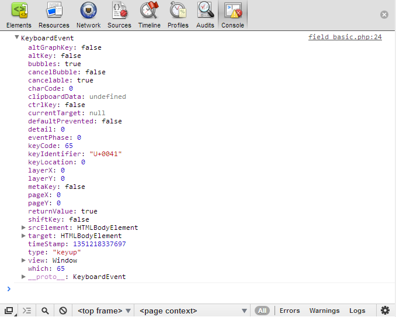

## Keyboard Events with Dojo
In this tutorial, we will be exploring Dojo's event normalization and `dojo/keys` and how Dojo makes it easy to handle
keyboard events.

### Getting Started

Keyboard events fire when keys are pressed on the keyboard.  This includes all keys, letters, numbers, symbols,
punctuation, as well as the Escape, function, Enter, Tab, and keypad keys.  Every keypress fires an event which may be
captured and handled.

Browser support and implementations of keyboard event handling varies.  Using Dojo to handle keyboard events allows you
to write code that will run properly across virtually all browsers.

### Keyboard Events

Listening for keyboard events in the browser allows you to implement a user interface that not only feels like a native
application, it gives you a greater control over the UI.

**onkeypress**
> Fires when any key is pressed and repeats until the key is released.  onkeypress can be used for the majority of keyboard event handling.

**onkeydown**
> Fires when any key is pressed and repeats until the key is released.  onkeypress will fire after onkeydown in most cases.

**onkeyup**
> Fires when the key is released.

Most key presses fire all three events, but there may be variations between browsers.  The next demo allows you to see
the keyboard events fired as you press keys.  Take some time to experiment with different keys and combinations.

Dojo normalizes keyboard events, enabling you to use the `dojo/keys` constants to test for keyboard input of non-printable keys.
	Let's say we want to create a form that will allow element traversal using the up and down arrows or enter key.  We can start with this simple example:

```html
<script src="//ajax.googleapis.com/ajax/libs/dojo/1.10.3/dojo/dojo.js"
                data-dojo-config="async: true"> </script>
<body>
    <h1>Press any key</h1>
    keyCode value: <input type="text" id="keyCode" size="2">
</body>
```

```js
require(["dojo/on", "dojo/domReady!"], function(on) {
    on(document, "keyup", function(event) {
        document.getElementById("keyCode").value = event.keyCode;
    });
});
```

[View Demo](demo/field_basic.html)

This example shows how simple it is to capture keyboard events on form elements and doing something (logging to the
console) using Dojo's normalized events and `dojo/keys`. This was accomplished using:

*   `dojo/on: ` [api](/api/?qs=1.10/dojo/on) [ref](/reference-guide/1.10/dojo/on.html)
*   `dojo/keys: ` [api](/api/?qs=1.10/dojo/keys) [ref](/reference-guide/1.10/dojo/keys.html)

You will notice, however, that our example doesn't behave as expected, and some functionality is missing - such as
handling the enter key. In our next example we'll fill in some missing details.

> Note that unlike the `dojo/_base/connect` API, the "on" event name prefix _must be omitted_ when using the `dojo/on`
module. See the [Events with Dojo](../events/) for more information.

### The KeyboardEvent object

As you can see below, when a keyboard event fires, a `KeyboardEvent` is passed to the event handler.  This event object
contains a lot of information about the event, but typically the piece most needed is the `keyCode` value.  This is the
Unicode value of the key pressed.



Moving on (pun intended), we can make this simple example more elegant and functional using the power of Dojo:

```html
<body>
    <h1>Press Up or Down Arrow Keys</h1>
    <input type="text" id="input1" value="up">
    <input type="text" id="input2" value="down">
    <input type="submit" id="send" value="send">
</body>
```

```js
require(["dojo/dom-construct", "dojo/on", "dojo/query", "dojo/keys", "dojo/domReady!"],
function(domConstruct, on, query, keys) {
    query("input[type='text']").on("keydown", function(event) {
        //query returns a nodelist, which has an on() function available that will listen
        //to all keydown events for each node in the list
        switch(event.keyCode) {
            case keys.UP_ARROW:
                event.preventDefault();
                //preventing the default behavior in case your browser
                // uses autosuggest when you hit the down or up arrow.
                log("up arrow has been pressed");
                break;
            case keys.DOWN_ARROW:
                event.preventDefault();
                //preventing the default behavior in case your browser
                // uses autosuggest when you hit the down or up arrow.
                log("down arrow has been pressed");
                break;
            case keys.ENTER:
                log("enter has been pressed");
                break;
            default:
                log("some other key: " + event.keyCode);
        }
    });
});
```

[View Demo](demo/field_traverse.html)

With just a few changes, we've eliminated some redundant code, as well as making our script more powerful &mdash;
allowing us to handle more than one type of key press in a single event handler, as well as handling multiple elements.
By using `dojo/query`, we can make full use of the `on` method for the `NodeList` that `dojo/query` returns. This works
exactly the same as the normal `on()` function, except that all the nodes in the `NodeList` are targeted.

The previous example uses some powerful pieces of Dojo, but in order to fully complete our task of using keyboard events
to traverse our form, we need to add a couple more pieces to our example. See the new example for a fully functional
example:

```html
<body>
    <h1>Press Up/Down Arrow Or Enter Keys to traverse form.</h1>
    <h2>Home/End will go to the beginning or end.</h2>
    <form id="traverseForm">
        First Name: <input type="text" id="firstName">
        Last Name: <input type="text" id="lastName">
        Email Address: <input type="text" id="email">
        Phone Number: <input type="text" id="phone">
        <input type="submit" id="send" value="send">
    </form>
</body>
```

```js
require(["dojo/dom", "dojo/dom-construct", "dojo/on", "dojo/query", "dojo/keys", "dojo/NodeList-traverse", "dojo/domReady!"],
function(dom, domConstruct, on, query, keys) {
    var inputs = query("input");

    on(dom.byId("traverseForm"), "keydown", function(event) {
        var node = query.NodeList([event.target]);
        var nextNode;

        //on listens for the keydown events inside of the div node, on all form elements
        switch(event.keyCode) {
            case keys.UP_ARROW:
                nextNode = node.prev("input");
                if(nextNode[0]){
                    //if not first element
                    nextNode[0].focus();
                    //moving the focus from the current element to the previous
                }
                break;
            case keys.DOWN_ARROW:
                nextNode = node.next("input");
                if(nextNode[0]){
                    //if not last element
                    nextNode[0].focus();
                    //moving the focus from the current element to the next
                }
                break;
            case keys.HOME:
                inputs[0].focus();
                break;
            case keys.END:
                inputs[inputs.length - 2].focus();
                break;
            case keys.ENTER:
                event.preventDefault();
                //prevent default keeps the form from submitting when the enter button is pressed
                //on the submit button
                if(event.target.type !== "submit"){
                    nextNode = node.next("input");
                    if(nextNode[0]){
                        //if not last element
                        nextNode[0].focus();
                        //moving the focus from the current element to the next
                    }
                }else {
                    // submit the form
                    log("form submitted!");
                }
                break;
            default:
                log("some other key: " + event.keyCode);
        }
    });
});
```

[View Demo](demo/form_traverse.html)

What just happened you say? This latest incarnation of our form traversal uses `dojo/on's` event delegation &mdash; we
have registered a single event listener on the `form`. This listens for all `keydown` events of all the child elements
of the `form` as well.

The power of event delegation is apparent in that we need to only make very small changes to our script to handle both
input on the text boxes as well as the submit button. This solution gracefully scales up as well; if more form input
elements are added to our page our script will still work 100% &mdash; and with the help of `dojo/on`'s event
normalization and `dojo/keys` it will work across browsers and platforms.

### Keyboard Navigation with [dijit/_KeyNavMixin](/reference-guide/1.10/dijit/_KeyNavMixin.html)

Finally, if your primary goal in handling keyboard events is navigation, you can use `dijit/_KeyNavMixin`. It requires
that some navigation event handlers are defined in your widget, but once you meet its requirements it handles listening
for and responding to navigation-related keyboard events for you. We won't go into detail in this tutorial, but you
can read about it in the [reference guide](/reference-guide/1.10/dijit/_KeyNavMixin.html) and see a basic implementation
in the following demo.

[View Demo](demo/keyNav.html)

### Conclusion

Dojo's event normalization using `dojo/on` makes it increasingly simple to handle keyboard input inside of the often
changing and conflicting browser environment. Using `dojo/on` and `dojo/keys`, we created a form that expanded upon the
default behavior of the up/down arrows and enter key. With this new knowledge, think of ways that you can use Dojo's
event normalization and event delegation to increase the usability of your web application.

### Resources

Find more details about `dojo/on` and other tools we used in this tutorial:

*   [SitePen's Blog: dojo/on](http://www.sitepen.com/blog/2011/08/03/dojoon-new-event-handling-system-for-dojo/)
*   [Events with Dojo Tutorial](../events/)