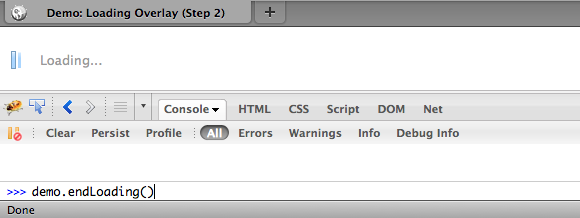

---
Category:  Widgets
...

## A Loading Overlay

In this tutorial, we'll create an overlay that puts us in control of the user experience while the loading of dependencies and rendering of the UI takes place in the background.

### Introduction: The Problem

Loading the various scripts and other resources and setting up even a relatively simple UI can take time.
	As widgets are instantiated and data is fetched, you can get distracting re-rendering of the page.
	So, it's common practice to overlay some or all of your page with a "loading" layer that lets your users know what's going on and hides any re-rendering or intermediate states in your UI.
	The solution should not compound the problem bringing too many of its own dependencies, and should avoid hard-wiring its behavior to any particular event, so we can keep some flexibility in how we define "loaded".

### Solution

Use dojo methods to inject an overlay element with CSS to style and position it.
A simple page-level API to put the page in and out of a loading state wraps an equally simple implementation. The `fadeOut` method from the `dojo/_base/fx` module provides a smooth transition between states.

You will need:

*   `dojo/_base/fx` for animation
*   CSS for the overlay style

### Discussion

One of the challenges here is not the implementation itself, but juggling the priority of requirements.
	You can imagine a loading widget which we can hide at will, features a loading bar with percentage increments, maybe even a non-modal or minimized state which allows the user to continue interacting with the rest of the screen while stuff loads in the background.
	This not that recipe. We want to keep it light and simple and solve the common case: a potentially multi-step loading sequence during which time we don't want to allow the user to see or interact with the UI.

### Building the Overlay

If you use your DOM inspector of choice on the demo page, you'll see the overlay as a child element of the `body`. It is a `div` with the associated CSS to size and position it on the page.


We will hardcode this on the page to ensure that dynamic content that is loaded doesn't show when it's only partially loaded.

```html
<div id="loadingOverlay" class="loadingOverlay pageOverlay"></div>
```

The stylesheet looks like this:

```css
html, body {
    height: 100%;
    margin: 0;
    overflow: hidden;
    padding: 0;
}

.pageOverlay {
    top: 0;
    left: 0;
    position: absolute;
    height: 100%;
    width: 100%;
    z-index: 1001;
    display: block;
}

#loadingOverlay {
    background:  #fff url('//ajax.googleapis.com/ajax/libs/dojo/1.10.3/dijit/themes/claro/images/loadingAnimation.gif') no-repeat 10px 23px;
}

.loadingMessage {
    padding: 25px 40px;
    color: #999;
}
```

...and you should see something like this:


[View Demo (Step 1)](demo/step1.html)

> The Dijit themes each come with their own `images` directory, with icons, gradients and other handy graphic assets used by the Dijit widgets - including this loading animation.
Even if you don't use Dijit on your page, all the graphics are licensed under the same terms as the code and ready for your use.

### Hide the Overlay

We've hardcoded the overlay, and it is given an id we can reference it with, and the class to pick up the styling.
This snippet is placed directly inside the `<body>` tag, with the `dojo.js` in the `<head>`.
As we don't depend on any code outside of dojo.js (Base), we don't need to use `dojo/domReady!` to wait for dependencies to load.
This way if the rest of the page takes a while to load in, it happens out of sight behind the loading overlay. Perception is everything: getting something in front of the user as soon as possible makes the page feel faster, even if the total time to load is exactly the same.

Now the element is there, we just need the function to hide it.
It frequently turns out to be handy to have an object that you can hang page-level properties and methods like this on, so we'll attach them to a '`demo`' object. We would normally not advocate a global variable, but this provides a quick and convenient way to get a reference from the console. It's a stand-in for a package for your main page or application object.

The first cut at showing and hiding the overlay:

```js
var demo;
require(["dojo/_base/declare","dojo/dom","dojo/dom-style"],
function(declare, dom, domStyle){
    var Demo = declare(null, {
        overlayNode:null,
        constructor:function(){
            // save a reference to the overlay
            this.overlayNode = dom.byId("loadingOverlay");
        },
        // called to hide the loading overlay
        endLoading:function(){
            domStyle.set(this.overlayNode,'display','none');
        }
    });
    demo = new Demo();
});
```

The CSS has already positioned, sized and z-indexed the overlay, we just need to toggle the `style.display` property to make it show up.
We could also have used the `add` and `remove` methods from the `dojo/dom-class` module to the same effect if we had a class with the same `display:none` rule.
In fact Dijit provides one in `dijit/themes/dijit.css`: `dijitHidden`, but not only do we add another dependency there, and a load of other rules we're not (yet) using,
we also get into an issue where another class with higher specificity could override ours and have no effect.
You could also set the `display` property directly with `dom.byId('loadingOverlay').style.display='none'`, but as `dojo/dom-style` smooths over some cross-browser issues for us, and gives us a nice syntax for setting multiple properties at once, it's a good habit to keep.

We can test this from the console. Load up the page, and in your browser's console invoke the function:

[](demo/step2.html)

[View Demo (Step 2)](demo/step2.html)

### Adding a Transition

Simply toggling the display of the overlay makes for an abrupt transition. We can make this experience much nicer by fading it out to reveal the page behind:

```js
endLoading: function() {
    // fade the overlay gracefully
    fx.fadeOut({
        node: overlayNode,
        onEnd: function(node){
            domStyle.set(node, 'display', 'none');
        }
    }).play();
},
```

`fadeOut` is in the `dojo/_base/fx` module, but it simply animates the opacity of the node we provide. We need to add an additional step at the end of that animation to set `display:none`, otherwise the overlay would still be present but invisible and would block clicks on the page.
Remember that animations happen asynchronously, so any statements after our `dojo/_base/fx.fadeOut(..)` will run before the animation complete. We use the onEnd hook provided by all dojo animations to add that step. Review the [effects](../effects/) and [animation](../animation/) tutorials for more details on how you can adjust to taste.

### Defining "Loaded"

With the functions defined, we just need to pick an event or moment to call them. You're probably familiar by now with `dojo/domReady!`, so let's hook that up:

```js
require(["dojo/domReady!"], function () {
    // layout is ready, hide the loading overlay
    demo.endLoading();
});
```

That works, and perhaps its enough. But what we've bought ourselves here is flexibility on how we define "loaded". We can call `demo.endLoading()` whenever we want.

For that to make sense we need to put back some of the complexity into our page, and see our solution in something more like "real-world" conditions.
The demo sets up a dijit-based layout using a TabContainer and an Editor and a bunch of ContentPanes. We should be using a build to compress the code each represents, and to minimize the number of HTTP requests being made.
But there's no getting away from the fact that each new component adds bytes to download.

Here's the list of requires:

```js
require(["dijit/layout/BorderContainer",
    "dijit/layout/TabContainer",
    "dijit/layout/ContentPane",
    "dijit/Editor",
    "dijit/_editor/_Plugin",
    "dijit/_editor/plugins/AlwaysShowToolbar",
    "dijit/_editor/plugins/FontChoice",
    "dijit/_editor/plugins/TextColor",
    "dijit/_editor/plugins/LinkDialog"]);
```

[View Demo (no overlay)](demo/start.html)

### Planning a Load Sequence

We know we want the overlay up until at least the layout is complete. But we don't actually need the editor immediately, so we can break it out:

```js
initEditor: function() {
    // if the editor hasn't been created, create it
    if(!registry.byId("edit")){
        require(["dijit/Editor",
            "dijit/_editor/_Plugin",
            "dijit/_editor/plugins/AlwaysShowToolbar",
            "dijit/_editor/plugins/FontChoice",
            "dijit/_editor/plugins/TextColor",
            "dijit/_editor/plugins/LinkDialog"],function(Editor){
            registry.byId("editPane").addChild(new Editor({}));
        });
    }
}
```

Now, we can load just what we initially need, take down the overlay, and load the rest in the background. The editor has gone from being created declaratively in the markup, to programmatically once its dependencies are loaded.
Finally, a little `setTimeout` introduces a barely perceptible pause to let our older browsers catch up:

```js
require(["dojo/_base/lang", "dojo/domReady!"], function (lang) {
    // layout is ready, hide the loading overlay
    demo.endLoading();
    // initialize the editor, after a half-second delay for older browsers
    setTimeout(lang.hitch(demo, "initEditor"), 500);
    // page is ready to run
});
```

[View Demo](demo/demo.html)

Other options here are to take down the overlay, and lazily-create the editor when we first click on that tab.  Experiment.

### Conclusion

Judicious application of just a few Dojo methods has created a nicer user experience, and put you in control of what you load when, and what your user sees in the meantime.
This recipe's solution is of course just one way to tackle the stated problem, but this one is simple, lightweight and readily extended in any direction your requirements take you.

### Resources

*   [Effects with Dojo](../effects/) (for use of dojo/_base/fx)
*   [Layout with Dijit](../dijit_layout/)
*   [dojo/dom-construct](/reference-guide/1.10/dojo/dom-construct.html)
*   [dojo/dom-style](/reference-guide/1.10/dojo/dom-style.html)
*   [lang.hitch](/reference-guide/1.10/dojo/_base/lang.html#hitch)