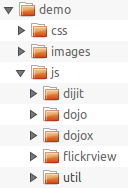

## Part 5 - Build FlickrView for production

In the previous parts, [Developing a Dojo Mobile Application](../part2), [Implementing FeedView](../part3) and
[Implementing Settings View](../part4), we created the HTML, CSS, and JavaScript code required to power the FlickrView 
mobile application. This tutorial will focus on updating the code for deployment, leveraging the Dojo build system to 
keep the application compact for production, and a basic review of the entire Dojo Mobile-powered application.

### Dojo Mobile and Builds

Creating a build for Dojo Mobile applications is extremely important because we want our mobile applications to be a 
small as possible. Let's walk through the steps to create a compact build of our Dojo Mobile application: FlickrView.

### Dojo's Build System



Typical build scripts are found within the Dojo Toolkit's `util/buildscripts`directory, so, for the rest of the 
tutorial, you will need a local copy of a Dojo source distribution. If you don't have that already, visit
[dojotoolkit.org/download](http://dojotoolkit.org/download).

Make sure you get a **source** distribution, that includes the `util` directory. Once you have that, copy the 
`dojo`, `dijit`, `dojox` and `util` directories into the `js` directory of your sample application. Your file structure 
should now be as follows.

### Build Profile

Let's create a build profile for FlickrView. The build profile is a configuration file that says what the build will 
include, and what options are used. The Dojo build system is fully documented on the
[Creating Builds tutorial](http://dojotoolkit.org/documentation/tutorials/1.10/build/), we will just explain 
briefly what it contains here.

The profile starts with some **options**:

*   `"basePath"` - defines the origin for all the relative paths in this profile;
*   `"action": "release"` - the standard action for a build
*   `"releaseDir"` - specifies the directory where the build results will be output
*   `"cssOptimize"` - option is useful for a mobile build since it makes sure all the CSS files that make up each 
theme are concatenated into one single CSS file

```js
var profile = {
	"basePath": "./",
	"action": "release",
	"releaseDir": "../release/js",

	"selectorEngine": "acme",
	"stripConsole": "normal",
	"copyTests": false,
	"cssOptimize": "comments.keepLines",
	"mini": true,
	"optimize": "closure",
	"layerOptimize": "closure",

	"localeList": "en-us",
```

Next are the **layers** definition:

In this tutorial, we define only one layer that contains all the modules needed by the application. A layer will result 
in one `.js` file being generated, and in our case, we define it as the dojo/dojo layer. It will include only the 
Dojo code that we actually use in our application, and the custom code that is specific to our application.

Note that we could have split our applications into multiple layers, for example one layer for the dojo code and one 
layer for the application code. But in the context of a mobile application deployed on networks with high latencies, 
having multiple requests could have a significant impact on the overall application launch time. For the same reason, 
we specify the builder to include the localized bundle into the layer (by means of the `includeLocales` property).

```js
	layers: {
		"dojo/dojo": {
			customBase: true,
			includeLocales: ["en-us"],
			include: [
				"dojox/mobile/parser",
				"dijit/registry",
				"dojox/mobile/compat",
				"dojox/mobile/ScrollableView",
				"dojox/mobile/ListItem",
				"dojox/mobile/FormLayout",
				"dojox/mobile/TextBox",
				"dojox/mobile/RadioButton",
				"dojox/mobile/Heading",
				"dojox/mobile/EdgeToEdgeList",
				"dojox/mobile/RoundRect",
				"dojox/mobile/Switch",
				"dojo/cldr/nls/de/gregorian",
				"dojo/cldr/nls/fr/gregorian",
				"dojo/cldr/nls/it/gregorian",
				"dojo/cldr/nls/ko/gregorian",
				"dojo/cldr/nls/pt/gregorian",
				"dojo/cldr/nls/es/gregorian",
				"dojo/cldr/nls/zh/gregorian",
				"dojo/cldr/nls/zh-hk/gregorian",
				"flickrview/FeedView",
				"flickrview/SettingsView"
			]
		}
	},
```

Then we define a set of has **features**:

Features are a way to isolate pieces of code that can be conditionally included or excluded (see dojo/has).

For example, we set the `"ie"` feature to `undefined`. By this, we state that we don't want the application to run on 
old Internet Explorer (only on mobile browsers), so we accept that any IE-specific code is excluded from the build.

```js
	staticHasFeatures: {
		"dom-addeventlistener": true,
		"dom-qsa": true,
		"json-stringify": true,
		"json-parse": true,
		"bug-for-in-skips-shadowed": false,
		"dom-matches-selector": true,
		"native-xhr": true,
		"array-extensible": true,
		"ie": undefined,
		"quirks": false,
		"dojo-sync-loader": false,
		"ie-event-behavior": 0
	},

	packages: [
		{ name: "dojo", location: "dojo" },
		{ name: "dijit", location: "dijit" },
		{ name: "dojox", location: "dojox" },
		{ name: "flickrview", location: "flickrview" }
	]
};
```

This build profile is included as `flickrview/js/flickrview-app.profile.js` in the downloadable archive available at the end of this article.

### Running the Build

Let's switch to the command line and build our layers based on the build profile above:

**Unix**

```js
cd js/util/buildscripts
./build.sh profile=../../flickrview-app.profile.js
```

**Windows**

```js
cd js\util\buildscripts
.\build.bat profile=..\..\flickrview-app.profile.js
```

The build process is a mix of JavaScript and Java (for code minification/optimization) tasks. By default, the unix
`build.sh` script uses **node.js** as the default runtime if available, or falls back to **Rhino** otherwise 
(this choice is motivated by the fact that **node.js** usually much more faster than **Rhino**).

The Windows `build.bat` script, on the other hand, only leverages **Rhino**. But that does not mean you can’t build with
**node.js** on Windows! Here is the command line to do it manually:

```js
.\node ..\..\dojo\dojo.js load=build --profile ../../flickrview-app.profile.js
```

After the build is completed, navigate to the `release/js/flickrview/` directory to view the result.

### Implementing the Build

To implement our newly created build files, update `flickrview.html`

First, update the path to Dojo, so that we now use the `dojo.js` file that was created by the build instead of the 
original `dojo.js`. This corresponds to the `dojo/dojo` layer in our profile, and the resulting file is in 
`release/js/dojo/dojo.js`, so we update the path of the Dojo script tag accordingly. We don't need to do other modifications 
since the layer contains all the modules the application needs.

```html
<script type="text/javascript" src="./release/js/dojo/dojo.js"></script>
<script>
	require([...], function(...){ // existing require calls
		// ... existing code
	});
	// ...
</script>
```

Finally, we can also simplify the `dojoConfig` section like this :

```html
<script type="text/javascript">
		dojoConfig = {
			async: true,
			parseOnLoad: false,
			mblHideAddressBar: true,
			extraLocale: ["en-us", "fr-fr", "de-de", "it-it", "ko-kr", "pt-br", "es-us", "zh-hk"]
		};
</script>
```

A build version of the HTML file, `flickrview-build.html`, is included in the downloadable archive. You can launch this 
file once you have run the build.

### Review

FlickrView is complete! Our simple mobile application has been templated (HTML), styled (CSS), coded (JavaScript), 
and built for production!

Let's review what we learned in the process of create FlickrView:

*   The basic widgets included within Dojo Mobile
*   The format which to declaratively code dojox/mobile widgets with HTML and programmatically create widgets with JavaScript
*   How to use dojo/request/script to retrieve JSON-formatted data from Flickr
*   How to extend dojox/mobile base widgets
*   Strategies behind following good JavaScript practices but also keeping code compact and minimized in dependencies
*   The special build process needed for dojox/mobile applications

In this tutorial, we saw that Dojo Mobile is an outstanding mobile application framework complete with themes and widgets 
to match mobile device controls. Dojo Mobile is also easy to learn, extend, and dynamically populate with content. 
FlickrView, a basic three-view application, was very easy to create, thanks to Dojo Mobile!

### Download The Source

Download [Part 5 - Build FlickrView for production](resources/DojoMobilePart5.zip).

### Resources & references

*   [Dojo Mobile Reference Guide](http://dojotoolkit.org/reference-guide/dojox/mobile.html)
*   [The Dojo Toolkit API](http://dojotoolkit.org/api)
*   [Creating Builds](http://dojotoolkit.org/documentation/tutorials/1.10/build/) (Tutorial)
*   [Get Dojo!](http://dojotoolkit.org/download) (Downloads)

### The FlickrView Series

* [Part 1 - Getting Started with Dojo Mobile](../part1/)
* [Part 2 - Developing a Dojo Mobile Application: FlickrView](../part2/)
* [Part 3 - FlickrView: Implementing FeedView](../part3/)  
* [Part 4 - FlickrView: Implementing SettingsView](../part4/)
* [Part 5 - Build FlickrView for production](../part5/)