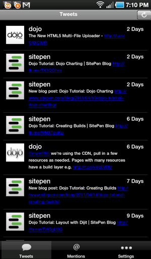

## TweetView: Android, Packaging, and Review

In the previous two posts,[Getting Started with TweetView: Tweets and Mentions](/documentation/tutorials/1.10/mobile/tweetview/starting_tweetview/) and[TweetView: Creating the Settings View](/documentation/tutorials/1.10/mobile/tweetview/settings/), we created the HTML, CSS, and JavaScript code required to power the[TweetView mobile application](/documentation/tutorials/1.10/mobile/tweetview/app). This tutorial will focus on implementing an Android theme, leveraging the Dojo build system to keep the application compact for production, and a basic review of the entire dojox/mobile-powered application.

### Implementing the Android Theme

Throughout the course of creating the CSS that powers our application, we've assumed the iPhone theme, even though we're using `deviceTheme` within our page. That allowed us to speed up development and worry about Android theming once the application was fully functional. The time for catering our application to Android is now!

The only remaining task in catering our application for Android is implementing a small snippet of code that will detect the device type and modify a few custom image paths (our refresh icon and TabBar icons) so that the Android images display:

```js
require(["dojox/mobile/parser", "dojox/mobile/TabBar", "tweetview/TweetView", "tweetview/SettingsView",
             "dojox/mobile/deviceTheme", "dojo/dom-attr", "dojo/_base/array", "dojox/mobile", "dojo/domReady!"],
	function(mobileParser, TabBar, TweetView, SettingsView, dm, domAttr, arrayUtil) {

		// If Android....
		if(dm.currentTheme == "android") {
			var imagePath = "js/tweetview/resources/images/";
			// Add a new "iconLoading" attribute to the TweetView instances
			TweetView.prototype.iconLoading = imagePath + "androidLoading.gif";
			// Update image path on bottom tabbar
			domAttr.set(document.getElementById("tabBar"), "iconBase", imagePath + "iconStripAndroid.png");
		}
		// Parse the page!
		mobileParser.parse();
});
```

<!-- protip -->
> A similar `if` statement would be used to implement images for any alternate theme.

Now your application will load the Android imagery if the device is a mobile Android-based device!



Great! Our simple application handles images for both Android and iOS devices.

### Remove Cache-Preventing Meta Tags

Remember the META tags we added to prevent caching during development of the widget?

```html
<!-- prevent cache -->
<meta http-equiv="cache-control" content="no-cache">
<meta http-equiv="pragma" content="no-cache">
```

Remove those to allow the application to be cached on the device.

### dojox/mobile and Builds

Creating a build for dojox/mobile applications is extremely important because we want our mobile applications to be a small as possible. Let's walk through the steps to create a compact build of our dojox/mobile application: TweetView.

#### Dojo's Build System

Typical build scripts are found within the Dojo Toolkit's `util/buildscripts` directory, so, for the rest of the tutorial, you will need a local copy of a Dojo source distribution. If you don't have that already, visit the [Download](http://dojotoolkit.org/download/) page on dojotoolkit.org. Make sure you get a "Source" distribution, that includes the util directory. Once you have that, copy the `dojo`, `dijit`, `dojox` and `util` directories into the `js` directory of your sample application. Your file structure should now be as follows:


#### TweetView Build Profile

Let's create a build profile for TweetView. The profile is a configuration file that says what the build will include, and what options are used. The Dojo build system is fully documented on the [Creating Build](/documentation/tutorials/1.10/build/) page of the documentation, we will just explain briefly what it contains here.

Here is our build profile (it is included in the downloadable archive, in `tweetview/app/js/tweetview.profile.js`):

```js
var profile = {

	"action" : "release",

	"releaseDir" : "tweetview-release/dojo",

	"selectorEngine" : "acme",
	"stripConsole" : "normal",
	"copyTests" : false,
	"cssOptimize" : "comments.keepLines",
	"mini" : true,
	"webkitMobile" : true,

	localeList: "en-us",

	layers: {
		"dojo/dojo": {
			customBase: true,
			include: [
				"dojo/_base/declare",
				"dojo/_base/lang",
				"dojo/_base/array",
				"dojo/_base/window",
				"dojo/_base/event",
				"dojo/_base/connect",
				"dojo/_base/html",
				"dojo/io/script",
				"dojo/Deferred",
				"dojo/DeferredList",
				"dojo/i18n",
				"dojo/date",
				"dijit/_WidgetBase",
				"dijit/_base/manager",
				"dojox/mobile",
				"dojox/mobile/parser",
				"dojox/mobile/deviceTheme",
				"dojox/mobile/ScrollableView",
				"dojox/mobile/TabBar",
				"dojox/mobile/TabBarButton",
				"dojox/mobile/ToolBarButton"
			]
		},
		"tweetview/tweetview-app": {
			include: [
				"tweetview/TweetView",
				"tweetview/SettingsView"
			]
		}
	},

	staticHasFeatures: {
		"dom-addeventlistener": true,
		"dom-qsa": true,
		"json-stringify": true,
		"json-parse": true,
		"bug-for-in-skips-shadowed": false,
		"dom-matches-selector": true,
		"native-xhr": true,
		"array-extensible": true,
		"ie": undefined,
		"quirks": false,
		"webkit": true
	},

	packages: [
		{ name:"dojo", location:"dojo" },
		{ name:"dijit", location:"dijit" },
		{ name:"dojox", location:"dojox" },
		{ name:"tweetview", location:"tweetview" }
	]
};
```

The profile starts with some options: `"action" : "release"` is the standard action for a build, `"releaseDir"` specifies the directory where the build results will be output. The `"cssOptimize"` option is useful for a mobile build since it makes sure all the CSS files that make up each theme are concatenated into one single CSS file.

Next are the layer definitions. Each layer will result in one `.js` file being generated. We define two layers: a `dojo/dojo` layer that will include only the standard Dojo code that we actually use in our application, and a `tweetview/tweetview-app` that will contain the custom code that is specific to our application. For each layer, we specify the set of modules that the layer will include.

Then we define a set of `has` features. Features are a way to isolate pieces of code that can be conditionally included or excluded (see [dojo/has](/reference-guide/1.10/dojo/has.html#dojo-has)). For example, we set the `"ie"` feature to `undefined`: by this, we state that we don't want the application to run on Internet Explorer (only on mobile browsers), so we accept that any IE-specific code is excluded from the build. Similarly we set `"webkit"` to true, so our build will run only on webkit-based browsers. You could choose different settings if you want to support more browsers.

<!-- protip -->
> Remember how we used a custom method, `_ViewMixin.getElements`, instead of `dojo/query`? There's no need to add `dojo/query` as a dependency if all we need is `getElementByClassName` element collection. This will save our application in build size.

#### Running the Build

Let's switch to the command line and build our layers based on the build profile above:

Unix:

```
cd js/util/buildscripts
./build.sh profile=../../tweetview.profile.js
```

Windows:

```
cd js\util\buildscripts
.\build.bat profile=..\..\tweetview.profile.js
```

After the build is completed, navigate to the `js/tweetview-release/dojo/tweetview/` directory to view the result:


#### Implementing the Build

To implement our newly created build files, open app.html.

First, update the path to Dojo, so that we now use the dojo.js file that was created by the build instead of the original dojo.js. This corresponds to the `dojo/dojo` layer in our profile, and the resulting file is in `js/tweetview-release/dojo/dojo/dojo.js`, so we update the path of the Dojo script tag accordingly.

We also need to load the application-specific code corresponding to our second layer, `tweetview/tweetview-app`. When using the AMD loader, additional layers must be loaded using `require` calls, like other modules. So, we add a new `require` call "around" our existing code, which means that all the code that we had previously (including the existing require calls) is now contained in the factory function of the new require call:

```html
<script src="js/tweetview-release/dojo/dojo/dojo.js"></script>
<script
    require(["tweetview/tweetview-app"], function(){
        require([...], function(...){ // existing require calls
            .. // existing code
        });
    });
```

<!-- protip -->
> The nested require calls are necessary to make sure that the layer code is loaded before the other modules are actually required.

Finally you must also update the `location` of the `tweetview` package in the `dojoConfig` section so that it points to `js/tweetview-release/dojo/release`: this is necessary to find the nls files generated during the build.

<!-- protip -->
> A "build" version of the HTML file, `index-build.html`, is included in the downloadable archive. You can launch this file once you have run the build.

### TweetView Review

TweetView is complete! Our simple mobile application has been templated (HTML), styled (CSS), coded (JavaScript), and built for production! Let's review what we learned in the process of create TweetView:

*   The basic widgets included within `dojox/mobile`
*   How to theme a `dojox/mobile` application to look like iOS and Android devices
*   The format which to declaratively code `dojox/mobile` widgets with HTML and programmatically create widgets with JavaScript
*   How to use `dojo/io/script` and `dojo/DeferredList` to retrieve JSON-formatted data from Twitter
*   How to extend `dojox/mobile` base widgets
*   Strategies behind following good JavaScript practices but also keeping code compact and minimized in dependencies
*   The special build process needed for `dojox/mobile` applications

I'm hoping you ended this project with the same feelings about `dojox/mobile` that I have: `dojox/mobile` is an outstanding mobile application framework complete with themes and widgets to match mobile device controls. dojox/mobile is also easy to learn, extend, and dynamically populate with content. TweetView, a basic three-view application, was very easy to create, thanks to `dojox/mobile`!

### dojox/mobile Will Only Get Better!

`dojox/mobile` is growing at a considerable rate due to the push by the Dojo team to provide the best mobile solutions. Look forward to more widgets, more code-efficient and processing-efficient widget controls, and more device-specific functionality. I encourage you to take the time to experiment with `dojox/mobile` and share your experiences with the rest of the Dojo community!

[Click here](../app/) to see the completed application in action!

### Download The Source

Download [TweetView](../app.zip). The archive will work as soon as you unzip the file!

### The TweetView Series

1.  [Getting Started with dojox/mobile](/documentation/tutorials/1.10/mobile/tweetview/getting_started/)
2.  [Introduction to TweetView](/documentation/tutorials/1.10/mobile/tweetview/intro_tweetview/)
3.  [Getting Started with TweetView: Tweets and Mentions](/documentation/tutorials/1.10/mobile/tweetview/starting_tweetview/)
4.  [Creating the Settings View](/documentation/tutorials/1.10/mobile/tweetview/settings/)
5.  [Android, Packaging, and Review](/documentation/tutorials/1.10/mobile/tweetview/packaging/)