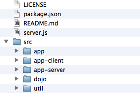

---
Category:  Modules
...

## Dojo and Node.js

JavaScript is not just for the client side.  With the rise of technologies like Node.js, server side JavaScript is a
very viable option.  Not only is JavaScript ready for the server side, AMD and the Dojo Toolkit also work well and this
tutorial will explain how you can use Dojo with Node.js.

### Getting Started

You should have already read up on some of the basics of Dojo, like [Defining Modules](../modules) and
	[Classy JavaScript with dojo/_base/declare](../declare/).  Also you should be somewhat familiar with
	[Node.js](http://nodejs.org/) and have it installed on your local machine, along with the
	[npm](http://npmjs.org/) package manager.  The last thing you will need before you get
	started, is a local [source distribution](/download/) of Dojo (Dojo Toolkit SDK).  We
	will be taking advantage of some features introduced in Dojo 1.8, so make you have the latest release of that.

On the other hand, I have prepared a GitHub [repository](https://github.com/kitsonk/dojo-node-boilerplate) which contains a sub-module that pulls the right parts of Dojo into a project.  It
	also follows the suggested layout of files and directories which will be used in this tutorial.

<!-- protip -->
> Built distributions or CDN distributions of Dojo will not work with Node.js, as they are all built
	assuming you are using a browser user agent.  Built, compressed code also makes it very difficult to debug your
	server side applications, so stick with a source distribution.

### AMD

You might be saying to yourself "I thought AMD was for the client, why would I want to run it on a server?".  While
	the server side doesn't "need" AMD as much as the client-side, there is minimal overhead and no disadvantages to
	AMD on the server-side.  It also means that your modules and coding style can be consistent across the client and
	server.  Using the same language only gets you so far, but if you have a single coding style, then you can even
	more rapidly write code.

Sadly for developers, who want to use their packages and modules to run either on the server or in a browser
	client have to support both CommonJS packaging and modules as well as AMD modules.  There is an increasing number
	of packages that support both CommonJS and AMD and who knows what we will see in the future as far as standards.

The good news is that the Dojo AMD loader works perfectly well under Node.js, and after a little bit of work, you
	can start coding in an AMD/Dojo like environment.

### Bootstrapping

In order to load an AMD module under NodeJS, we need a module loader.  The `require()` that comes
	default with Node.js can only load CommonJS modules.  The Dojo AMD loader (as well as other loaders, like RequireJS)
	can be "bootstrapped" to allow you to have an "AMD environment".

But, before we actually load the loader, we need to have a structure for our application.  I suggest the following
	layout for your project (it follows the boilerplate repository I mentioned above):



Now, what we need to do is give just enough configuration to the Dojo loader that it can then load another module.
	Once, we load the Dojo loader, it will take over and then any modules we load will "behave" as AMD modules.  So
	let's take a look at what we should put in our bootstrap file, which we will call `/server.js`:

```js
// Configuration Object for Dojo Loader:
dojoConfig = {
	baseUrl: "src/", // Where we will put our packages
	async: 1, // We want to make sure we are using the "modern" loader
	hasCache: {
		"host-node": 1, // Ensure we "force" the loader into Node.js mode
		"dom": 0 // Ensure that none of the code assumes we have a DOM
	},
	// While it is possible to use config-tlmSiblingOfDojo to tell the
	// loader that your packages share the same root path as the loader,
	// this really isn't always a good idea and it is better to be
	// explicit about our package map.
	packages: [{
		name: "dojo",
		location: "dojo"
	},{
		name: "app",
		location: "app"
	},{
		name: "app-server",
		location: "app-server"
	}]
};

// Now load the Dojo loader
require("./src/dojo/dojo.js");
```

### Loading Modules

Now we could run this file, but it wouldn't really do anything, because we are not loading any modules or executing
	any functional code.  So let's create a simple module that will log a message to the console named `
	src/app-server/server.js`:

```js
require([], function(){
	console.log("Hello World!");
});
```

We also need our bootstrap script to load the module.  The easiest way (there are others), is to include the module
	in the `deps` vector of the configuration object.  I like to do it in a way that makes it easier to
	change and configure:

<!-- highlight: [1,2,26] -->
```js
// The module to "bootstrap"
var loadModule = "app-server/server";

// Configuration Object for Dojo Loader:
dojoConfig = {
	baseUrl: "src/", // Where we will put our packages
	async: 1, // We want to make sure we are using the "modern" loader
	hasCache: {
		"host-node": 1, // Ensure we "force" the loader into Node.js mode
		"dom": 0 // Ensure that none of the code assumes we have a DOM
	},
	// While it is possible to use config-tlmSiblingOfDojo to tell the
	// loader that your packages share the same root path as the loader,
	// this really isn't always a good idea and it is better to be
	// explicit about our package map.
	packages: [{
		name: "dojo",
		location: "dojo"
	},{
		name: "app",
		location: "app"
	},{
		name: "app-server",
		location: "app-server"
	}],
	deps: [ loadModule ] // And array of modules to load on "boot"
};

// Now load the Dojo loader
require("./src/dojo/dojo.js");
```

Now we just need to run our application, which we should do from the root directory of our project:

```
$ node server
Hello World!
$
```

<!-- protip -->
> The boilerplate mentioned above also includes a script named `boot.js` which is a handy
	tool for just booting a module from the command line.  For example, to boot the server, you would run `node
	boot "app-server/server"`.

### Using Node.js Modules

Once you are in the AMD world, `require()` and `define()` work in an AMD way.  You can load
	modules just like you would on the client side.  The challenge though comes in when you want to leverage a
	standard CommonJS module, which is what Node.js uses. Since `require()` has been "overwritten" with the
	AMD one, just calling `require()` will not load the CommonJS module any more.  Dojo has a solution to
	that, as of Dojo 1.8, there is an AMD plugin module named [`dojo/node`](/reference-guide/1.10/dojo/node.html) which will load a CommonJS module for you.

The argument for the plugin (the string after the `!`) will be the module as if you were using the native
	Node.js `require()`.  For example:

```js
// This:
var fs = require("fs");

// Would become:
require([ "dojo/node!fs" ], function(fs){
	// Utilise the "fs" module
});
```

Let's modify our `app-server/server.js` to load the Node.js `fs` module and read a JSON file,
	parse it and log it to the console:

```
require([
	"dojo/node!fs"
], function(fs){
	var helloworld = fs.readFileSync("helloworld.json");
	console.log(JSON.parse(helloworld));
});
```

And in the root of our project, we should create our `helloworld.json`

```js
{
	"Hello": "World!"
}
```

And if we run our application again, we should get the following:

```
$ node server
{ Hello: 'World!' }
$
```

<!-- protip -->
> Paths, both for the `dojo/node` for loading modules and when using the file system are
	relative to where the `node` is invoked.  So even though our module was
	`./app-server/server.js` we utilised paths relative to the root of our project.  The exception to this is
	that relative paths for `define()` work just like they do in the browser, which is relative to the path
	of the module.

<!-- protip -->
> Node.js, built upon the Google V8 JavaScript engine, is fully ES5 compliant, which means that you can
	"skip" having to worry about making sure your code degrades well.  For example, above, we didn't use the
	`dojo/json` module to provide support for parsing our JSON string, which we would have likely have
	done if we were coding for a browser. But if you want your code to work on older browsers, you can certainly
	continue to use these features in your code.

So, now that we are running AMD modules with the Dojo loader under Node.js we have started our journey.  But we
	wouldn't gain enough benefits unless we transform more of our coding style to the "Dojo-way", and there can be a
	of advantages to following the "Dojo-way".  Not only do you share the same coding style on your server side and
	client side code, but you also can take advantage of [Dojo Promises](../promises),
	[Dojo Requests](../ajax), [Dojo i18n](../i18n),
	[Dojo Topics and Events](../events) as well as the richness of other AMD that are
	available.

### Deferred and Promises

One of the powerful features of Node.js is its non-blocking nature.  The vast majority of core APIs in Node.js run
	asynchronously.  The default way though this is done is through an async callback function.  If you have worked with
	Dojo for any length of time, you are likely familiar with the power of dealing with asnyc functionality through
	Deferreds and Promises.  There are some other frameworks out there that provide a promise based interface for
	Node.js, but using since Dojo already has a promise framework, we will use that.

Above, we used `fs.readFileSync` to load our file and display the results, but that method runs
	synchronously and would be blocking.  So why don't we do that asynchronously:

```js
require([
	"dojo/node!fs"
], function(fs){
	fs.readFile("helloworld.json", function(err, data){
		if(err) console.error("I was robbed!");
		console.log(JSON.parse(data));
	});
});
```

So this works, but we end-up with this very non-Dojo-esque callback function.  So why don't we transform this into
	something that returns a promise:

```js
require([
	"dojo/node!fs",
	"dojo/Deferred"
], function(fs, Deferred){

	function readFilePromise(filename){
		var dfd = new Deferred();
		fs.readFile(filename, function(err, data){
			if(err) dfd.reject(err);
			dfd.resolve(data);
		});
		return dfd.promise;
	}

	readFilePromise("helloworld.json").then(function(helloworld){
		console.log(JSON.parse(helloworld));
	}, function(err){
		console.error("I was robbed!");
	});
});
```

Now when we interface with the `readFilePromise` we can utilise the promise pattern for handling the
	asynchronous function.  This includes the ability to change promises, which can come in quite handy then make
	the code much more readable than "callback within callback", which you would have to do if you followed the
	Node.js async model.

In practical purposes, you wouldn't create a function every time to just then use it as a promise.  You would likely
	create a module which exposes the functions you want to return promises and load that module in order to utilise
	the "promise" version of the functions.

<!-- protip -->
> I have created a package that provides a lot of this functionality "out of the box".  It is called
	[setten](https://github.com/kitsonk/setten).  It is available under the same license as
	the Dojo Toolkit and everything has been contributed under the Dojo Foundation's CLA.  Hopefully it will continue
	to grow over time, providing useful modules that can make working with Node.js more "Dojo-like".  In particular, it
	has a module named `setten/util` which can transform async callback functions into promise based ones, by
	using `util.asDeferred()`.

### Building Applications

Now that we have some of the "basics" out of the way, it is likely that if you are reading this tutorial, you have a
	desire to create a combined client/server application in Node.js.  One where you have Dojo-style coding for your
	server and Dojo-style coding for your client code. While building whole applications is beyond the capabilities of
	this tutorial, I will try to give you some advice and structure.

One of the first things you would likely want to do is build an optimised build of your client-side code for use with
	your deployed application, so your server is serving up a built layer file and concatenated CSS.  In part, this is
	why I recommended you build out three different packages for your application specific code:

*   **`src/app`** - For modules that are shared between the server and the client.
*   **`src/app-server`** - For your base server module and other modules only used by the server.
*   **`src/app-client`** - For your client modules.

You would create Dojo build profiles for the `app` and `app-client` packages so they could be
	built by the Dojo builder and you would create an overall application build profile that would be used to identify
	your layers, which would be served up by your server.  The boilerplate I mention above has this framework all laid
	out for you, plus includes a `build.sh` and `build.bat` which will invoke the build process
	to generate a build for you.  The build will be output to the `lib` path.

Another approach is to take the approach that is laid out in the `
	[dojo-boilerplate](https://github.com/csnover/dojo-boilerplate)` project, where
	client and server code co-exists in the same modules.  In this approach, the `dojo/has` module is used
	to "branch" the client and server code.  For example, we could write a module that does one thing if it is loaded
	in a browser and something totally different if loaded under node:

```js
define([
	"dojo/has", // Dojo's feature detection module
	"require"   // The "context" require, that is aware of the current context
], function(has, require){
	var app = {};

	if(has("host-browser")){
		// we are running under a browser
		require([ "dojo/request" ], function(request){
			request.get("/helloworld.json", {
				handleAs: "json"
			}).then(function(data){
				console.log(data);
			});
		});
	}

	if(has("host-node")){
		// we are running under node
		require([ "dojo/node!fs" ], function(fs){
			var data = fs.readFileSync("helloworld.json");
			console.log(JSON.parse(data));
		});
	}

	return app;
});
```

When this code is built by the Dojo builder, and if we use Google Closure to optimise our code, then dead branch
	removal would occur, which would eliminate the server side code from our modules.

Personally, I like the separation of concerns, where modules are either designed to run on the server, the client or
	both, and it makes it "cleaner" to do builds and not fully rely on the code optimisation to ensure the server side
	code doesn't get distributed to the client.  This alternative pattern though is wholly viable.

<!-- protip -->
> For more on building code, take a look at the [Creating Builds](../build) tutorial.

### Conclusion

Hopefully this tutorial has given you a view of how to get started using Dojo under Node.js.  I personally think there
	is a lot of power in being able to use the same language and patterns that you use on the client as well as the
	server.  While other technologies and languages have tried to blur the line between the client and server before,
	I think we are starting to see situations where our code can be truly isomorphic and not worry about the specific
	context that it is executing in.

Here are some things I or others have done under Node.js to maybe spark some ideas for you.  Personally I "replaced"
	any server side code I write with Dojo running under NodeJS.

*   Build "whole stack" websites and web applications. ([My personal homepage](https://github.com/kitsonk/kitsonkelly.com))
*   A documentation server and documentation generation tool. ([Dojoment](https://github.com/kitsonk/dojoment))
*   Automated testing tools. ([Teststack](https://github.com/csnover/dojo2-teststack))
*   Server side widget rendering. ([Server Side Dijit](https://github.com/jthomas/server_side_dijit))

There maybe no limit to the number of things that can be done with Dojo under NodeJS.  Good luck and see what sort
	of interesting things you can think of to do.