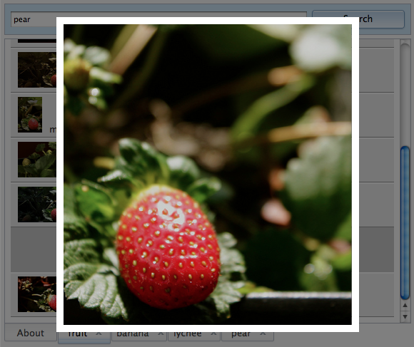

## Application Controller

A page-level controller is the glue that ties together modular functionality to make a living, breathing application. 
We'll implement configuration and an explicit lifecycle over a loosely coupled architecture to assemble a 
single-page-application of many moving parts.

### Introduction

As a modular toolkit, much of Dojo's documentation and demos concern those individual components in isolation. 
But when you need to assemble together components to make an application, you need some framework to hang those pieces 
on, and flexibility in how they are wired together.

### The Problem

Best practices suggest keeping a separation of concerns, and to maintain the modularity of the pieces that comprise 
the application. So, how do you manage the loading and initialization of disparate components and wire them up together 
to get data flowing and user interactions handled in a way that is itself flexible and modular?

### The Solution

A page-level controller is an object that has responsibility for the management of the page or application at a 
large-grain level. It assumes control of the lifecycle of the application and the loading of its parts. It initializes 
and connects together those parts in the correct sequence and keeps specific knowledge of this big picture out of the 
components themselves.

[](demo/demo.html)

[View Final Demo](demo/demo.html)

### Discussion

Dojo does not express an opinion on how you should assemble applications out of the components it provides. It has 
all the nuts, bolts and moving parts, but no blueprints. As a Toolkit, this is by design. You can sprinkle a little 
Dojo onto an otherwise static web page, or you can build a complete GUI application framework with it, using the design 
patterns and implementation of your choice. For this tutorial, though, we'll take a sample somewhere in the middle, and 
build a concrete implementation that meets some key requirements:

*   Leverage the Dojo package system to facilitate module loading and optimization via the build scripts.
*   Maintain modularity — avoid coding specific knowledge of the application into the components that play a part in it.
*   Preserve separation of concerns — the UI should remain ignorant of where its data comes from and vice-versa

### Getting Started

The scenario for this recipe is that we want to build an application that allows a user to search for photos
on [Flickr](http://www.flickr.com/), view a result listing with thumbnails, and be able click to see a large version of
each image. It is a kind of master-detail pattern, much repeated and found in some form in most applications. For this
tutorial we're really focussed on the orchestration — how the individual parts are brought together — so we'll just do a
quick overview of the parts themselves to provide some context.

#### The Store

The data layer in this application is handled by the `dojox/data/FlickrStore`. This is an out-of-the-box component, which
implements the `dojo/data` Read API over the top of requests to the Flickr API service.

We use the standard `fetch` method to pass a query, which is turned into a JSONP request to the Flickr service, which
responds and fires our `onComplete` callback. The other components should know as little as possible about Flickr. Any
specific knowledge should be confined to the thing instantiating the store and providing its configuration — our
application in other words.

#### The UI Layout

We use the same kind of `BorderContainer`-based layout seen in the [Layout tutorial](../../dijit_layout/). Each search
result will be given its own tab in the `TabContainer` that occupies the central region

#### The Form

The user enters search keywords via an input field in the top region. They can click the search button, or just press
the Enter key to submit the search. Wiring up event handlers and their actions is the domain of our application
controller in this example.

We could have created a custom widget to provide a slightly higher-level interface to our application, but the simple
requirements here didn't warrant it.

#### The Result Listings

Our application's `renderItem` method renders the results and creates the new tab panel.

We use an event delegation technique to register a click event listener that will cause the item selected to display the
corresponding larger image. Here too, we could have created a custom widget to render the items, but the flow and
responsibilities aren't much changed at the application level.

#### The Lightbox

We put the large image in a lightbox-style popup, floating over the main UI. We use an instance of
the `dojox/image/LightboxNano` widget to pop up and display the photo.

#### The Loading Indicator

We use a simple pair of `startLoading` and `endLoading` methods to put up loading overlay. Loading indication in this app
is of page/app-level concern, so the overlay itself and the methods to show/hide it reside on the application
controller.

### Step 1: The Layout

In this application, we're using the declarative style of UI creation. The main application layout is described in the
markup in the page, with the appropriate `data-dojo-type` and `data-dojo-props` attributes to configure our widgets.

The keyword entry field is a plain HTML text input, and the button that submits the search is a plain HTML button.
Dijit's `BorderContainer` takes care of positioning and sizing the top and center regions to make the search bar fixed,
and the results area flexible in height.

Scrolling will be handled by the individual tab panes — we're using `dijit/layout/ContentPane`.

```html
<script>
	require([
		"dijit/layout/BorderContainer",
		"dijit/layout/TabContainer",
		"dijit/layout/ContentPane",
		"dojo/domReady!"
	]);
</script>
```

These are the modules we'll need for the initial layout. The markup is as follows:

```html
<body class="claro">
	<div id="appLayout" class="demoLayout" data-dojo-type="dijit/layout/BorderContainer" data-dojo-props="design: 'headline'">
		<div class="centerPanel" id="tabs" data-dojo-type="dijit/layout/TabContainer" data-dojo-props="region: 'center', tabPosition: 'bottom'">
			<div data-dojo-type="dijit/layout/ContentPane" data-dojo-props="title: 'About'">
				<h2>Flickr keyword photo search</h2>
				<p>Each search creates a new tab with the results as thumbnails</p>
				<p>Click on any thumbnail to view the larger image</p>
			</div>
		</div>
		<div class="edgePanel" data-dojo-type="dijit/layout/ContentPane" data-dojo-props="region: 'top'">
			<div class="searchInputColumn">
				<div class="searchInputColumnInner">
					<input id="searchTerms" placeholder="search terms">
				</div>
			</div>
			<div class="searchButtonColumn">
				<button id="searchBtn">Search</button>
			</div>
		</div>
	</div>
</body>
```

[View Step 1](demo/step1.html)

If you are working along with this demo, you will want to include [its CSS](demo/style.css).

So far, so good. Everything is where it should be, but there's no functionality, and as we build up that functionality,
we'll need somewhere to put it all. Enter the application controller.

### Step 2: Application Controller

We'll create a new `demo/app` module for the application controller.

```js
define(["dojo/_base/config", "dojox/data/FlickrRestStore", "dojox/image/LightboxNano"],
function(config, FlickrRestStore, LightboxNano) {
	var store = null,
	flickrQuery = config.flickrRequest || {},

	startup = function() {
		// create the data store
		store = new FlickrRestStore();
		initUi();
	},

	initUi = function() {
		// summary:
		// 		create and setup the UI with layout and widgets
		// create a single Lightbox instnace which will get reused
		lightbox = new LightboxNano({});

	},
	doSearch = function() {
		// summary:
		// 		initiate a search for the given keywords
	},
	renderItem = function(item, refNode, posn) {
		// summary:
		// 		Create HTML string to represent the given item
	};
	return {
		init: function() {
			// proceed directly with startup
			startup();
		}
	};
});
```

The `demo/app` module gets the query details it will eventually pass to the Flickr store from the Dojo config object. 
That keeps a lot of the kind of specifics that might change in between testing, development and production out of the 
module itself. The `dojoConfig` declaration looks like this:

```js
dojoConfig = {
	async: true,
	isDebug: true,
	parseOnLoad: true,
	packages: [{
		name: "demo",
		location: "/documentation/tutorials/1.10/recipes/app_controller/"
	}],
	flickrRequest: {
		apikey: "YOURAPIKEYHERE",
		sort:[{
			attribute: 'datetaken',
			descending: true
		}]
	}
};
```

[View Step 2](demo/step2.html)

While this demo does use a specific API key, in order to properly use the Flickr API, do make sure that you properly
register and use your own API key. Also note that parseOnLoad alone does not make the `dojo/parser` resource available;
the `dijit` resources we initially required (`BorderContainer`, etc.) makes the parser available.

For more on `dojo/_base/config`, check out the [tutorial](../../dojo_config/) and the 
[reference guide](/reference-guide/1.10/dojo/_base/config.html).

The`demo/app` module is where we'll keep the data store reference, as well as the query information we have that will be
used in each Flickr request.

We've defined an`init` method as the main entry point. The visual and interaction setup will be done in our`initUi`
method, where all the widget and DOM-dependent steps can take place.

We've stubbed in the main interaction — sending keywords typed in the search field over to the`doSearch` method.

You can declare a class that defines your controller using`dojo/declare` — if you have a need for variations and further
componentization of the application functionality.

### Step 3: Hooking up Search

The controller has the knowledge needed to create the store requests. It connects up the events from the search bar to 
invoke the `doSearch` method, where it assembles a request object and calls the store's `fetch` method with it.

Note that when the search successfully completes, we're not processing it here directly, but handing each result item 
over to our `renderItem` method, helping us to preserve separation of concerns.

```js
doSearch = function() {
	// summary:
	// 		initiate a search for the given keywords
	var terms = dom.byId("searchTerms").value;
	if(!terms.match(/\w+/)){
		return;
	}
	var listNode = createTab(terms);
	var results = store.fetch({
		query: lang.delegate(flickrQuery, {
			text: terms
		}),
		count: 10,
		onItem: function(item){
			// first assign and record an id
			// render the items into the <ul> node
				var node = renderItem(item, listNode);
			},
			onComplete: endLoading
		});
	},
```

[View Step 3](demo/step3.html)

#### Step 4: Search Results

To do something with the response we get back from the store, we need to build on the`renderItem` method. Notice, the
flow doesn't change, the markup doesn't change, how we fetch data is still separate from how we render it.

We'll add a few properties to the application controller to facilitate the rendering — a template for the item contents,
and some object paths that we'll use to locate the urls we need in the items Flickr gives back.

```js
var itemTemplate = '${title}';
var itemClass = "item";
var itemsById = {};

var largeImageProperty = "media.l"; // path to the large image url in the store item
var thumbnailImageProperty = "media.t"; // path to the thumb url in the store item
```

Now the`renderItem` method has work to do:

```js
renderItem = function(item, refNode, position) {
	// summary:
	// 		Create HTML string to represent the given item
	itemsById[item.id] = item;
	var props = lang.delegate(item, {
		thumbnail: lang.getObject(thumbnailImageProperty, false, item)
	});
	node.id = refNode.id + "_" + item.id;

	return domConstruct.create("li", {
		"class": itemClass,
		innerHTML: string.substitute(itemTemplate, props)
	}, refNode, position);
};
```

[View Step 4](demo/step4.html)

### Step 5: View Large Image

The main piece we're missing at this point is the ability to view the larger image. For that we're using
the `LightboxNano` widget. It is a fairly lightweight implementation of a lightbox and a good fit here.

```js
initUi = function() {
	// summary:
	// 		create and setup the UI with layout and widgets

	// create a single Lightbox instnace which will get reused
	lightbox = new LightboxNano({});

	// set up ENTER keyhandling for the search keyword input field
	on(dom.byId("searchTerms"), "keydown", function(event){
		if(event.keyCode === keys.ENTER){
			event.preventDefault();
			doSearch();
		}
	});

	// set up click handling for the search button
	on(dom.byId("searchBtn"), "click", doSearch);

	endLoading();
},
```

We hook up click handling on the result items to determine which list item was clicked, map that to the store item and
retrieve the current url from that item for display in the lightbox:

```js
showImage = function (url, originNode){
	// summary:
	// 		Show the full-size image indicated by the given url
	lightbox.show({
		href: url, origin: originNode
	});
},
showItemById = function (id, originNode) {
	var item = itemsById[id];
	if(item) {
		showImage(lang.getObject(largeImageProperty, false, item), originNode);
	}
},
```

[View Step 5](demo/step5.html)

Using event delegation to register a single click event listener on the whole list is both more efficient and flexible.
Having nothing bound to the list nodes leaves you free to change or remove those at will, without needing to disconnect
and reconnect events on each item.

### Step 6: Loading Indication

Each step so far has been filling in stubs and layering functionality. That has been fairly mechanical, in part because
of the structure of our application, as well as the clear sequence of events we've implemented. At this point we are
feature complete, but the user experience needs work.

You've probably noticed the flash of unstyled content that appears while the Dojo modules load and before the widgets
are created. In production, we would compress and concatenate together the dependencies so they would load faster, but
we would improve things in either case by adding a "Loading..." overlay.

We'll use a simple implementation consisting of a pair of `startLoading` and `endLoading` methods in `demo/app`. Loading
indications should be side effects. We don't want to have to restructure the flow we've built up to accommodate it.

We can hook into the methods to show the overlay using `dojo/aspect` from our `startup` method:

```js
startup = function() {

	// create the data store
	store = new FlickrRestStore();

	// build up and initialize the UI
	initUi();

	// put up the loading overlay when the 'fetch' method of the store is called
	aspect.before(store, "fetch", function() {
			startLoading(registry.byId("tabs").domNode);
		});
},
```

The `startup` method represents the point in the sequence when the data store is initialized, and in which we create 
all the widgets (via `.initUI`), so it's a good place to hook in the loading indicator.

Keeping it at arm's length like this not only allows us to gather together all the loading-related connections into once
place, but it also means we don't have to put code inside the functions of interest. That's of immediate value with the
store's `fetch` method call, but might also serve us down the road if we want to inherit some of these application
controller methods from a base class.

[View Step 6](demo/step6.html)

### Step 7: Staggered Loading

With the loading indication in place, we can step back a bit. How is this going to work as we go into production and
look to optimize how it is delivered?

The sequence we've put in place allows us to experiment with what we load, when. As a first step, lets take the `require`
statement out of the HTML page and locate them in a `demo/module`.

This approach buys us two things:

*   It puts the dependency list in one place so we can add or change it without having to update our HTML each time.
*   It will pay dividends when we come to create a build for this application — a topic for another tutorial.

The `demo/module` file looks like this:

```js
define([
	"dijit/layout/BorderContainer",
	"dijit/layout/TabContainer",
	"dijit/layout/ContentPane",
	"dojox/data/FlickrRestStore"],
	function() {

	}
);
```

The script block in our HTML can now be simplified to this:

```html
<script>
	require(["demo/app", "dojo/domReady!"], function(demoApp) {
		demoApp.init();
	});
</script>
```

With the newly created `dojo/module` resource created, we must now add it to `demo/app`'s dependency list:

```js
define([/* all previous dependencies */, "demo/module"], function() {
	/* our other methods here */
});
```

Now that the layout classes are available within the `demo/module` resource, the page may now be parsed properly.

[View Step 7](demo/step7.html)

### Step 8: Further Improvements

There's clearly a lot of questions this implementation doesn't yet answer. We're not really handling errors here, and 
user experience overall could be improved. One quick thing we can do to improve the responsiveness of the application is
to start preloading the larger images so they are already cached on disk when the user clicks to view them.

The events needed are already defined. We can inject new code to run right after each `renderItem`, which passes the
items we'll need:

```js
startup: function() {
	//...
	// when items are being rendered, also preload the images
	onItem: function(item){
			...
			preloadItem(item);
	},
}```

The result is much improved with no change to the application flow.  `renderItems` still renders items — adding in
preloading code in there would have been awkward. The new `preloadItems` is definitely an application or page-level
concern, and not something that the renderer needs to bother with.

[View Final Demo](demo/demo.html)

### Final Code

The final `demo/app` resource looks like:

```js
define([
	"dojo/dom",
	"dojo/dom-style",
	"dojo/dom-class",
	"dojo/dom-construct",
	"dojo/dom-geometry",
	"dojo/string",
	"dojo/on",
	"dojo/aspect",
	"dojo/keys",
	"dojo/_base/config",
	"dojo/_base/lang",
	"dojo/_base/fx",
	"dijit/registry",
	"dojo/parser",
	"dijit/layout/ContentPane",
	"dojox/data/FlickrRestStore",
	"dojox/image/LightboxNano",
	"demo/module"
], function(dom, domStyle, domClass, domConstruct, domGeometry, string, on, aspect, keys, config, lang, 
	baseFx, registry, parser, ContentPane, FlickrRestStore, LightboxNano) {
    
	var store = null,
		preloadDelay = 500,
		flickrQuery = config.flickrRequest || {},

		itemTemplate = '${title}',
		itemClass = 'item',
		itemsById = {},

		largeImageProperty = "media.l", // path to the large image url in the store item
		thumbnailImageProperty = "media.t", // path to the thumb url in the store item

		startup = function() {

			// create the data store
			store = new FlickrRestStore();

			// build up and initialize the UI
			initUi();

			// put up the loading overlay when the 'fetch' method of the store is called
			aspect.before(store, "fetch", function() {
					startLoading(registry.byId("tabs").domNode);
				});
		},

		endLoading = function() {
			// summary:
			// 		Indicate not-loading state in the UI

			baseFx.fadeOut({
				node: dom.byId("loadingOverlay"),
				onEnd: function(node){
					domStyle.set(node, "display", "none");
				}
			}).play();
		},

		startLoading = function(targetNode) {
			// summary:
			// 		Indicate a loading state in the UI

			var overlayNode = dom.byId("loadingOverlay");
			if("none" == domStyle.get(overlayNode, "display")) {
				var coords = domGeometry.getMarginBox(targetNode || document.body);
				domGeometry.setMarginBox(overlayNode, coords);

				// N.B. this implementation doesn't account for complexities
				// of positioning the overlay when the target node is inside a
				// position:absolute container
				domStyle.set(dom.byId("loadingOverlay"), {
					display: "block",
					opacity: 1
				});
			}
		},
		initUi = function() {
			// summary:
			// 		create and setup the UI with layout and widgets

			// create a single Lightbox instnace which will get reused
			lightbox = new LightboxNano({});

			// set up ENTER keyhandling for the search keyword input field
			on(dom.byId("searchTerms"), "keydown", function(event){
				if(event.keyCode == keys.ENTER){
					event.preventDefault();
					doSearch();
				}
			});

			// set up click handling for the search button
			on(dom.byId("searchBtn"), "click", doSearch);

			endLoading();
		},
		doSearch = function() {
			// summary:
			// 		initiate a search for the given keywords
			var terms = dom.byId("searchTerms").value;
			if(!terms.match(/\w+/)){
				return;
			}
			var listNode = createTab(terms);
			var results = store.fetch({
				query: lang.delegate(flickrQuery, {
					text: terms
				}),
				count: 10,
				onItem: function(item){
					// first assign and record an id
					itemsById[item.id] = item;
					// render the items into the <ul> node
					var node = renderItem(item);
					node.id = listNode.id + "_" + item.id;
					listNode.appendChild( node );
				},
				onComplete: endLoading
			});
		},
		showImage = function (url, originNode){
			// summary:
			// 		Show the full-size image indicated by the given url
			lightbox.show({
				href: url, origin: originNode
			});
		},
		createTab = function (term, items) {
			// summary:
			// 		Handle fetch results

			var contr = registry.byId("tabs");
			var listNode = domConstruct.create("ul", {
				"class": "demoImageList",
				"id": "panel" + contr.getChildren().length
			});

			// create the new tab panel for this search
			var panel = new ContentPane({
				title: term,
				content: listNode,
				closable: true
			});
			contr.addChild(panel);
			// make this tab selected
			contr.selectChild(panel);

			// connect mouse click events to our event delegation method
			var hdl = on(listNode, "click", onListClick);
			return listNode;
		},

		showItemById = function (id, originNode) {
			var item = itemsById[id];
			if(item) {
				showImage(lang.getObject(largeImageProperty, false, item), originNode);
			}
		},
		onListClick = function (event) {
			var node = event.target,
				containerNode = registry.byId("tabs").containerNode;

			for(var node = event.target; (node &amp;&amp; node !==containerNode); node = node.parentNode){
				if(domClass.contains(node, itemClass)) {
					showItemById(node.id.substring(node.id.indexOf("_") +1), node);
					break;
				}
			}
		},
		renderItem = function(item, refNode, posn) {
			// summary:
			// 		Create HTML string to represent the given item
			itemsById[item.id] = item;
			var props = lang.delegate(item, {
				thumbnail: lang.getObject(thumbnailImageProperty, false, item)
			});

			return domConstruct.create("li", {
				"class": itemClass,
				innerHTML: string.substitute(itemTemplate, props)
			}, refNode, posn);
		};

	return {
		init: function() {
			startLoading();

			// register callback for when dependencies have loaded
			startup();

		}
	};
});
```

[View full source](demo/app-step7.js)

The final HTML structure looks like:

```html
<!-- overlay -->
<div id="loadingOverlay" class="pageOverlay">
	<div class="loadingMessage">Loading...</div>
</div>

<!-- application -->
<div id="appLayout" class="demoLayout" data-dojo-type="dijit/layout/BorderContainer" data-dojo-props="design: 'headline'">
	<div class="centerPanel" id="tabs" data-dojo-type="dijit/layout/TabContainer" data-dojo-props="region: 'center', tabPosition: 'bottom'">
		<div data-dojo-type="dijit/layout/ContentPane" data-dojo-props="title: 'About'">

			<h2>Flickr keyword photo search</h2>
			<p>Each search creates a new tab with the results as thumbnails</p>
			<p>Click on any thumbnail to view the larger image</p>

		</div>
	</div>
	<div class="edgePanel" data-dojo-type="dijit/layout/ContentPane" data-dojo-props="region: 'top'">
		<div class="searchInputColumn">
			<div class="searchInputColumnInner">
				<input id="searchTerms" placeholder="search terms">
			</div>
		</div>
		<div class="searchButtonColumn">
			<button id="searchBtn">Search</button>
		</div>
	</div>
</div>
```

### Summary

We've made many decisions along the way while building this application. At any juncture the answer could have been
different, given different requirements or preferences. For example:

*   We could certainly have created custom widgets to more neatly encapsulate the result listing.
*   The controller could have been derived from a class.
*   We could have used a more generic data store, or even the newer `dojo/store` API.
*   We could have represented the user interface with its own object — sometimes known as the "whole-UI widget" 
which the controller would populate and talk to.

But fundamentally, it wouldn't change what we've built here. By defining an explicit sequence of steps for
initialization, and clear roles for the application controller and its parts — the store and the UI — we've made
extension in any of these directions possible.

Hopefully, by going through the motions of taking a pile of building blocks and creating an application from them, we've
removed some of the hand-waving and "your code goes here" puzzles.

### Resources

*   [Dijit Layout tutorial](../../dijit_layout/)
*   [dojo/_base/lang::getObject](/reference-guide/1.10/dojo/_base/lang.html#dojo-base-lang-getobject)
*   [Lightbox Nano](/reference-guide/1.10/dojox/image/LightboxNano.html)
*   [FlickrRestStore](/reference-guide/1.10/dojox/data/FlickrRestStore.html)