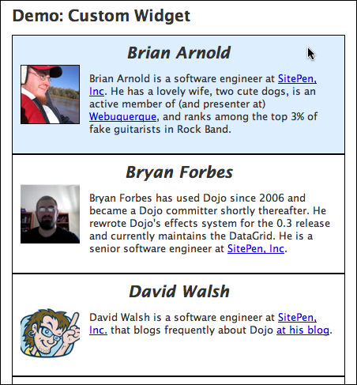
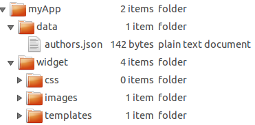
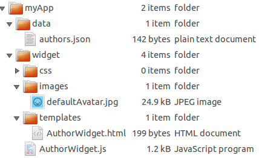
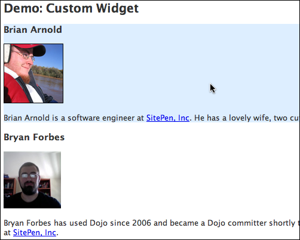

## Creating a custom widget

In this recipe, we'll be covering how to leverage pieces of Dojo and the Dijit framework to create your own custom widgets, specifically covering use of `dijit/_WidgetBase` and `dijit/_TemplatedMixin` to quickly and easily set up your widget.

### Introduction

The Dojo Toolkit ships with the Dijit framework, which is a set of graphical controls called widgets. We can build graphical user interfaces with these widgets.

You may require a specific widget that is not provided by Dojo. In this case, you can use Dijit's core in order to build this widget with more ease.

### Setup

For our scenario, let's say that we have a data source somewhere, in JSON format, listing a series of authors, such as those who've penned a tutorial for Dojo. We happen to have that, and it looks something like this:

```js
[
	{
		"name": "Brian Arnold",
		"avatar": "/includes/authors/brian_arnold/avatar.jpg",
		"bio": "Brian Arnold is a software engineer at SitePen, Inc., ..."
	},
	/* More authors here... */
]
```

We also know that we want our end result to live in a page, somewhere like this:

```html
<body>
    <!-- Headers and whatnot -->
    <h2>Authors</h2>
    <div id="authorContainer">
        <!-- Authors go here! -->
    </div>
</body>
```

We'll also say that we want it to be a little fancy—perhaps we get a background color to fade in as we mouse over it. Eventually, we want it to look something like this:


### Solution

We can create our own widget by following a simple series of steps.

1.  Create some file structure for our custom widget
2.  Create markup that will represent an individual author
3.  Augment our author markup to make it a Dijit template
4.  Create our widget class using `declare`
5.  Style as appropriate

#### Step 1: Create a file structure for our custom widget

While this step is arguably optional, it's generally considered a good practice to have a proper file structure for your custom Dijit work (or custom code in general). In this case "myApp" is the folder that will house all of our "custom" code — by "custom" we mean code written specifically for this app. General-purpose and 3rd-party libraries (like dojo, dijit, etc.) would be in folders that are siblings of "myApp". This name is completely up to you, but use something meaningful, like the name of your organization, or the application that this widget will be a part of. We like to group our widgets together, so we'll create a folder named "widget" directly under "myApp". We'll call our new widget AuthorWidget — it's module id will be `myApp/widget/AuthorWidget`. Widgets often use external resources, so we'll add some folders under the "widget" folder to organize them — css, images, and templates. Our eventual structure looks like this:



We haven't actually created any files yet in our custom space - just some hierarchy.

#### Step 2: Create markup that will represent an individual author

Now that we have some structure to store our pieces, let's create some simple markup that represents an individual author. For your first widget, it's likely going to be simplest to just set up a basic page where you directly put in some sample values.

When you're working out a template, you should always create one parent wrapping element that contains all of the other elements. This element can be whatever you want, but it's important to have just one root element. For our data, we'll use a `div` as our wrapping element. We'll put in our author's name using an `H3` element, the image using an `img` element, and then our bio inside of a `p` element.

```html
<div>
    <h3>Brian Arnold</h3>
    
    <p>Brian Arnold is a software engineer at SitePen, Inc., ...</p>
</div>
```

#### Step 3: Augment our author markup to make it a Dijit template

When using `dijit/_TemplatedMixin`, you can adjust your markup in a variety of ways:

*   You can have values from your widget automatically inserted
*   You can designate elements in your template as Attach Points, giving you a programmatic reference to that node in the widget
*   You can set up methods to be called on DOM events related to specific nodes

For our purposes, we're not worried about events right now — but we definitely want to take advantage of some of the automatic insertion. We're going to create a file in our hierarchy, under `myApp/widget/templates/` named `AuthorWidget.html`. It's basically the markup defined above, but with some simple additions.

```html
<div>
    <h3 data-dojo-attach-point="nameNode">${name}</h3>
    
    <p data-dojo-attach-point="bioNode">${!bio}</p>
</div>
```

There are a few things to note as to what's going on here:

*   We can use a `${attribute}` syntax to directly insert some values, like our name.
*   We can use a `${!attribute}` syntax to directly insert some values from our widget as well, like we're doing with bio. The major distinction between `${attribute}` and `${!attribute}` in this case is that our bio contains HTML, and we want to avoid having `dijit/_TemplatedMixin` perform automatic escaping on the inserted content.
*   All `dijit/_WidgetBase`-based widgets have a `baseClass` property by default, and by leaning on that, we can provide a custom class to our avatar.
*   We've given all nodes an attach point, meaning that in our widget code, we can use that name to reference that node directly. Think of it kind of like doing some `getElementById` type work without needing IDs, where we set up references in advance — so with an instance of AuthorWidget, we could use `myAuthor.nameNode` to directly reference the H3 DOM node for that widget.

You might have noticed that we haven't set the avatar's source directly. What happens if we have an author that doesn't have an avatar specified? We don't want to show a broken image. We'll handle the default value for that when we create our widget, which we'll do now!

#### Step 4: Create our widget class using `dojo/_base/declare`

At this point, in our file structure above, we're going to create a file named `AuthorWidget.js` in the `widget` folder. We'll also add a default avatar image. Our file structure is starting to fill out a little! After this step, it'll be much more filled out. We'll be doing the bulk of our work at this point.



Now we can simply build our widget! The following code would go in your `AuthorWidget.js` file.

```js
// myApp/widget/AuthorWidget.js
define(["dojo/_base/declare","dijit/_WidgetBase", "dijit/_TemplatedMixin"],
	function(declare, _WidgetBase, _TemplatedMixin){
		return declare([_WidgetBase, _TemplatedMixin], {
		});
}); // and that's it!
```

Using `declare` we easily create our custom AuthorWidget from `dijit/_WidgetBase` and `dijit/_TemplatedMixin`. Now, if we stopped here, this wouldn't work. We need to add a few custom properties for our widget, as well as set up some default values for properties left unspecified in the options passed when the widget is instantiated. Here's the setup for our declaration, now with properties.

```js
define([
	"dojo/_base/declare",
	"dojo/_base/fx",
	"dojo/_base/lang",
	"dojo/dom-style",
	"dojo/mouse",
	"dojo/on",
	"dijit/_WidgetBase",
	"dijit/_TemplatedMixin",
	"dojo/text!./templates/AuthorWidget.html"
], function(declare, baseFx, lang, domStyle, mouse, on, _WidgetBase, _TemplatedMixin, template){
	return declare([_WidgetBase, _TemplatedMixin], {
		// Some default values for our author
		// These typically map to whatever you're passing to the constructor
		name: "No Name",
		// Using require.toUrl, we can get a path to our AuthorWidget's space
		// and we want to have a default avatar, just in case
		avatar: require.toUrl("./images/defaultAvatar.png"),
		bio: "",

		// Our template - important!
		templateString: template,

		// A class to be applied to the root node in our template
		baseClass: "authorWidget",

		// A reference to our background animation
		mouseAnim: null,

		// Colors for our background animation
		baseBackgroundColor: "#fff",
		mouseBackgroundColor: "#def"
	});
});
```

We have several things going on here, so let's break it down.

*   We start off with some properties relevant to our author - `name`, `bio`, `avatar` - setting default values. By using `require.toUrl`, we can get a path to where our AuthorWidget is located, and tap into the images folder under there.
*   Using the `templateString` property and `dojo/text`, we specify our template's contents.
*   We set our `baseClass`. This will be applied to our root node, which in our case is the `div` in our template.
*   We set up a reference for our animation, to be worked with in a moment, as well as a couple of colors for the animation.

This is all well and good, and if we stopped here, it would actually work as a very basic widget that displayed information. However, we can add in a couple of methods to make things a bit safer. We're going to add:

*   some logic in `postCreate` (the most commonly extended lifecycle method from `_WidgetBase`)
*   a custom property setter for the `avatar` property
*   a utility function to make it easy to change background color.

Let's visit each one of those.

The `postCreate` method is where we want to put the bulk of our work. It's called once our widget's DOM structure is ready, but before it's been inserted into the page. It's typically the best place to put any sort of initialization code.

```js
postCreate: function(){
	// Get a DOM node reference for the root of our widget
	var domNode = this.domNode;

	// Run any parent postCreate processes - can be done at any point
	this.inherited(arguments);

	// Set our DOM node's background color to white -
	// smoothes out the mouseenter/leave event animations
	domStyle.set(domNode, "backgroundColor", this.baseBackgroundColor);
	// Set up our mouseenter/leave events
	// Using dijit/Destroyable's "own" method ensures that event handlers are unregistered when the widget is destroyed
	// Using dojo/mouse normalizes the non-standard mouseenter/leave events across browsers
	// Passing a third parameter to lang.hitch allows us to specify not only the context,
	// but also the first parameter passed to _changeBackground
	this.own(
		on(domNode, mouse.enter, lang.hitch(this, "_changeBackground", this.mouseBackgroundColor)),
		on(domNode, mouse.leave, lang.hitch(this, "_changeBackground", this.baseBackgroundColor))
	);
}
```

Here, we're setting some style based on our `baseBackgroundColor` property, and then setting up some onmouseenter/onmouseleave events, so that as people mouse over the DOM node, our custom `_changeBackground` function is called. Let's take a look at that:

```js
_changeBackground: function(newColor) {
	// If we have an animation, stop it
	if (this.mouseAnim) {
		this.mouseAnim.stop();
	}

	// Set up the new animation
	this.mouseAnim = baseFx.animateProperty({
		node: this.domNode,
		properties: {
			backgroundColor: newColor
		},
		onEnd: lang.hitch(this, function() {
			// Clean up our mouseAnim property
			this.mouseAnim = null;
		})
	}).play();
}
```

<!-- protip -->
> Why is this method called `_changeBackground` and not just `changeBackground`? It is named with a leading underscore to indicate that users of this widget should treat the method as though it were private, and not something to be used directly.
> It's a common Dojo pattern to prefix methods or objects with an underscore in order to indicate that they shouldn't be used directly. It doesn't actively stop users from using those methods, but is a useful implicit indication of sorts that "Hey, this isn't meant for general use".

</div>

We're checking our `mouseAnim` property to see if there's an animation there, and if we have something there, we're calling `stop` to stop it, as a means of being safe. Then, we simply set up the new animation and save it back into `mouseAnim`, then start it playing. This example is very similar to an effect as demonstrated in the [Animation tutorial](../../animation/), though with some different colors.

Finally, remember how we had concerns earlier that a user might not have an avatar, and we set up a default one? We can set up a custom setter function for attributes, which will automatically be called any time that value is set, either when the widget is being created or if someone calls `myWidget.set("avatar", somePath)`. The name of the method is special, and maps to the name of the property—in this case, for `avatar`, our name will be `_setAvatarAttr`.

```js
_setAvatarAttr: function(imagePath) {
	// We only want to set it if it's a non-empty string
	if (imagePath != "") {
		// Save it on our widget instance - note that
		// we're using _set, to support anyone using
		// our widget's Watch functionality, to watch values change
		this._set("avatar", imagePath);

		// Using our avatarNode attach point, set its src value
		this.avatarNode.src = imagePath;
	}
}
```

Starting with Dojo 1.6, all `dijit/_WidgetBase` widgets include `dojo/Stateful` in their inheritance chain, which means that users can actively watch for value changes. We use `_set` within our setter to ensure that all `watch` calls are properly fired, and then we use our `avatarNode` attach point to set the image's `src` attribute to the value being set. By wrapping it in a check for the string not being empty, we're trying to avoid cases where the avatar property may be there, but with nothing but an empty string. This way, we get our default image if we have no value, with a bit of a safety check.

To use the widget, we do the following:

```html
<div id="authorContainer"></div>
```

```js
require(["dojo/request", "dojo/dom", "dojo/_base/array", "myApp/widget/AuthorWidget", "dojo/domReady!"],
	function(request, dom, arrayUtil, AuthorWidget){
	// Load up our authors
	request("myApp/data/authors.json", {
		handleAs: "json"
	}).then(function(authors){
		// Get a reference to our container
		var authorContainer = dom.byId("authorContainer");

		arrayUtil.forEach(authors, function(author){
			// Create our widget and place it
			var widget = new AuthorWidget(author).placeAt(authorContainer);
		});
	});
});
```

With all of these items in place, we have a working widget! However, as you can see, it's not exactly pretty yet.



[View Demo](demo/unstyled.html)

#### Step 5: Style as appropriate

One of the benefits of using `dijit/_WidgetBase`, as mentioned above, is that it gives us a `baseClass` that we can work off of for styling purposes. Using that, we can create some fairly simple styling. We have a folder under our AuthorWidget space just for css, so let's create an `AuthorWidget.css` file in there.

```css
/* myApp/widget/css/AuthorWidget.css */
.authorWidget {
	border: 1px solid black;
	width: 400px;
	padding: 10px;
	overflow: hidden; /* I hear this helps clear floats inside */
}

.authorWidget h3 {
	font-size: 1.5em;
	font-style: italic;
	text-align: center;
	margin: 0px;
}

.authorWidgetAvatar {
	float: left;
	margin: 4px 12px 6px 0px;
	max-width: 75px;
	max-height: 75px;
}
```

Since we know our `baseClass` is `authorWidget`, we can work off of that. Also, if you recall, in the template, we set a class on the avatar of `${baseClass}Avatar`, so we can use `authorWidgetAvatar` in our styling.

Now, with that in place, we just need to add the CSS to our `head` on our page, and we have a nicer looking author list!


[View Demo](demo/index.html)
### Summary

As you can see, using `dijit/_WidgetBase` and `dijit/_TemplatedMixin` makes it fairly easy to create a custom widget. We were able to quickly set up a template, and with a little bit of work, we were able to create our AuthorWidget class based off of `dijit/_WidgetBase` and `dijit/_TemplatedMixin`.

It's worth noting that most widgets in Dijit itself are built using these same tools, and we've only scratched the surface of what they can do. Be sure to follow through some of the links below for more information!

### Resources

*   [dijit/_WidgetBase](/reference-guide/1.10/dijit/_WidgetBase.html)
*   [dijit/_TemplatedMixin](/reference-guide/1.10/dijit/_TemplatedMixin.html)
*   [Tutorial on dojo/declare](../../declare/)
*   [Dojo Reference Guide: Writing Your Own Widget](/reference-guide/1.10/quickstart/writingWidgets.html)