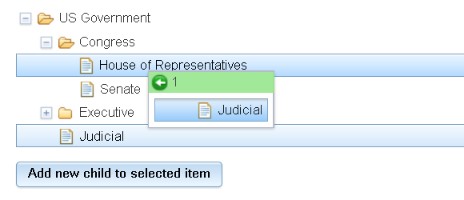

---
Category:  Working with Data
...

## Connecting a Store to a Tree

The Dojo `Tree` component is a powerful tool for visual presentation of hierarchical data. In this tutorial we will look at how to connect the tree to a store for quick and efficient data drill-down into nested data.

### Introduction

The [Dojo `Tree` component](/reference-guide/1.10/dijit/Tree.html) provides
a comprehensive, familiar, intuitive drill-down presentation of hierarchical data.
It also separates the data model concerns from the presentation.
This tutorial will examine various ways to provide the data to drive a tree.

The first example uses a static tree with the data sourced from a single JSON file.
This can be used to provide navigation through data.
The second example expands on this design to add powerful features like drag and drop, and dynamic tree manipulation.
The final example shows how data can be lazy-loaded.

###  Tree with a Static Store

A static store is well-suited for a tree with limited size.
In this example, clicking on the tree nodes displays a related image.

The first step is to create the data.  We will use the Memory store, which means that
the store data is JSON-encoded, and can contain supporting information.
In this case, the `name` is used to label each node of the tree.
This tree has four `items`, and each has a `name` and an `id`.

```js
{
	"name": "US Government",
	"id": "root",
	"children": [
		{
			"name": "Congress",
			"id": "congress"
		},
		{
			"name": "Executive",
			"id": "exec"
		},
		{
			"name": "Judicial",
			"id": "judicial"
		}
	]
}
```

A tree is served data from an object implementing the
 [dijit/tree/model](/reference-guide/1.10/dijit/tree/model.html) interface.
Usually, that object is an instance of
[dijit/tree/ObjectStoreModel](/reference-guide/1.10/dijit/tree/ObjectStoreModel.html),
and it is fed by a [dojo/store](/reference-guide/1.10/dojo/store.html).
That's how this example will work.

The code below creates a Memory store, feeding into an ObjectStoreModel, which then feeds a tree.
Finally, the `onLoad` and `onClick` events are used to display the associated image.

```js
require([
	"dojo/dom", "dojo/json", "dojo/store/Memory",
	"dijit/tree/ObjectStoreModel", "dijit/Tree", "dojo/text!./data/static", "dojo/domReady!"
], function(dom, json, Memory, ObjectStoreModel, Tree, data){
	// set up the store to get the tree data
	var governmentStore = new Memory({
		data: [ json.parse(data) ],
		getChildren: function(object){
			return object.children || [];
		}
	});

	// set up the model, assigning governmentStore, and assigning method to identify leaf nodes of tree
	var governmentModel = new ObjectStoreModel({
		store: governmentStore,
		query: {id: 'root'},
		mayHaveChildren: function(item){
			return "children" in item;
		}
	});

	// set up the tree, assigning governmentModel;
	var governmentTree = new Tree({
		model: governmentModel,
		onOpenClick: true,
		onLoad: function(){
			dom.byId('image').src = '../resources/images/root.jpg';
		},
		onClick: function(item){
			dom.byId('image').src = '../resources/images/'+item.id+'.jpg';

		}
	}, "divTree");
	governmentTree.startup();
});
```

Note how we had to implemented two methods ourselves:

1.   getChildren() - to return a list of children for a given item
1.   mayHaveChildren() - in its simplest form this always returns true, but it
	can return false if you can tell just by looking at an item that it couldn't possibly have any children,
	currently or in the future (due to drag and drop or other data store updates).

<a href="demo/basic.html" class="button">View Demo</a>

### Dynamic Updates and Drag & Drop

Here we will learn how to use the `Tree` with drag-n-drop, and real-time response to data changes.

[](demo/demo.html)

<a href="demo/demo.html" class="button">View Complete Demo</a>

For a Tree to work with dynamic data updates, including DnD,
the store needs to be able to understand and track parent-child relationships,
and to notify the tree when items change, especially when an item's list of children changes.
With that in mind, we will create our data in a relational format where each object points to its parent:

```js
[
	{
		"name": "US Government",
		"id": "root"
	},
		{
			"name": "Congress",
			"id": "congress",
			"parent": "root"
		},
			{
				"name": "House of Representatives",
				"id": "house",
				"parent": "congress"
			},
			{
				"name": "Senate",
				"id": "senate",
				"parent": "congress"
			},
		{
			"name": "Executive",
			"id": "exec",
			"parent": "root"
		},
			{
				"name": "President",
				"id": "pres",
				"parent": "exec"
			},
			{
				"name": "Vice President",
				"id": "vice-pres",
				"parent": "exec"
			},
			{
				"name": "Secretary of State",
				"id": "state",
				"parent": "exec"
			},
			{
				"name": "Cabinet",
				"id": "cabinet",
				"parent": "exec"
			},
				{
					"name": "National Security Council",
					"id": "security",
					"parent": "cabinet"
				},
				{
					"name": "Council of Economic Advisers",
					"id": "economic",
					"parent": "cabinet"
				},
				{
					"name": "Office of Management and Budget",
					"id": "budget",
					"parent": "cabinet"
				},
		{
			"name": "Judicial",
			"id": "judicial",
			"parent": "root"
		}
]
```

Despite the indenting, this is actually a flat list of objects where each object (except the root object)
points to its parent.

Next, we make the store.
The store needs to have the following capabilities to be used with ObjectStoreModel and the Tree,
and to reflect dynamic data updates:

1.  Support to get the tree root node <i>via a query</i> (store.query()), rather than a store.get() call,
	and return a list with one item and an observe() method.   ObjectStoreModel will use the observe() method
	to detect changes to the root node such as modifications to the label.
1.  A getChildren() method that returns a list of children with an observe() method.
	The observe() method is used to detect when any of the children change (such as modification of their label),
	and also when new children are added or old children are removed.
1.  A put() method than can attach an item as a child of another item.

Capabilities #1 and #2 are simplified by wrapping the store in an
[Observable](/reference-guide/1.10/dijit/tree/Observable.html).
After that, getRoot() and getChildren() can be implemented as simple queries against the store.

For #3, since dojo/store/Memory doesn't support this option, we will add it ourselves.
The code becomes:

```js
require([
	"dojo/aspect", "dojo/json", "dojo/query", "dojo/store/Memory", "dojo/store/Observable",
	"dijit/Tree", "dijit/tree/ObjectStoreModel", "dijit/tree/dndSource", "dojo/text!./data/all.json", "dojo/domReady!"
], function(aspect, json, query, Memory, Observable,
	Tree, ObjectStoreModel, dndSource, data){

	// set up the store to get the tree data, plus define the method
	// to query the children of a node
	var governmentStore = new Memory({
		data: json.parse(data),
		getChildren: function(object){
			return this.query({parent: object.id});
		}
	});

	// To support dynamic data changes, including DnD,
	// the store must support put(child, {parent: parent}).
	// But dojo/store/Memory doesn't, so we have to implement it.
	// Since our store is relational, that just amounts to setting child.parent
	// to the parent's id.
	aspect.around(governmentStore, "put", function(originalPut){
		return function(obj, options){
			if(options && options.parent){
				obj.parent = options.parent.id;
			}
			return originalPut.call(governmentStore, obj, options);
		}
	});

	// give store Observable interface so Tree can track updates
	governmentStore = new Observable(governmentStore);
};
```

Finally, to get DnD support, we need to define the drag-n-drop controller:
We will use the standard `dijit/tree/dndSource` as the controller:

```js
require(["dijit/Tree", "dijit/tree/dndSource", "dojo/domReady!"], function(Tree, dndSource){
	tree = new Tree({
		model: usGov,
		// define the drag-n-drop controller
		dndController: dndSource
	}, "tree");
	tree.startup();
});
```

Now drag-n-drop operations should trigger calls to `model.pasteItem()` which will update the data store
via `put()`.

### Programmatic Data Changes

Note that the `Tree` follows standard MVC principles of responding to data model changes
rather than controller actions.
This is extremely powerful because the view of the data can respond to changes regardless of what triggered the change
(direct programmatic changes, drag-n-drop, etc.).

Consequently, to add a new child, we can simply
save it with a `put()`, specifying the parent, and the Tree will automatically respond.
(Remember though the aspect.around() code we added above, to make dojo/store/Memory handle put(object, {parent: p}).)
In the demo, a button triggers the addition of a child object using the following code:

```js
query("#add-new-child").on("click", function(){
	// get the selected object from the tree
	var selectedObject = tree.get("selectedItems")[0];
	if(!selectedObject){
		return alert("No object selected");
	}

	// add a new child item
	var childItem = {
		name: "New child",
		id: Math.random()
	};
	governmentStore.put(childItem, {
		overwrite: true,
		parent: selectedObject
	});
});
```

We can remove children with the same approach.
We could also change properties of objects, such as the name (the label of the nodes).
In the demo, we listen for double-clicks to prompt for a new name for objects:

```js
tree.on("dblclick", function(object){
	object.name = prompt("Enter a new name for the object");
	governmentStore.put(object);
}, true);
```

In the end, we end up with the following:

```js
require([
	"dojo/aspect", "dojo/json", "dojo/query", "dojo/store/Memory", "dojo/store/Observable",
	"dijit/Tree", "dijit/tree/ObjectStoreModel", "dijit/tree/dndSource", "dojo/text!./data/all.json", "dojo/domReady!"
], function(aspect, json, query, Memory, Observable,
	Tree, ObjectStoreModel, dndSource, data){

	// set up the store to get the tree data, plus define the method
	// to query the children of a node
	var governmentStore = new Memory({
		data: json.parse(data),
		getChildren: function(object){
			return this.query({parent: object.id});
		}
	});

	// To support dynamic data changes, including DnD,
	// the store must support put(child, {parent: parent}).
	// But dojo/store/Memory doesn't, so we have to implement it.
	// Since our store is relational, that just amounts to setting child.parent
	// to the parent's id.
	aspect.around(governmentStore, "put", function(originalPut){
		return function(obj, options){
			if(options && options.parent){
				obj.parent = options.parent.id;
			}
			return originalPut.call(governmentStore, obj, options);
		}
	});

	// give store Observable interface so Tree can track updates
	governmentStore = new Observable(governmentStore);

	// create model to interface Tree to store
	var model = new ObjectStoreModel({
		store: governmentStore,

		// query to get root node
		query: {id: "root"}
	});

	tree = new Tree({
		model: model,
		dndController: dndSource
	}, "tree"); // make sure you have a target HTML element with this id
	tree.startup();

	query("#add-new-child").on("click", function(){
		// get the selected object from the tree
		var selectedObject = tree.get("selectedItems")[0];
		if(!selectedObject){
			return alert("No object selected");
		}

		// add a new child item
		var childItem = {
			name: "New child",
			id: Math.random()
		};
		governmentStore.put(childItem, {
			overwrite: true,
			parent: selectedObject
		});
	});

	query("#remove").on("click", function(){
		var selectedObject = tree.get("selectedItems")[0];
		if(!selectedObject){
			return alert("No object selected");
		}
		governmentStore.remove(selectedObject.id);
	});

	tree.on("dblclick", function(object){
		object.name = prompt("Enter a new name for the object");
		governmentStore.put(object);
	}, true);
});
```

Note that with drag and drop, any of the nodes may eventually have children, so mayHaveChildren() should return false.
Therefore we removed the custom mayHaveChildren() method and just use the default one.

### Lazy Loading Tree

When data sets become large, it's better to fetch items from the server as needed (a.k.a lazy loading),
rather than initially downloading all the data.

The first step, again, is to create the data.  In real life, the data would likely
be stored in a database and served by a REST-ful service like Persevere or CouchDB.
However, for the purposes of this demo example, we will create data
where each tree item is stored in a separate file on the server:

```
data/
    cabinet
    congress
    exec
    root
```

Further, each item has a stub listing of it's children (i.e. listing the name of each child, but not that
child's children).
So, the data file for Congress will be called "congress" and will look like this:

```js
{
	"name": "Congress",
	"id": "congress",
	"children": [
		{
			"name": "House of Representatives",
			"id": "house"

		},
		{
			"name": "Senate",
			"id": "senate"
		}
	]
}
```

Next we create our data store. This will be the store that drives the Tree.
Here we will use the JsonRest store, which facilitates lazy loading of data.
Here is the basic instantiation of the `JsonRest` store for connecting to our server:

```js
require(["dojo/store/JsonRest"], function(JsonRest) {
	usGov = new JsonRest({
		target: "data/",

		getChildren: function(object){
			// object may just be stub object, so get the full object first and then return it's
			// list of children
			return this.get(object.id).then(function(fullObject){
				return fullObject.children;
			});
		}
	});
});
```

Note how getChildren() may be passed a stub object like:

```js
{
	"name": "Congress",
	"id": "congress",
	"children": true
}
```

So, in order to get the children, it first needs to fetch the file called "congress":

```js
{
	"name": "Congress",
	"id": "congress",
	"children": [
		{
			"name": "House of Representatives",
			"id": "house"

		},
		{
			"name": "Senate",
			"id": "senate"
		}
	]
}
```

The code to create the model, and tree is similar to above:

```js
require([
	"dojo/store/JsonRest",
	"dijit/Tree", "dijit/tree/ObjectStoreModel", "dojo/domReady!"
], function(JsonRest, Tree, ObjectStoreModel){

	...

	// create model to interface Tree to store
	model = new ObjectStoreModel({
		store: usGov,

		getRoot: function(onItem){
			this.store.get("root").then(onItem);
		},

		mayHaveChildren: function(object){
			return "children" in object;
		}
	});

	tree = new Tree({
		model: model
	}, "tree"); // make sure you have a target HTML element with this id
	tree.startup();
});
```

Note that we provided a custom getRoot() method.
That's because by default ObjectStoreModel tries to get the root node by executing a query against the server.
Since our server is merely serving static files, and cannot respond to queries, we overrode the
getRoot() method to just do a get() call.

<a href="demo/lazy.html" class="button">View Demo</a>

### Dynamic Updates and DnD with a client/server store

Supporting DnD and dynamic updates with a client-server store like JsonRest is complicated,
and beyond the scope of this tutorial.
The JsonRest store bundled with dojo is not sufficient, because it's merely a client side component.
A RESTful service on the server is also required.

Likely, you should use a package like Persevere that provides the necessary features.
If you wanted to implement your own server-side RESTful service,
then it should support the following:

**1. Retrieving a single item**

With JsonRest, an item is typically retrieved via a path-like URL like below (where "root" is the id of an object):

```
http://server/data/root
```

However, when ObjectStoreModel gets the root item of the Tree, it uses a query, which would cause JsonRest to
issue a GET request like this to the server:

```
http://server/data?id=cabinet
```

which would return:

```js
[
	{
		"name": "Cabinet",
		"id": "cabinet"
	}
]
```

Side note: Why does ObjectStoreModel execute a query against the server to get the root node,
even though you could get the root node with a simple store.get("root") call?   Because using
store.query({id: "root"}) against a store supporting the Observable interface will let
ObjectStoreModel monitor when there are changes to the root node, such as a change to the label.

**2. Retrieving an item's children**

GET request for the children of an item, ex:

```
http://server/data?parent=cabinet
```

which would return the children of the item with the "cabinet" id:

```js
[
	{
		"name": "National Security Council",
		"id": "security"
	},
	{
		"name": "Council of Economic Advisers",
		"id": "economic"
	},
	{
		"name": "Office of Management and Budget",
		"id": "budget"
	}
]
```

**3. Notification of changes**

Ideally, queries to the server like above don't just return a list of children and forget about them.
After the above query, the server is supposed to be in charge of notifying the client whenever the list of children
changes.
Without this notification, dynamic store updates and DnD will not work.

**4. PUT and DELETE requests**

 Finally, the server should handle PUT and DELETE requests
 to do updates, insertions, and deletions.
 And... upon doing the update, insert, or delete, notify the client that the data has changed.
 JsonRest doesn't have provisions for this.

### Conclusion

The `Tree` is designed to properly separate the data model concerns from presentation,
and the new object store can easily be extended with hierarchical logic to drive the `Tree`.
The `Tree` provides important features such as keyboard navigation and accessibility.
Also, the `Tree` and object store combination leverages the additional powerful functionality
of the `Tree` including scalable lazy loading, drag-n-drop, and real-time response to data model changes.
We encourage you to [explore the Tree documentation](/reference-guide/1.10/dijit/Tree.html)
in more depth to learn more about the `Tree` capabilities such styling, icon customization, and its API.