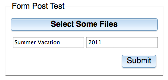
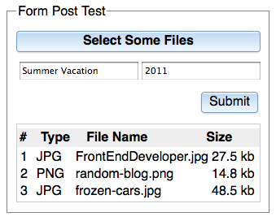

## HTML5 Multi-File Uploader

The HTML5 multi-file uploader is a widget that creates a stylable file-input button, with optional mult-file selection, using only HTML elements. Non-HTML5 browsers have fallback options of Flash or an iframe.

### Getting Started

They are called file inputs because they are a standard form `input` element, with the type
set to "file". For years, file inputs could only select and upload one file at a time. The
[HTML5 spec](http://www.w3.org/TR/2010/WD-html-markup-20101019/input.file.html) allows for
multiple selections. Of course, there are variances amongst the browsers. Firefox 3.6 is different from
WebKit and Firefox 4+. As you may have guessed, Internet Explorer has not implemented it yet... not even in IE9.

<!-- protip -->
> The `dojox/form/Uploader` is an improvement upon, and replaces the `dojox/form/FileUploader`. The various
problems created by Flash are avoided because it is not used in Mozilla and Webkit browsers. Support for
FileUploader ceased as of 1.6, but the code will remain until 2.0 for backwards compatibility.

To handle the different scenarios that a Dojo developer will need, the actual "upload functionality" is
handled with plugins. Without these plugins, the Uploader code allows the file-input to be custom styled,
and handles the multi-selection in non-HTML5 browsers, using the standard trick of adding a new file-input
element after each individual file selection. Pretty much all there is to it is to add a data-dojo-type to a file-input:

```html
<input type="file" multiple="true" data-dojo-type="dojox/form/Uploader"
    data-dojo-props="
        label: 'Select Some Files',
        url: '/tests/UploadFile.php',
        uploadOnSelect: true">
```

This will render a button using whatever Dijit style is enabled. In this case, the default Claro:


Note you would also need one of the uploader plugins for the Ajax upload to work, which I will show shortly.

The Uploader also may be placed in a form and will "just work". Remember to
set the `enctype` attribute in your form to `multipart/form-data`, which is used
for uploading files.

```html
<form method="post" action="/tests/UploadFile.php" id="myForm"
enctype="multipart/form-data">
    <fieldset>
        <legend>Form Post Test</legend>
        <input class="browseButton" name="uploadedfile" multiple="true"
            type="file" data-dojo-type="dojox/form/Uploader"
            data-dojo-props="label: 'Select Some Files'" id="uploader">
        <input type="text" name="album" value="Summer Vacation">
        <input type="text" name="year" value="2011">
        <input type="submit" label="Submit" data-dojo-type="dijit/form/Button">
    </fieldset>
</form>
```

And the result:



Again, without a plugin, you are on your own for the actual upload. This is something that is missing
from the older FileUploader — the ability to just use a styled upload button and post the entire page to the server.

So while the previous example will upload multiple files, you don't have a visual indication of what
files have been selected. In the scenario above, you could choose several files, but you wouldn’t have
any visual indication of what was selected. There is a helper widget, `dojox/form/uploader/FileList`
which automatically connects to a `dojox/form/uploader/Uploader` and detects when files are added,
removed, or uploaded, and displays the list. It also has a built-in progress bar that shows during an
Ajax upload.

Here is an example of the FileList, modifying the same code as above:

<!-- highlight: 11 -->
```html
<form method="post" action="UploadFile.php" id="myForm"
enctype="multipart/form-data">
    <fieldset>
        <legend>Form Post Test</legend>
        <input name="uploadedfile" multiple="true" type="file" id="uploader"
        data-dojo-type="dojox/form/Uploader" data-dojo-props="label: 'Select Some Files'">
        <input type="text" name="album" value="Summer Vacation">
        <input type="text" name="year" value="2011">
        <input type="submit" label="Submit" data-dojo-type="dijit/form/Button">
        <div id="files" data-dojo-type="dojox/form/uploader/FileList"
            data-dojo-props="uploaderId: 'uploader'"></div>
    </fieldset>
</form>
```

<!-- protip -->
> Note that the FileList has one custom attribute that points to the Uploader, as highlighted above.

And the result:



### Plugins

The Uploader has three plugins available to handle Ajax uploads. The HTML5 plugin deals with the new
file-input types in Gecko (Firefox) and WebKit (Safari, Chrome) browsers. You then have two options for what to do with IE: the
IFrame plugin or the Flash plugin. There’s nothing new or fancy about them; they actually share code
with the older FileUploader, albeit simplified.

The IFrame and Flash plugins extend the HTML5 plugin, so you don’t need to require both. And as you may expect,
the only time you use the HTML5 plugin by itself is if you have a non-IE project (lucky you!).

In the previous example, the page will change and do a form post to UploadFile.php. To Ajax-ify it,
just require one of the plugins:

```js
require(["dojox/form/uploader/plugins/Flash"], ...
```

If you prefer to not use Flash in IE, simply use the IFrame plugin:

```js
require(["dojox/form/uploader/plugins/IFrame"], ...
```

So wait... the earlier example used no plugins and was for a straight form; and these plugins are
ajaxified but for IE. Where is the HTML5 plugin?

As I said, the Flash and IFrame plugins extend the HTML5 plugin, so it’s included and works automatically.
But you could, if you knew that you weren’t using IE... ever... yes, even IE9, which
[doesn’t include HTML5 form support](http://clubajax.org/ie9-html5-tests-99-bogus/)...
include the HTML5 plugin the same way:

```js
require(["dojox/form/uploader/plugins/HTML5"], ...
```

Either way, everything is handled automatically. When the "Submit" button is pressed, the Uploader
intercepts the onsubmit event and blocks it so the page doesn’t change, grabs the URL from the action
attribute, collects all the data in the form fields, and sends everything to the server.

### UploadFile.php

Because this API allows for the arbitrary upload of files, the server-side PHP example is disabled by default
in the Dojo release for security reasons. To use the server-side example, simply remove the word disabled
from [dojox/form/tests/UploadFile.php.disabled](https://github.com/dojo/dojox/blob/1.10/form/tests/UploadFile.php.disabled),
or implement your own version in your server-side language of choice to try out the Uploader on your server.

### Conclusion

Thanks to a few years of experience working on the _FileUploader_, I was able to make the Uploader
very easy to use and versatile. My previous work with the _FileUploader_ was getting difficult
to maintain because the Flash plugin just doesn’t play nicely in any browser other than IE. So while it
worked adequately, there were constant and subtle bugs with it in Dijit Tabs or Djit Dialog boxes.
Thankfully the HTML5 features in Firefox and WebKit have matured enough that the multi-file-inputs
can be used effectively, and the fact that they are native HTML elements means they render without issue.